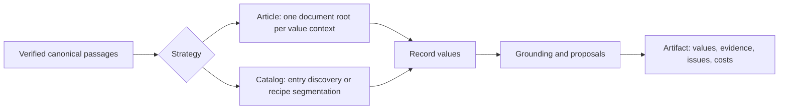

# Extraction stages and controlled experiments

Production runs `extractDurableV1`: its planner reads one verified canonical
generation, checks pinned strategy settings and calls `run.dispatch` to assemble
evidence-bearing values. Each model call is captured and checkpointed separately,
and retained snapshots are published through restricted coordination routines.
The experiment runner calls the same strategy implementations through
`kei_exp.kie.extract.run.extract`, retaining its result payload locally.



## Ownership

| Module | Responsibility |
| --- | --- |
| `kie/passages.py` | Verify canonical files and expose stable passages/tables; shared with the recipe stages, outside `kie/extract/`. |
| `run.py` | Load the evidence, check its generation and hand it to the implementation the options choose; the strategies share one call shape. Return the assembled result. |
| `rendering.py` | Expose block types and table cell spans to the model while retaining exact canonical text. |
| `spans.py` | Offer exact generation-scoped source ranges and intact canonical cells for compact grounding decisions. |
| `routing.py` | Map reconciled values to reply origins and order whole verification units with exhaustive unresolved fallback. |
| `method.py` | Validate explicit experimental choices; enforce the Article context ceiling. |
| `contexts.py` | Partition whole passages or structural groups with disjoint primary ownership, inherited heading context and optional overlap; assemble or reconcile values without hiding scalar conflicts. |
| `selection.py` | Select whole value contexts from inventory support, adjacent qualifiers and schema relevance; expose omitted units. |
| `article.py` | The Article implementation: the document's one root read from each value context, assembled across contexts and grounded. The service path sends no inventory request but counts `inventory_request` to size bounded contexts; research replays still use the inventory functions. |
| `catalog.py` | The version 1 Catalog implementation: generic record discovery and one call per record slice. |
| `assembly.py` | What Article and the version 1 Catalog share: document values over contexts, policy, scheduling and routing of fixed record values through `grounding.technique` (shared with grounding-only experiments), and the version 1 artifact with its fingerprint and prompt version. |
| `stages.py` | The shared value prompts (guardrail, schema instruction, labelled passages), document and record value requests and their conformance, value helpers, and the record merge. |
| `schema.py` | The extraction schema as Studio's editor writes it: the strict reply schema, the field notes a prompt lists, `conform`, and evidence-policy resolution. |
| `calls.py` | Extraction call execution: `complete` routes a finished request to its role's model, admits it against the served context when counted, invokes the adapter, reads the reply and records every attempt as a `Call`. The only way an extraction stage reaches a model. |
| `llm.py` | The protocol adapters `OpenAIChat` and `NuExtractChat` (request construction, the one explicit unsupported-format fallback, the HTTP call) and `parse_json`. |
| `gliformer.py` | Native GLiFormer fields over discovered entries, with no chat emulation or value repair. |
| `models.py` | The deployment's extraction models, their permitted roles and defaults, a run's choice, and `ROLE`/`Router`: which role and chat serve each stage. |
| `tokens.py` | Count requests on the serving endpoint's `/tokenize` and read its context size. |
| `grounding.py` | Ground version 1 Catalog and Article values in their passages. The `semantic`, `quoted`, `spans` and `off` techniques share one call shape; `technique` maps `article.grounding` (omitted: `semantic`) to one, and `assembly.py` calls it without knowing which. |
| `grounded.py` | The recipe Catalog implementation: entry extraction under the token budget, the merge of an entry's windows and conflict arbitration. |
| `acceptance.py` | Decide, without a model, whether a recipe Catalog candidate is accepted, proposed or rejected: its value typed, its quote in the entry, a recipe key introducing it; the candidate reply schemas. |
| `locate.py` | Locate a quoted value in a block's own text as raw code-point spans, matching on a normalised view that maps back to raw offsets. |
| `windows.py` | Cut an oversized recipe Catalog entry into consecutive windows whose request fits the budget, with optional one-line overlap. |
| `catalog_result.py` | Shape recipe Catalog outcomes into records, evidence links (table cells, glossary normalization) and review items. |
| `unified.py` | The unified Catalog, result version 3: per-stage budgets resolved from the served context, record discovery, then each entry's extraction, verification and arbitration. |
| `discovery.py` | The unified Catalog's source units, counted windows and record discovery with its source ledger. |
| `durable.py` | Plan and capture calls for every method: planning runs the algorithms against committed call outputs, and an unexecuted request yields to the durable workflow instead of reaching a provider. |
| `captured_provider.py` | Send a captured request's saved HTTP body without recomposition. |
| `retained.py` | Validate typed values, bind stable record and field identities and publish retained snapshots, always from validated stage objects, never debug files. |
| `experiments/extraction/` | Register inputs/comparisons, capture and resume calls, and analyze completed cells. Never imported by serving code. |

These are ordinary Python functions. There is no plugin graph or separate
service per stage. Strategy differences reflect source structure: an Article is
one document-level object read across the whole source; Catalog entries own
contiguous source spans.

## Pipeline map

How one production Extraction runs, from its pinned input selection to the saved
values Studio reads. Studio owns Schema Suggestion and Interaction model calls;
this service owns every Extraction model call and grounding. Each immutable
input selection pins its Schema Revision, Source Representation Revision and
method; later calls never substitute a newer revision for those producing inputs.

### Admission, source and publication

| Step | Owner |
| --- | --- |
| Pinned selection and dispatch | Studio's [`initializeDurableExtraction`](../../../packages/extraction/src/durable-repository.ts) stores the immutable executable schema, method and source pins. Its reconciler dispatches `extractDurableV1` with only protocol, Extraction ID and attempt ID; the worker reads the selection through restricted [`coordination`](../src/kei_exp/workflows/coordination.py) routines. |
| Effective inputs | [`effective` / `plan_next`](../src/kei_exp/workflows/durable_extract.py) validates `run.ExtractRequest`, resolves and saves effective model routes, options and protocol versions for that selection, then reuses those captured inputs on recovery. An unservable model choice or unknown recipe is refused before a new provider call. |
| Canonical input | `plan_next` loads verified canonical `Evidence`/`Passage`s with [`passages.load`](../src/kei_exp/kie/passages.py) and refuses a generation different from the source pin. [`run.dispatch`](../src/kei_exp/kie/extract/run.py) chooses unified Catalog, recipe Catalog, Article or generic Catalog from the pinned options. |
| Captured calls | [`CapturePlanner`](../src/kei_exp/kie/extract/durable.py) reserves exact model requests and correction context before execution. [`extractionCallV1` / `invoke_capture`](../src/kei_exp/workflows/durable_extract.py) durably saves each response before acknowledgement. Recovery and unchanged-input Retry reuse committed successful outputs; failed responses remain attempt-specific history. |
| Result assembly | [`assembly.artifact`](../src/kei_exp/kie/extract/assembly.py), [`grounded.extract`](../src/kei_exp/kie/extract/grounded.py) and [`unified.extract`](../src/kei_exp/kie/extract/unified.py) assemble the version-1, version-2 and version-3 internal results, including values, Evidence and diagnostics. Unified execution/discovery records and entry work are assembled in memory; deleted stage files are not checkpoints. |
| Retained publication | [`retained.publish_values` / `publish_final`](../src/kei_exp/kie/extract/retained.py) validate typed values, bind stable record/field identities, retain producing selections and producer Evidence, and call `publish_snapshot`. [`publish_result`](../src/kei_exp/workflows/durable_extract.py) completes publication before the attempt's acknowledgement. Nothing publishes an extraction result beside a parse run. |
| Studio read and review | The [`durable repository`](../../../packages/extraction/src/durable-repository.ts) reads fixed snapshots and numbered correction versions. [`kei-evidence`](../../../packages/extraction/src/kei-evidence.ts) projects producer Evidence against the pinned Source Representation; corrections and finalization use the durable routes. No legacy workflow or HTTP artifact reader participates. |

### Model calls

Each row is one call purpose: the stage label its `Call` records, the role
[`models.ROLE`](../src/kei_exp/kie/extract/models.py) assigns it, who prepares
the source and builds the prompt and reply schema, and who interprets the answer.

| Strategy | Stage → role | Initiated by | Source, prompt and reply schema | Interpretation |
| --- | --- | --- | --- | --- |
| Article | `document` → fields | [`assembly.document_values`](../src/kei_exp/kie/extract/assembly.py), per source context | [`stages.extract_document`](../src/kei_exp/kie/extract/stages.py): `_instruction` over the document fields, the context's complete text as `text_of` or `rendering.structured_source`, [`schema.json_schema`](../src/kei_exp/kie/extract/schema.py); counted, 2,048 output tokens | `schema.conform`; contexts assembled by `contexts.assemble_document`; listed as `unverified` |
| Article | `record` → fields | [`article.document_root`](../src/kei_exp/kie/extract/article.py), per value context | [`stages.record_request`](../src/kei_exp/kie/extract/stages.py) under `stages.DOCUMENT`, no identity, over each value context (by default the complete source); counted; the reply may use the served context the input leaves, at least 4,096 tokens | `schema.conform`; contexts assembled by `contexts.assemble_document` |
| Article | `grounding` → reasoning | [`assembly.ground_records`](../src/kei_exp/kie/extract/assembly.py) → `grounding.technique` (default `semantic`), each claim first in the context its value was read from (`routing.verify_routed`) | [`grounding.verify`](../src/kei_exp/kie/extract/grounding.py): `GROUNDING`, `QUOTED_GROUNDING` or `SPAN_GROUNDING`, the record's scalar fields, each claim beside the scalar fields of the list items enclosing it, and complete evidence; per-batch reply schema enumerating eligible labels; counted, 2,048 output tokens, batches split to fit | `grounding.verify` accepts only offered labels (and, when quoted, exact substrings with attribution) as `Link`s; every claim is verified by the model, with exhaustive fallback stopping at support |
| Generic Catalog | `document` → fields | `assembly.document_values`, one context | `stages.extract_document` over the source clipped to `record_chars` (`text_truncated` when cut) | `schema.conform`; `unverified` |
| Generic Catalog | `discovery` → reasoning | [`catalog.discover`](../src/kei_exp/kie/extract/catalog.py), per page-aligned chunk of `discovery_chars` | `catalog.DISCOVERY` with its examples, `B`-labelled blocks (`_labelled`), reply schema enumerating the shown labels | `catalog.discover` keeps ordered starts and a final-chunk end, reports ignored labels and numbering anomalies, and cuts record slices |
| Generic Catalog | `record` → fields | [`catalog.extract`](../src/kei_exp/kie/extract/catalog.py), per slice | [`stages.extract_record`/`stages.record_request`](../src/kei_exp/kie/extract/stages.py): `_instruction` and the slice clipped to `record_chars` | `schema.conform` |
| Generic Catalog | `grounding` → reasoning | `assembly.ground_records` → `grounding.semantic` | `grounding.verify`: every claim, a value found once in its slice included, goes to `GROUNDING` calls with its field, its sibling fields and the record's fields, under the `record_chars` character budget | as Article |
| Unified Catalog | `discovery` → reasoning | [`discovery.discover`](../src/kei_exp/kie/extract/discovery.py), per counted window of source lines (`discovery.plan`), which under defaults version 2 never crosses a printed page (`discovery.groups_of`); asked `KEI_CATALOG_CHUNKS` at a time; halved on a cut-off reply or one that is not the requested object (run directly, on any failed call) | `discovery.DISCOVERY`: record description, `L`-labelled window lines between unlabelled context; reply names each record or record-free start by line and printed label, adding its exact text only when it begins mid-line, and whether the window begins and ends inside a record | code places each start at its line's start, or where its text occurs once in the line; windows join only on agreeing continuation flags; the rest stays `unresolved` in the ledger |
| Unified Catalog | `entry` → fields | [`unified._Run.entry`](../src/kei_exp/kie/extract/unified.py), per counted window of the entry's own lines | `unified.ENTRY` with field notes; the entry text, earlier and later lines of the entry as overlap, record-free lines before it as context; `{value, quote}` candidates, `_item_text` per list object | `unified._Checker`: typed value, quote located in the entry, literal or supporting span (a value in another cell of the quoted table row is literal in its own cell); `unified._merged` joins equal observations and keeps partial list items as proposals |
| Unified Catalog | `verification` → reasoning | `unified._Run._verify`, per window's candidates | `unified.VERIFY`: the window's text and labelled candidates; reply `supported`, `unsupported` or `unclear` per label; batches halved on overflow | only `supported` is accepted; anything else stays a proposal or rejection |
| Unified Catalog | `arbitration` → reasoning | `unified._Run._settle`, per scalar whose accepted values disagree | `unified.ARBITRATION` over every candidate with its snippet, or no call when they do not fit | the chosen candidate, or all left unresolved |
| Unified Catalog | `document` → fields | `unified._Run.document`, per counted window over every admitted line | `unified.DOCUMENT`: `{value, quote}` candidates for document fields | located in the window; windows reconciled by `contexts.reconcile_values`, conflicts kept; always `unverified` |

Article counts every request on the serving endpoint of its role
([`tokens.counters_for`](../src/kei_exp/kie/extract/tokens.py) over `/tokenize`)
and refuses when either role's context size is unknown. Generic Catalog uses
character budgets: its record calls reply within 2,048 tokens, and its other
calls send no `max_tokens`, so the adapter's 8,192 applies. The unified Catalog
counts every request too; each stage's input ceiling is the served context minus
its reply reserve (or the method's custom ceiling), and its reply reserve is
sent as `max_tokens`.

Every row above sends its request through the same execution seam,
[`calls.complete`](../src/kei_exp/kie/extract/calls.py):

1. `models.Router.for_stage` picks the chat serving the stage's role. The
   run's routes come from `models.chats_for`: the run's `options.models` over
   the deployment's defaults (NuExtract fills fields when the deployment
   configures it; the instruction model reasons).
2. With a counter, the request is counted; one that does not fit its output
   allowance in the served context is a failed `Call` and is never sent.
3. The adapter in [`llm.py`](../src/kei_exp/kie/extract/llm.py) builds and
   sends the HTTP request. Both adapters send temperature 0 with thinking off.
   `OpenAIChat` requests strict `json_schema` output and repeats the request once without it only
   after a 400 refusal that names structured output as unsupported; nothing
   remembers that refusal for later calls. `NuExtractChat` sends the reply schema
   as its template (`nuextract_template`) and the instructions in
   `chat_template_kwargs`, with the source as the only user message; a schema it
   cannot express raises `TemplateError`, with no fallback to another model.
4. A `finish_reason` of `length` or text `llm.parse_json` cannot read is a failed
   call with a null answer; nothing is repaired. A counted request whose served
   prompt count differs is failed too.
5. Every attempt becomes a `Call`, the refused one included, in order.

`llm.parse_json` accepts literal control characters inside strings and keeps
their exact value, like their escaped spellings; it removes only a leading
thinking envelope and a code fence. Malformed structure, missing delimiters,
trailing objects and truncated replies still fail.

A provider exception (connection error, timeout, HTTP error) is not a `Call`:
[`invoke_capture`](../src/kei_exp/workflows/durable_extract.py) marks that
capture failed, and the attempt is acknowledged as `capture_failed` once the
committed responses of its other calls are compiled. `calls.complete` owns no
prompt, reply schema, conformance or grounding decision, and makes no retry of
its own.

Pause and Stop are cooperative. A durable attempt stops at its coordination
boundaries: the planner checks the attempt's intent before it plans, and a
capture checks it again, and must be admitted by `begin_call`, before its
request is sent. A request already in flight finishes first. The `before_entry`
hooks of `run.extract` and `run.dispatch` stay for callers that pass one; the
durable planner passes none.

### The recipe Catalog

A request with `options.catalog.recipe` runs
[`grounded.extract`](../src/kei_exp/kie/extract/grounded.py) instead of generic
Catalog; it is an optional path for catalogues a recipe describes, not the
generic Catalog's replacement. Structural segmentation replaces discovery.
`grounded._Run.call` counts each `entry` and `document` (fields) and
`arbitration` (reasoning) request against the recipe's input budget before handing it to the same
`calls.complete`; code in `acceptance.py` accepts, proposes or rejects each
candidate, and the result is version 2 with code-point span Evidence. The
[grounded catalogue design](design/2026-09-23-grounded-catalogue-design.md) is
its contract.

## Article choices

Omitting `options.article` runs the reference method: the complete source as
one value context, `semantic` grounding. Setting any option records every
setting and `method_version: 1` in the fingerprint. Studio sets these options on
its Model Configuration Advanced tab, where the options of the last two rows are
read-only. `method.ArticleOptions.coherent` refuses the combinations the last
column names.

| Option | Effect | Requires |
| --- | --- | --- |
| `context=full\|bounded` | The complete source, or whole canonical passages partitioned under `context_tokens` (default 12,288, at least 8,192), output reserves included. A refused bounded call never falls back to the complete source. | |
| `overlap_passages=0..2` | Preceding passages as context that never changes primary ownership. Tables are indivisible; an oversized passage is refused, never clipped. | `context=bounded` |
| `grouping=structural` | Keep a heading with its first body block and tables with adjacent captions and footnotes, across page furniture; carry the latest heading into continuation units. An oversized group is refused intact; no heading hierarchy or cross-page table is inferred. | `context=bounded` |
| `rendering=structured` | Expose canonical block IDs, labels and pages, and table cell IDs, rows, columns, spans and roles. Every source character is kept; the markup is counted, so it can raise cost or cause refusal. | |
| `grounding=semantic\|quoted\|spans\|off` | Source-label verification; exact source-substring checks with model-attested attribution; span IDs chosen from offered canonical ranges, with quotes rebuilt from the source; or no links. A valid substring and the model's attribution are not independent proof of semantic correctness. | |
| `evidence_policy=schema` | Apply the schema's `evidencePolicy` metadata (below). | `quoted` or `spans` grounding |
| `identity`, `identity_fields`, `prompt`, `selection` | No effect on Article's prompts, record identity or units read, but they stay in the fingerprint, and with `context=bounded` the first three can still shift source-context sizing. Research replays still read them. | `identity=conservative` needs `identity_fields`; `selection` needs `context=bounded` |
| `grounding_schedule`, `grounding_routing` | No effect on how Article grounds: it always checks each claim first in the context its value was read from, with exhaustive fallback, stopping at support. `grounding_routing` still adds its diagnostics (`value_origins`, `grounding_routes`). | `grounding_schedule` needs grounding; `grounding_routing` needs `grounding_schedule=unresolved` and `quoted` or `spans` grounding |

With `evidence_policy=schema`, each schema node's `evidencePolicy` decides
whether its values are verified: `quoted`, `derived` or `unverified`. A node
without one inherits the closest parent's policy, defaulting to `quoted`; an
explicit child policy overrides its parent; an explicit null is rejected. Values
under `derived` or `unverified` are kept unverified: listed in `ungrounded` with
an `evidence_policy_skipped` issue, and counted in `grounding_eligibility` (all
and eligible record leaves, skipped paths and policies);
`completion.eligible_grounding` reports only the eligible set (`not_applicable`
when it is empty). `derived` describes eligibility; it does not verify a
calculation. Without this option the metadata prunes nothing.

Across value contexts, `contexts.assemble_document` keeps every array item in
reading order. An item equal to one an earlier context returned is joined only
when the two contexts share source that prints it exactly once
(`overlap_items_joined`); other equal items stay and are named as
`possible_repeated_items`. Objects merge field by field, and a disagreeing
scalar is null with its conflict recorded. Nothing infers that two different
items are one observation, so more contexts can mean more duplicate or
contradictory candidates.

Article inventories no identities: the result's `inventory` holds the one
document identity. A long list is restated item by item, so the root's reply
keeps at least 4,096 tokens, and a bounded context's at least as many as its
request counts. A durable call fits whole correction examples above that reply
floor, then gives the spare capacity to the reply. The captured request records
its exact examples, the omitted ones and why, the tokenizer identity and the
token budget (counted input, context ceiling, reply allowance); a guidance edit
never recomposes a started call or a retry of an unchanged selection.

With `options.article` set, `completion` separates processing, attempted source
coverage, grounding, document fields and record recall (always `unmeasured`),
and `complete` is false: successful calls and linked fields cannot establish
that every array item was found.

A request exercising the structural input:

```json
{"strategy": "article", "article": {
  "context": "bounded", "context_tokens": 12288,
  "rendering": "structured", "grouping": "structural", "grounding": "quoted"
}}
```

## Catalog choices

`options.catalog.factors` independently controls glossary use, inherited
headings, overlap, and verification. Omission preserves existing behavior and
serialization. Disabling verification retains typed model values as proposals,
without accepting or grounding them; `raw_candidates` preserves the replies.
Structural ownership and canonical spans are never disabled. Glossary-off also
disables glossary normalization; heading-off disables inherited bindings and
heading context; overlap-off disables neighboring context and window overlap.

`headed-graves-da@1` is a narrow, declared recipe for standalone `Grav N`
headings. It was developed on one supplied excavation-report excerpt. Its seven detected
blocks and complete line disposition are observations, not annotated block F1.
It does not apply the German catalogue's field bindings or strip `Grav` from a
printed identifier. Transfer to other grave reports is unmeasured.

The unified Catalog (`options.unified`) gives every nonblank source line one
ledger disposition: `entry`, `other`, `unresolved` or `withheld`. Its windows
read the whole admitted text. A window that cannot be read leaves its range
unresolved rather than clipped. Run directly (`run.extract`, as the study and
evaluation harnesses do), a failed call, a request the server refuses for itself
(a non-transient HTTP error) included, fails only its window, which is halved or
left failed and visible. A durable Extraction halves a window only for a
discovery or entry reply cut off at its token limit, or a reply that parses but
is not the requested object. Any other failed call, such as a reply
`llm.parse_json` cannot read, or a provider exception fails its capture, and the
attempt is acknowledged as `capture_failed` (above). A record the supplied
source ends inside, with no unread text after it, ends `source_end` and does not
make boundaries incomplete. The internal result carries the execution record
(pins and resolved budgets), the discovery record and each entry's work;
retained snapshots keep the execution and discovery records as diagnostics.

## Research boundary

The methods adapt published ideas rather than replicate published systems:
bounded decomposition, stable source IDs, overlap, explicit nulls, deterministic
verification and schema or glossary context. Structural grouping adapts
[BLOCKIE's linked-block idea](https://arxiv.org/html/2505.13535v1) using
canonical labels, without an LLM rewriting the source or proof of block
independence. Literal quoted-source checking follows the decoding constraint in
[LMDX Algorithm 2](https://arxiv.org/html/2309.10952v2), without its coordinate
training or voting. Trained models, coordinate embeddings, supervised SCRI/GEC
training, stochastic voting, VLM crop rereading, learned routing and cross-unit
semantic reconciliation are not implemented.

## Run a study

From this service directory, the study harness registers an immutable comparison
and runs it cell by cell:

```sh
.venv/bin/python -m experiments.extraction.register DIAGNOSIS_ROOT MANIFEST.json
.venv/bin/python -m experiments.extraction.study validate MANIFEST.json OUTPUT_DIR
.venv/bin/python -m experiments.extraction.study preflight MANIFEST.json OUTPUT_DIR
.venv/bin/python -m experiments.extraction.study run MANIFEST.json OUTPUT_DIR
.venv/bin/python -m experiments.extraction.analyze OUTPUT_DIR REPORT.json
```

Registration pins source PDFs, every canonical JSON file, generations, schemas,
gold, scorer, implementation files, method settings and model endpoint metadata.
Any changed pinned input refuses execution, so a code, schema or policy change
needs a new registration. `register` freezes a six-paper annotated development
corpus and ten example PDFs that are not public, so the registered studies
cannot be rerun from a public checkout. `run` resumes an interrupted cell only
when its next request exactly matches the captured one; saved replies count as
reused, not fresh inference. The runner starts no model service and supplies no
credentials. Small development samples cannot establish generalization, and
model links are not an independent semantic grounding score.

Each study's protocol was declared before its results were inspected:

- R2a, value-unit selection replay: [selection protocol](../experiments/extraction/selection-protocol.md) (`experiments.extraction.selection_replay`).
- R3, structured Article input: [rendering protocol](../experiments/extraction/rendering-protocol.md) (`experiments.extraction.register_rendering`).
- R4, structural grouping: [grouping protocol](../experiments/extraction/grouping-protocol.md).
- R5, fixed-upstream grounding: [grounding protocol](../experiments/extraction/grounding-protocol.md) (`experiments.extraction.grounding_study`).

## Iterative evaluation against a golden workbook

`experiments/extraction/iterative_eval.py` is the developer loop for "pilot a few
documents, then run the whole set": it reads a golden Excel sheet, extracts
through the service's own entrypoint, and scores field-level precision, recall
and F1, compared as multisets after NFKC, casefold and whitespace normalization.
Its module docstring defines the sheet format and the metrics, and
`iterative-eval.example.json` shows the configuration.

```sh
.venv/bin/python -m experiments.extraction.iterative_eval gold     CONFIG.json  # inspect how the sheet was read
.venv/bin/python -m experiments.extraction.iterative_eval run      CONFIG.json  # pilot, then full; both scored
.venv/bin/python -m experiments.extraction.iterative_eval pipeline CONFIG.json  # the fixed three rounds
.venv/bin/python -m experiments.extraction.iterative_eval report   CONFIG.json
.venv/bin/python -m experiments.extraction.iterative_eval compare  BASELINE.json CANDIDATE.json
```

Documents are canonical runs: name existing runs in `runs`, let the harness reuse
a run under `runs_root`, or point it at a PDF it parses first (a born-digital PDF
needs no model server). It never starts a service, supplies credentials or
touches PostgreSQL. Each cell's model calls are captured under the output, so an
interrupted run resumes from the exact saved requests and the full phase only
extracts the documents the pilot did not.

### The fixed three-round pipeline

`pipeline` runs `PILOT_1` over the first two documents in upload order (or the
pair named by `pilot_documents`), `PILOT_2` over the same two with `PILOT_1`'s
shadow-review differences as patterns-only guidance, then `BATCH` over every
document with `PILOT_2`'s. Each round writes `metrics.json`, `report.md` and
`status.json` under `rounds/<round>/` (the label lower-cased) beside its
resumable cells; the manifest pins the schema, options, gold digests and each
round's guidance digest, and `metrics.csv` and `metrics.xlsx` hold one row per
round. Guidance is applied by the harness's own field-role wrapper
(`GuidanceChat`); it never enters a durable admission or a product fingerprint.

Metrics per round: micro, macro and per-field precision, recall and F1; presence
and exact-cell accuracy; evidence-anchor coverage (populated, grounding-eligible
record leaves carrying a locatable anchor: coverage, not correctness); and
shadow-reviewer effort (`edited + rejected + added + deleted`). Catalog records
align to gold rows one to one by the record-identity field (`identity`,
defaulting to `amino_acid_hydroxyproline_value` when the sheet has that field
and to the first field column otherwise); unmatched records are reported, never
counted as correct. `exhaustive` (default true) decides whether a prediction
with no gold counterpart is a false positive or an unscored extra.

Strict normalized matching is the primary score. A judge, when the
configuration's `judge.enabled` is true, sends only the pairs strict matching did
not confirm to the reasoning model and reports its own precision, recall and F1
beside the strict numbers, with judged and unjudged counts; a pair whose judge
call failed stays unjudged. It records every request and verdict under the
round's `judge/` and is a diagnostic, not ground truth.

### Running the watcher on a developer deployment

A developer deployment runs the evaluator as a profile-gated Compose service, so
the production stack starts nothing extra unless an operator asks for it:

```sh
docker compose --profile eval up -d eval_watcher
```

The watcher polls every `FREE_EVAL_INTERVAL` seconds for a Project Context that
has both a current `projectSpreadsheetVersion` with rows and at least one Source
Document whose canonical run is on the host. It builds the Extraction Schema
from the gold header columns (`FREE_EVAL_STRATEGY=article` by default), writes
the stored gold rows back to a workbook, runs the fixed pipeline with the judge
on (`FREE_EVAL_JUDGE=0` turns it off), and records one `EvaluationRound` per
round — `PENDING` before the run, then `SUCCEEDED` or `FAILED` with its metrics
and pins. A gold version that already has rounds is skipped, so restarting the
watcher does not duplicate work, and a new gold upload is a new version
evaluated on its own.

Model endpoints default to the deployment's extraction server
(`KEI_EXTRACT_URL`/`KEI_EXTRACT_MODEL`); `FREE_EVAL_FIELDS_URL`/`_MODEL` and
`FREE_EVAL_REASONING_URL`/`_MODEL` point one role at a separate server. The
watcher image is `Dockerfile.eval-watcher`: the parsing service plus its dev
dependencies and the `experiments/` harness. The production image is untouched,
no evaluation route is added to the Parsing Service, and Studio only reads the
recorded rounds.
