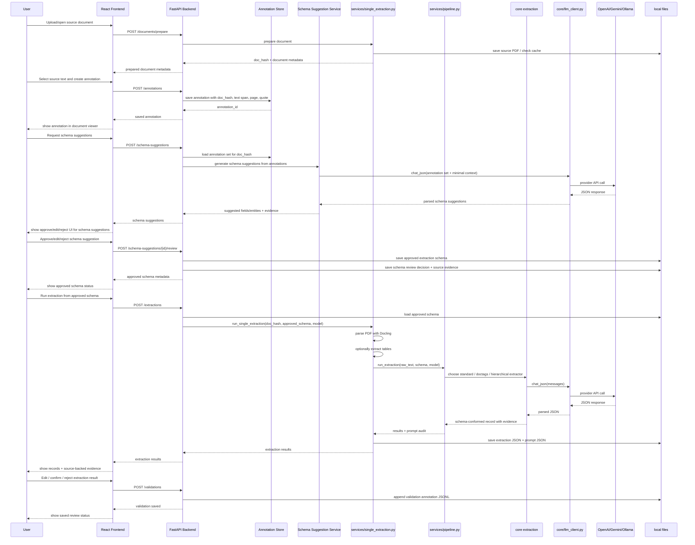

```mermaid
sequenceDiagram
    participant U as User
    participant FE as React Frontend
    participant API as FastAPI Backend
    participant A as Annotation Store
    participant SG as Schema Suggestion Service
    participant S as services/single_extraction.py
    participant P as services/pipeline.py
    participant C as core extraction
    participant L as core/llm_client.py
    participant M as OpenAI/Gemini/Ollama
    participant FS as local files

    U->>FE: Upload/open source document
    FE->>API: POST /documents/prepare
    API->>S: prepare document
    S->>FS: save source PDF / check cache
    S-->>API: doc_hash + document metadata
    API-->>FE: prepared document metadata

    U->>FE: Select source text and create annotation
    FE->>API: POST /annotations
    API->>A: save annotation with doc_hash, text span, page, quote
    A-->>API: annotation_id
    API-->>FE: saved annotation
    FE-->>U: show annotation in document viewer

    U->>FE: Request schema suggestions
    FE->>API: POST /schema-suggestions
    API->>A: load annotation set for doc_hash
    API->>SG: generate schema suggestions from annotations
    SG->>L: chat_json(annotation set + minimal context)
    L->>M: provider API call
    M-->>L: JSON response
    L-->>SG: parsed schema suggestions
    SG-->>API: suggested fields/entities + evidence
    API-->>FE: schema suggestions
    FE-->>U: show approve/edit/reject UI for schema suggestions

    U->>FE: Approve/edit/reject schema suggestion
    FE->>API: POST /schema-suggestions/{id}/review
    API->>FS: save approved extraction schema
    API->>FS: save schema review decision + source evidence
    API-->>FE: approved schema metadata
    FE-->>U: show approved schema status

    U->>FE: Run extraction from approved schema
    FE->>API: POST /extractions
    API->>FS: load approved schema
    API->>S: run_single_extraction(doc_hash, approved_schema, model)
    S->>S: parse PDF with Docling
    S->>S: optionally extract tables
    S->>P: run_extraction(raw_text, schema, model)
    P->>C: choose standard / doctags / hierarchical extractor
    C->>L: chat_json(messages)
    L->>M: provider API call
    M-->>L: JSON response
    L-->>C: parsed JSON
    C-->>P: schema-conformed record with evidence
    P-->>S: results + prompt audit
    S->>FS: save extraction JSON + prompt JSON
    S-->>API: extraction results
    API-->>FE: extraction results
    FE-->>U: show records + source-backed evidence

    U->>FE: Edit / confirm / reject extraction result
    FE->>API: POST /validations
    API->>FS: append validation annotation JSONL
    API-->>FE: validation saved
    FE-->>U: show saved review status
```