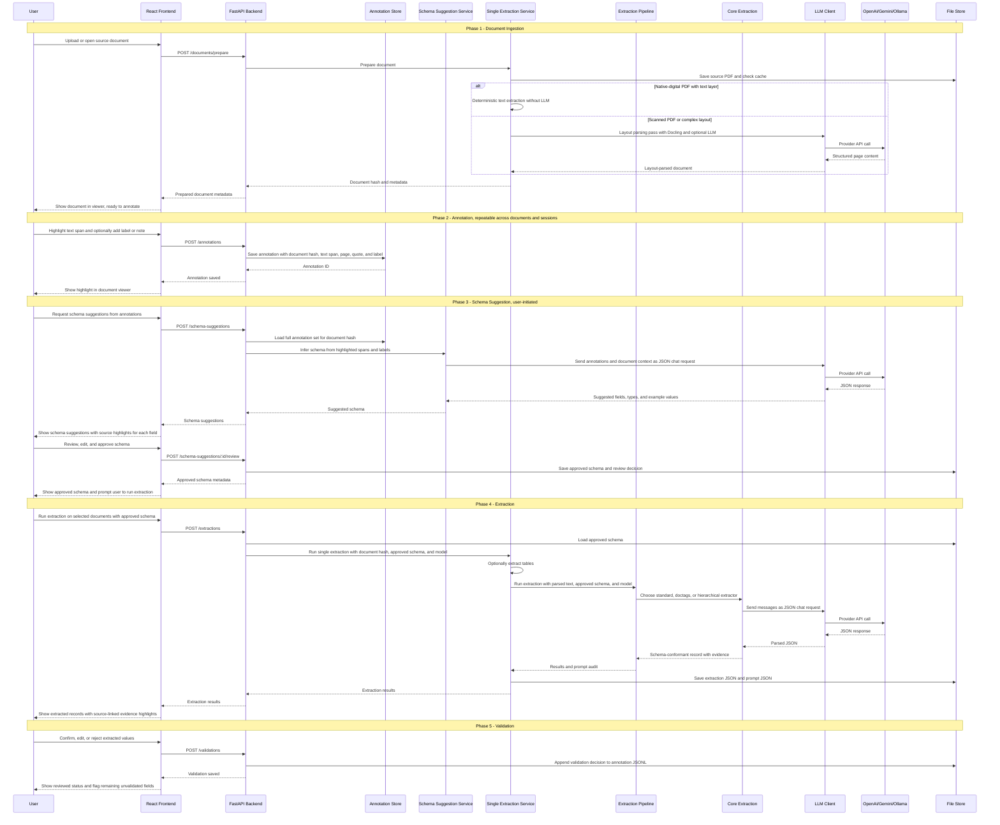

```mermaid
sequenceDiagram
    participant U as User
    participant FE as React Frontend
    participant API as FastAPI Backend
    participant A as Annotation Store
    participant SG as Schema Suggestion Service
    participant S as Single Extraction Service
    participant P as Extraction Pipeline
    participant C as Core Extraction
    participant L as LLM Client
    participant M as OpenAI/Gemini/Ollama
    participant FS as File Store

    Note over U,FS: Phase 1 - Document Ingestion

    U->>FE: Upload or open source document
    FE->>API: POST /documents/prepare
    API->>S: Prepare document
    S->>FS: Save source PDF and check cache

    alt Native-digital PDF with text layer
        S->>S: Deterministic text extraction without LLM
    else Scanned PDF or complex layout
        S->>L: Layout parsing pass with Docling and optional LLM
        L->>M: Provider API call
        M-->>L: Structured page content
        L-->>S: Layout-parsed document
    end

    S-->>API: Document hash and metadata
    API-->>FE: Prepared document metadata
    FE-->>U: Show document in viewer, ready to annotate

    Note over U,FS: Phase 2 - Annotation, repeatable across documents and sessions

    U->>FE: Highlight text span and optionally add label or note
    FE->>API: POST /annotations
    API->>A: Save annotation with document hash, text span, page, quote, and label
    A-->>API: Annotation ID
    API-->>FE: Annotation saved
    FE-->>U: Show highlight in document viewer

    Note over U,FS: Phase 3 - Schema Suggestion, user-initiated

    U->>FE: Request schema suggestions from annotations
    FE->>API: POST /schema-suggestions
    API->>A: Load full annotation set for document hash
    API->>SG: Infer schema from highlighted spans and labels
    SG->>L: Send annotations and document context as JSON chat request
    L->>M: Provider API call
    M-->>L: JSON response
    L-->>SG: Suggested fields, types, and example values
    SG-->>API: Suggested schema
    API-->>FE: Schema suggestions
    FE-->>U: Show schema suggestions with source highlights for each field

    U->>FE: Review, edit, and approve schema
    FE->>API: POST /schema-suggestions/:id/review
    API->>FS: Save approved schema and review decision
    API-->>FE: Approved schema metadata
    FE-->>U: Show approved schema and prompt user to run extraction

    Note over U,FS: Phase 4 - Extraction

    U->>FE: Run extraction on selected documents with approved schema
    FE->>API: POST /extractions
    API->>FS: Load approved schema
    API->>S: Run single extraction with document hash, approved schema, and model
    S->>S: Optionally extract tables
    S->>P: Run extraction with parsed text, approved schema, and model
    P->>C: Choose standard, doctags, or hierarchical extractor
    C->>L: Send messages as JSON chat request
    L->>M: Provider API call
    M-->>L: JSON response
    L-->>C: Parsed JSON
    C-->>P: Schema-conformant record with evidence
    P-->>S: Results and prompt audit
    S->>FS: Save extraction JSON and prompt JSON
    S-->>API: Extraction results
    API-->>FE: Extraction results
    FE-->>U: Show extracted records with source-linked evidence highlights

    Note over U,FS: Phase 5 - Validation

    U->>FE: Confirm, edit, or reject extracted values
    FE->>API: POST /validations
    API->>FS: Append validation decision to annotation JSONL
    API-->>FE: Validation saved
    FE-->>U: Show reviewed status and flag remaining unvalidated fields
```