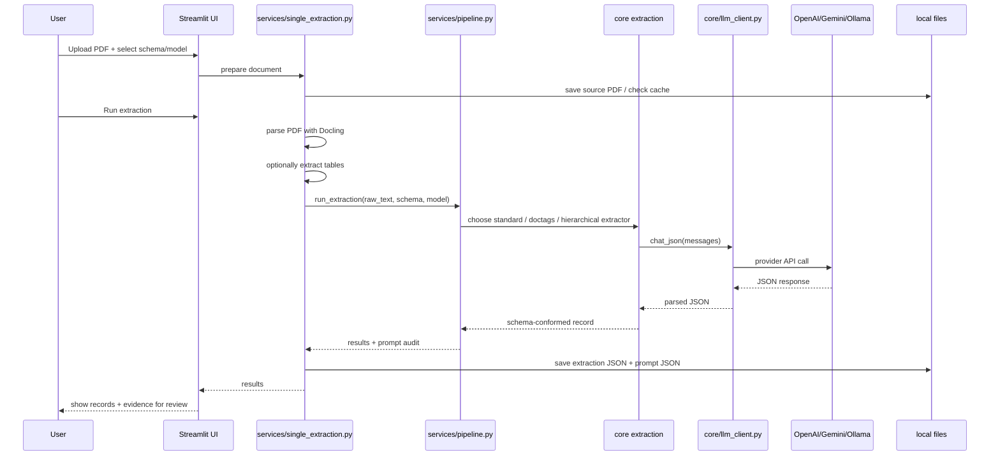

```mermaid
sequenceDiagram
    participant U as User
    participant UI as Streamlit UI
    participant S as services/single_extraction.py
    participant P as services/pipeline.py
    participant C as core extraction
    participant L as core/llm_client.py
    participant M as OpenAI/Gemini/Ollama
    participant FS as local files

    U->>UI: Upload PDF + select schema/model
    UI->>S: prepare document
    S->>FS: save source PDF / check cache
    U->>UI: Run extraction
    S->>S: parse PDF with Docling
    S->>S: optionally extract tables
    S->>P: run_extraction(raw_text, schema, model)
    P->>C: choose standard / doctags / hierarchical extractor
    C->>L: chat_json(messages)
    L->>M: provider API call
    M-->>L: JSON response
    L-->>C: parsed JSON
    C-->>P: schema-conformed record
    P-->>S: results + prompt audit
    S->>FS: save extraction JSON + prompt JSON
    S-->>UI: results
    UI-->>U: show records + evidence for review
```