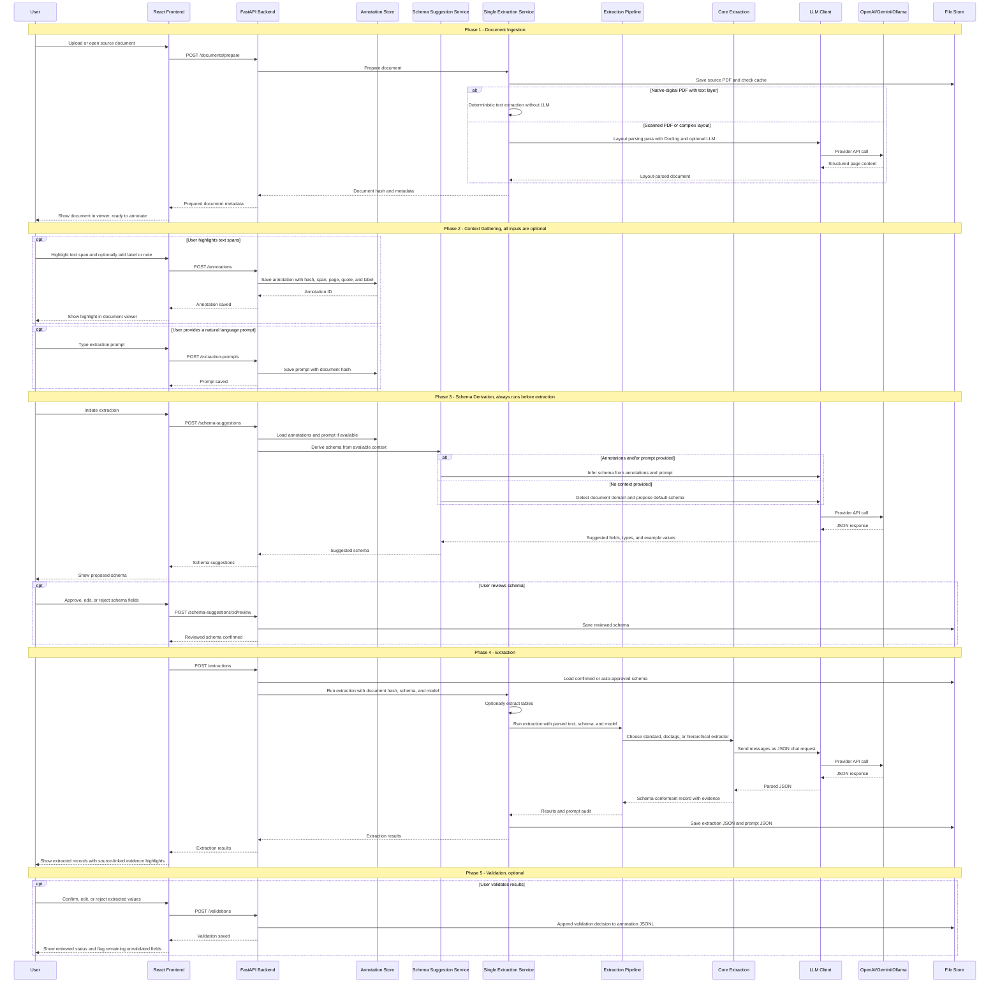

# FREE architecture

The sequence below describes the wider researcher workflow. For the implemented
source-document ingestion boundary, see
[Canonical source document parsing](parsing-service.md). Its table, OCR,
geometry, and evaluation rules are recorded in
[Parsing quality policy](parsing-quality.md).

