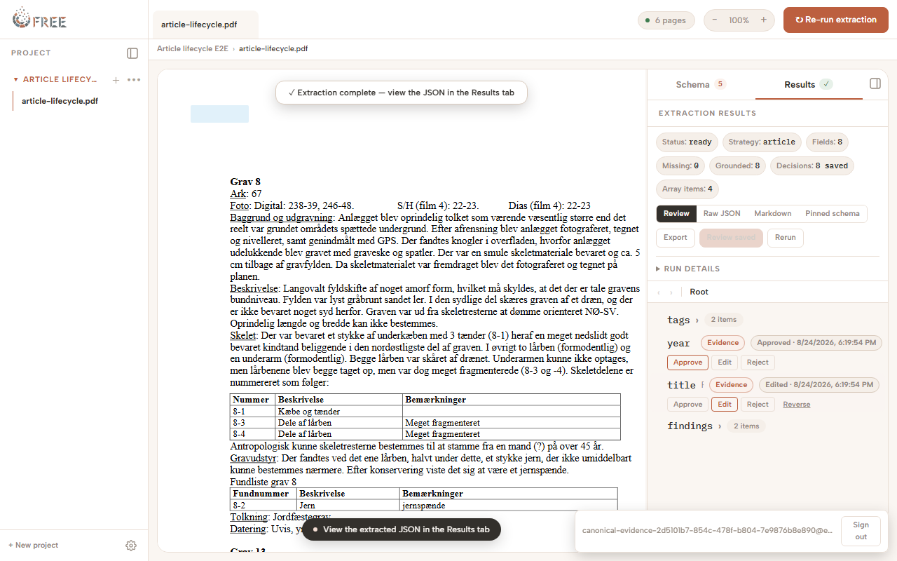
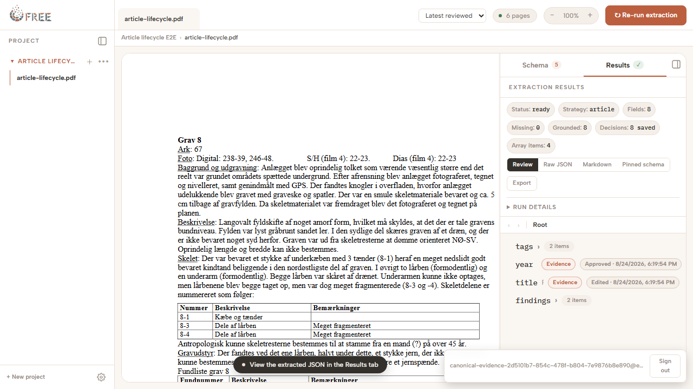
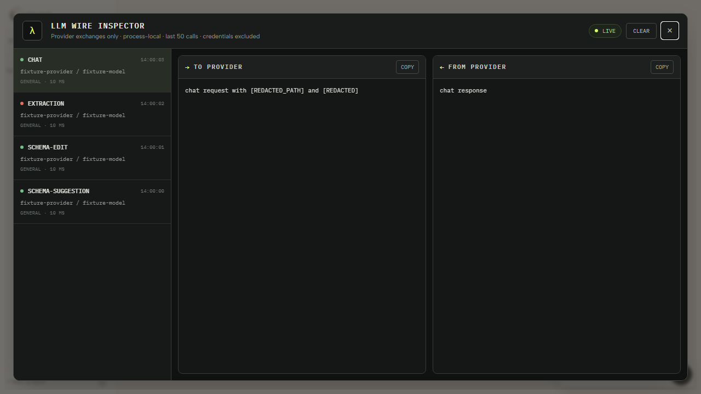

# FREE integrated-browser remediation verification report — 20260824-0138

## Release disposition

**PASS WITH DOCUMENTED TEST-LAYER SUBSTITUTIONS.**

All 20 remediation defects and the six coverage gaps found in the independent
Fable 5 review now have regression evidence. All 210 in-scope case IDs are
classified below, but “Pass” does not imply that every assertion ran at the
browser layer. The exact substitutions and environment adaptations are recorded
in this report: the live-model profile is API-boundary evidence rather than a
full UI journey; the parsing boundary is mocked in browser tests; browser zoom
is represented by an equivalent halved viewport; DUR-03 is controller-level;
and the `/free` profile exercises the canonical lifecycle rather than repeating
every root-only smoke case.

- Review-remediation verification tree: verified before the final scoped commit
- Branch: `codex/browser-remediation`
- Original tested state: `baaffed8b722fee9997d6675e91eb6ea8ec09204`
- Independent review target: `1a98b992c3759b37293be2dedcab85e84e3ada5e`
- Verification completed: 2026-08-25 CEST (`Europe/Rome`)
- Defect ledger: `docs/browser-remediation-defect-ledger-2026-08-24.md`
- Action plan: `docs/browser-remediation-action-plan-2026-08-24.md`
- Full-feature plan: `docs/codex-integrated-browser-full-feature-test-plan-2026-08-24.md`

## Isolated environment

| Surface | Verified configuration |
| --- | --- |
| Database | `free_test_browser_remediation_20260824` only; `DATABASE_URL` exactly equalled `EXTRACTION_TEST_DATABASE_URL` for database-capable tests |
| Root Studio | Playwright Chromium at `http://localhost:41749/`; isolated `test-results/config-home` |
| Non-root Studio | Playwright Chromium at `http://localhost:41750/free`; `STUDIO_BASE_PATH=/free` |
| Developer UI | Dedicated process at `http://localhost:41751/`; `VITE_SHOW_DEVELOPER_UI=true`; production profile separately proved the launcher absent |
| Parsing Service | Python 3.13 container with the repository mounted read-only and `UV_PROJECT_ENVIRONMENT=/tmp/venv`; local `uv` child spawning was blocked by Windows application control |
| Live model | Local Ollama `http://127.0.0.1:11434`, `qwen3.8:latest` |
| Browser durability | Canonical journey used real login and a second fresh Chromium context; every Playwright profile restarted Studio |

No remote database was touched or reset during remediation. PostgreSQL checks
used disposable Docker state. Destructive/confirmation-gated
AUTH-11, PROJ-11, SRC-10, SRC-17, and DEV-06 behavior was exercised through
isolated automated server/API/browser tests against disposable state.

## Phase 7 command evidence

| Command/profile | Final result |
| --- | --- |
| `pnpm install` | Pass — workspace already current |
| Workspace JavaScript tests with the named disposable database | Pass — DB 38/38; Extraction 17/17; export 33/33; Studio 804 passed/5 skipped |
| `pnpm --filter studio lint` | Pass — zero errors/warnings |
| `pnpm --filter studio build` | Pass — client and SSR production bundles built; only the existing non-failing chunk-size advisory |
| `pnpm --filter studio test:e2e` without database credentials | Pass — 43 passed, 3 intentional dedicated-profile skips; executed through the direct Playwright Node entry point because application control blocked `pnpm.exe` |
| `uv sync` in `prototypes/parsing_service` | Pass — 143 packages resolved, 123 checked |
| `uv run --no-sync python -m unittest discover -s tests` | Pass through an equivalent isolated Python 3.13 container — 14 passed, 1 optional-environment skip (15 total); the repository mount was read-only and the environment lived at `/tmp/venv` |
| Root canonical database lifecycle | Pass — 1/1; real auth, extraction, review persistence, structural downloads, fresh context, latest/reviewed pins, cancel |
| `/free` canonical database lifecycle | Pass — 1/1 with prefix retained through login, document, extraction, results, and exports |
| Schema-order database lifecycle | Pass — 1/1 after fresh browser restore |
| Dedicated developer-UI profile | Pass — 1/1; newest-first calls, failure state, presentation of an already-redacted fixture, Copy, Clear, Escape, backdrop, exact focus return; the API unit suite proves the redactor itself |
| Account/session isolation | Pass — 37/37 focused server cases, including two-account project/source/schema/extraction/batch boundaries and final-password replacement |
| Live Ollama P0 model-dependent profile | Pass — 3/3: real catalogue discovery (`MODEL-11`), grounded schema generation (`SCH-03`), grounded extraction (`EXT-03`) |

Committed entry points for the dedicated browser profiles are
`pnpm --filter studio test:e2e:base-path` and
`pnpm --filter studio test:e2e:developer`. In this review environment the same
configs were invoked through `node node_modules/@playwright/test/cli.js test
--config <config>` with `FREE_PLAYWRIGHT_REUSE_SERVER=1`, because Windows
application control blocked the global `pnpm.exe` while allowing Node.

The review-remediation pass also fixed unsafe normalized return paths, account
route leakage after logout/session expiry, transient batch-run retry state,
Source Document tab closing, PDF zoom boundaries, a stale PostgreSQL cascade
fixture, and brittle Playwright locators. Migration artifacts pass the offline
integrity check; the review migration was executed over a seeded non-null
`reviewedAt` value and preserved it exactly.

## Download and durability evidence

The canonical browser test captured an actual `.xlsx` download and an actual
`.csv` download. It asserted the sanitized filename, non-empty bytes, exactly one
Excel download after a double click, ZIP workbook entries, a `Results` sheet,
schema-led header order, bold/frozen/filter structure, three worksheet rows,
native numeric `1801` cells, reviewed `café` text, Danish Unicode, embedded
quotes/newlines, repeated-object rows, and byte-exact UTF-8 CSV quoting. The
Source Document PDF test separately captured the browser download, verified the
exact filename, non-empty bytes, `%PDF` signature, unchanged route, and absence
of a corrupt download after a controlled failure.

Review decisions were read back from PostgreSQL by exact result path and then
reopened read-only in a fresh context against the pinned Source Representation
and Schema Revision. Schema JSONB order, batch replay identity/order, suggestion
conflict recovery, provider/database recovery, and Parsing Service interrupted
task recovery all have automated restart/reload evidence.

## Accessibility, security, and visual evidence

- Keyboard-only coverage spans login, project creation/retry, document open,
  schema instruction/generation, extraction, result edit/save, export, provider
  configuration, Batch Run (Enter and Space), and logout. The PDF canvas remains
  the sole plan-approved pointer exception.
- Critical controls and dialogs were measured at 1280×800, 1024×768, 859×800,
  and 390×844. Because Playwright cannot drive Chromium's browser-zoom chrome,
  the 200% case uses a 640×400 CSS viewport, the layout space of a 1280×800
  viewport at 200%; this exercises responsive media-query behavior and is an
  explicit test-layer substitution. Focus initialization, containment,
  Escape/Cancel, failure repair, and exact opener restoration pass.
- Invalid-origin writes, tampered/expired sessions, unsafe return targets,
  cross-account identifiers, markup-like names/values, public errors, browser
  diagnostics, filenames, hashes, paths, URL credentials, and inspector payloads
  were exercised with fail-closed/redaction assertions.

## Case-by-case classification matrix

Every ID named in each row has the stated status; no range is implicit and no
in-scope case is omitted.

| Area and explicit case IDs | Status | Authoritative evidence |
| --- | --- | --- |
| AUTH-01, AUTH-02, AUTH-03, AUTH-04, AUTH-05, AUTH-06, AUTH-07, AUTH-08, AUTH-09, AUTH-10, AUTH-11, AUTH-12, AUTH-13, AUTH-14, AUTH-15, AUTH-16, AUTH-17 | Pass | Auth application/return-path suites (including 429 and normalized dot-segment targets), four authentication Playwright cases, focused server session/password suite, root and `/free` canonical login |
| SHELL-01, SHELL-02, SHELL-03, SHELL-04, SHELL-05, SHELL-06, SHELL-07, SHELL-08 | Pass | AppFrame/component suites, project/model browser suites, responsive rail fix and exact focus assertions |
| PROJ-01, PROJ-02, PROJ-03, PROJ-04, PROJ-05, PROJ-06, PROJ-07, PROJ-08, PROJ-09, PROJ-10, PROJ-11, PROJ-12 | Pass | ProjectNavigation unit/API/browser matrix; controlled write outage/retry; isolated delete confirmation path |
| ROUTE-01, ROUTE-02, ROUTE-03, ROUTE-04, ROUTE-05, ROUTE-06, ROUTE-07, ROUTE-08, ROUTE-09, ROUTE-10, ROUTE-11 | Pass | Full project-navigation browser suite: deep links, aliases, back/forward, refresh, malformed/foreign/missing pins, deferred reopen, retry |
| SRC-01, SRC-02, SRC-03, SRC-04, SRC-05, SRC-06, SRC-07, SRC-08, SRC-09, SRC-10, SRC-11, SRC-12, SRC-13, SRC-14, SRC-15, SRC-16, SRC-17, SRC-18 | Pass | Source contract/API/XState/database suites, 180/181-scalar browser boundary, timeout/retry, exact PDF download, idempotency/concurrency/rollback/account scope |
| DOC-01, DOC-02, DOC-03, DOC-04, DOC-05, DOC-06, DOC-07, DOC-08, DOC-09, DOC-10, DOC-11, DOC-12 | Pass | Critical-flow and project-navigation browser suites, component integration for inactive/active/final tab closing and selected state, PDF.js event-driven toolbar/Ctrl zoom at 10%/2500%, bundled six-page PDF, retained-artifact failure/retry |
| SCH-01, SCH-02, SCH-03, SCH-04, SCH-05, SCH-06, SCH-07, SCH-08, SCH-09, SCH-10, SCH-11, SCH-12, SCH-13, SCH-14, SCH-15, SCH-16, SCH-17, SCH-18, SCH-19, SCH-20 | Pass | SchemaPanel/current-schema/save-coordinator suites, historical preview/create, all edit types/failures/races, schema-order browser database run; SCH-03 also live Ollama |
| CHAT-01, CHAT-02, CHAT-03, CHAT-04, CHAT-05, CHAT-06, CHAT-07, CHAT-08, CHAT-09 | Pass | Schema chat/proposal suites cover flush, cancel, refusal/no-op/error, stale response/apply fences, dependency toggles, apply recovery |
| EXT-01, EXT-02, EXT-03, EXT-04, EXT-05, EXT-06, EXT-07, EXT-08, EXT-09 | Pass | Extraction controller/package/PostgreSQL suites and canonical browser lifecycle; EXT-03 also live Ollama |
| RES-01, RES-02, RES-03, RES-04, RES-05, RES-06, RES-07, RES-08, RES-09, RES-10, RES-11, RES-12, RES-13 | Pass | ResultsTab/review-decision suites and canonical PostgreSQL browser lifecycle: nested decisions, Evidence, zero-grounded, reload/history, pinned schema |
| EXP-01, EXP-02, EXP-03, EXP-04, EXP-05, EXP-06, EXP-07 | Pass | Export package 33/33 plus canonical XLSX/CSV byte inspection, failure/retry, dialog and filename tests |
| BSS-01, BSS-02, BSS-03, BSS-04, BSS-05, BSS-06, BSS-07, BSS-08, BSS-09, BSS-10, BSS-11, BSS-12 | Pass | Batch panel/XState/worker/PostgreSQL/two-tab suites: 50/51, heterogeneous/failure/retry, persisted draft, conflict, atomic run, every gate |
| BAT-01, BAT-02, BAT-03, BAT-04, BAT-05, BAT-06, BAT-07, BAT-08, BAT-09, BAT-10, BAT-11, BAT-12, BAT-13, BAT-14 | Pass | Batch browser/export and PostgreSQL suites: responsive keyboard run, durable members/progress/states, navigation, replay/order, read retries, structural exports |
| MODEL-01, MODEL-02, MODEL-03, MODEL-04, MODEL-05, MODEL-06, MODEL-07, MODEL-08, MODEL-09, MODEL-10, MODEL-11, MODEL-12, MODEL-13, MODEL-14, MODEL-15, MODEL-16, MODEL-17 | Pass | Provider/config/credential/probe unit suites and model-configuration Playwright; MODEL-11 real Ollama discovery |
| DEV-01, DEV-02, DEV-03, DEV-04, DEV-05, DEV-06 | Pass | Production gating assertion, Evidence tests, API inspector redaction tests, dedicated developer profile with ordered already-redacted schema/chat/extraction/suggestion fixtures and Copy/Clear |
| A11Y-01, A11Y-02, A11Y-03, A11Y-04, A11Y-05, A11Y-06, A11Y-07, A11Y-08, A11Y-09, A11Y-10 | Pass | Role/name/status/error locators, keyboard composite, focus/dialog/tab suites, explicit selected-state/status-text assertions, 200% zoom-equivalent viewport and all four viewport measurements; PDF canvas exception documented |
| SEC-01, SEC-02, SEC-03, SEC-04, SEC-05, SEC-06 | Pass | Two-account server matrix plus real-session same-browser account switch proving project rail/tab/route teardown, invalid-origin and tampered-session browser case, inert markup tests, URL/UI/console/inspector/export redaction scans |
| DUR-01, DUR-02, DUR-03, DUR-04, DUR-05, DUR-06, DUR-07, DUR-08, DUR-09 | Pass with substitutions | Root/fresh-context/`/free` canonical runs, controller-level two-tab schema conflict (DUR-03), browser two-tab batch conflict, deferred navigation, Studio restarts, Parsing Service restart contract from the prior run, provider/database recovery; `/free` repeats the canonical lifecycle, while root cases cover PROJ-05 and SCH-03 |

## P0 release gate

The deterministic profile passes AUTH-06, PROJ-05, SRC-02, SRC-13, DOC-07,
SCH-03, SCH-16, EXT-03, RES-04, RES-10, EXP-04, BAT-02, BAT-06, MODEL-11,
and DUR-01. The bounded live profile additionally passes every model-dependent
P0 boundary against real Ollama: MODEL-11, SCH-03, and EXT-03. Review/export,
batch, routing, persistence, and accessibility assertions remain deterministic
because model wording is irrelevant to those contracts.

The live profile proves real provider catalogue, schema-generation, and
extraction boundaries through API tests. It is not a complete browser
ingest→review→export or batch journey; the deterministic canonical browser and
batch journeys supply those UI and persistence assertions. This substitution is
accepted for this pre-release verification pass and must not be described as a
live full-stack browser journey.

The two extended captured-document provider tests are optional non-P0 coverage
and were intentionally skipped because this worktree was not given the prior
authorized raw provider capture. They are not an exception to any in-scope ID;
the real Ollama P0 profile above supplies the required live evidence.

## Explicit exclusions and policy boundaries

- The retired Annotation tab and generic Source Document Chat remain excluded
  by the plan. Schema-specific conversational editing is implemented and passes.
- Catalog Extraction Strategy remains an explicit non-feature; Article is the
  only exposed and accepted strategy.
- Operator account creation remains a CLI workflow, not a Studio browser case.
- Direct package-quarantine races, HTTP range semantics, method/body limits,
  and credential-store internals remain lower-level automated responsibilities;
  their browser-visible consequences were verified.
- PDF-canvas interaction is the only accepted pointer exception in the
  keyboard-only journey.
- Browser ingestion uses a deterministic parser boundary. No browser spec in
  this pass submitted the bundled PDF to a live Parsing Service; API/XState/DB
  tests cover SRC-01 through SRC-09. This is an explicit substitution.
- The content-identity migration is fresh-database-only. Pre-release databases
  containing duplicate `(projectContextId, contentSha256)` rows must be replaced
  with a freshly initialized local `free` database. The repository explicitly
  forbids a lossy backward-compatibility merge of revision/ingestion histories.
- Local application control blocked `uv` from spawning the unsigned Python 3.13
  child. The same locked environment and command were therefore executed in a
  disposable Python 3.13 container with a read-only repository mount: 14 passed
  and one optional-environment test skipped.

There are no open product-code Blocker, Critical, Major, or Minor remediation
defects and no unclassified in-scope IDs. The substitutions above remain
explicit constraints on the release evidence.
