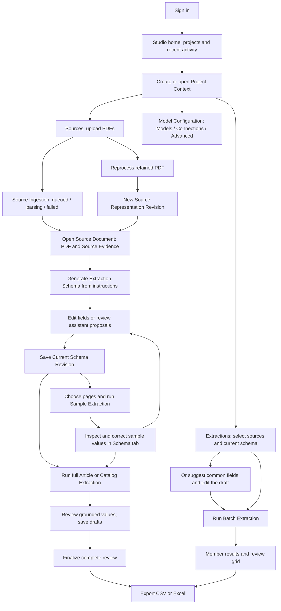

# FREE Studio: UX workflows and E2E user-story catalogue

Date: 2026-10-01. Status: source-backed test-design catalogue; no application code changed and no browser tests executed for this analysis.

Scope: FREE Studio, including its authenticated ingestion, schema, extraction, Evidence, review and export workflows. The internal Parsing Service is included where it affects the researcher's experience, not as a separate application.

Baseline: Git HEAD `54c22483adc25d1bd56a26cde7300d14b9fefaa6`, plus the current working tree inspected on this date. Existing changes to local-development documentation, the Sample Extraction workbench tasks, its integration plan/evidence, and the untracked unified-Catalog proposal were present. Additional concurrent application edits appeared during the analysis; this is an inspected-source snapshot, not verification of a frozen release candidate. This document does not treat proposals as delivered features. A request to the supported local HTTPS address found no running application; the findings below come from current source, product contracts and test definitions, not observed browser execution. Subsequent deployment observations are recorded separately in the [exploratory browser record](2026-10-01-studio-exploratory-browser.md).

The [root README](../../README.md) is the normative product contract. Use [CONTEXT.md](../../CONTEXT.md) for domain terms, [Studio README](../../prototypes/studio/README.md) for current behavior, and the [existing E2E coverage inventory](2026-10-01-e2e-existing-coverage.md) when assigning these stories to tests. This catalogue describes test targets; the inventory describes assertions already written. Neither is a passing-test receipt.

## 1. The researcher's workflow

The primary actor is an authenticated **Researcher Account** working in its own **Project Contexts**. A second account is essential for ownership tests. A second tab or browser context using the same account is essential for concurrency tests. The deployment operator supplies services and deployment connections but has no Studio administration workflow in this scope.

A user does not need to visit every branch. Model configuration may use deployment defaults. Sampling is optional. Schema Suggestion supports the schema-guided path; the current Studio UI does not expose a separate schema-free Direct Extraction journey.

### Screens and continuity

| Surface | User intent and entry | Important exits and continuity |
| --- | --- | --- |
| Authentication and recovery | Sign in, renew a session, recover access, sign out | Return to the requested owned route; local recovery belongs to the account. |
| Studio home and project rail | Resume a project or create one | Summaries and activity link into owned research state; list errors differ from an empty account. |
| Project Sources | Upload, find, download, reprocess or delete PDFs | Browser upload queue and admitted Source Ingestions have different lifetimes. |
| Project Schemas | See schemas, names and Current Schema Revision | Schema editing also occurs in document and batch preparation surfaces. |
| Document workspace | Read PDF; use Schema, Evidence and Results panels | Open document tabs are local UI state; source and extraction identities come from routes. |
| Schema panel | Generate, edit, inspect history, try sample values | Autosave creates immutable revisions; an assistant proposal needs Apply changes. |
| Results panel | Follow a full Extraction, inspect values and Evidence, review | Normal complete reviews save automatically; carried decisions require explicit finalization. |
| Project Extractions | Prepare a batch, inspect history and members | Replayed selection opens existing batch; Run again creates a fresh batch. |
| Batch review grid | Compare and review member results | Open the exact member Extraction in the document workspace, then return to the grid. |
| Model Configuration | Select models, manage personal connections and method settings | Apply commits the draft; Discard restores saved choices; keys are browser-local. |
| Export options | Choose row meaning, treatment of other repeated fields and format | Single and batch exports use the schema pinned to the exported results. |

### States that must stay distinct in tests

| Dimension | States / boundary | Why it matters |
| --- | --- | --- |
| Access | resolving session, authenticated, expiring, expired, signed out, unavailable | Project data must not flash before authentication or after account changes. |
| Ingestion | unsent file, sending, admitted, queued, parsing, failed, published Source Document | Only admitted work is durable; a missing local File cannot be recovered after reload. |
| Source identity | current revision versus revision pinned to an earlier Extraction | Reprocessing must not rewrite historical Evidence or reviews. |
| Schema | empty, generating, editable draft, saving, saved, conflict, historical preview | Extraction must use an acknowledged revision, never a merely visible draft. |
| Extraction | queued, running, cancellation requested, terminal success/failure | Execution status, result availability and completeness are separate assertions. |
| Evidence | grounded, ungrounded, geometry available/unavailable, cell/segment/input precision | A populated value is not automatically supported, locatable or reviewable. |
| Review | untouched, locally decided, saved draft, conflict, finalized, reverted | Draft persistence does not make a review authoritative. |
| Sample transfer | as reviewed, fixed, changed, unmatched | Carried decisions are drafts, and require identity/value/Evidence agreement. |
| Batch | per-member pending/success/failure/cancellation; existing versus fresh run | One failed member must not hide successful members or inflate export coverage. |
| Configuration | saved versus draft; requested versus effective run method | Configuration edits apply to future admissions, never rewrite admitted work. |

## 2. How to turn the catalogue into tests

Every story below reads as “As a researcher, I want to … so that …”. The acceptance column supplies a concrete **Given → When → Then** scenario. Split alternatives into parameterized cases; a story is not necessarily one Playwright test.

Priority: **P0** protects ownership, research correctness or the main complete journey; **P1** covers important everyday and recovery behavior; **P2** covers secondary ergonomics. Suggested minimum tier:

- **B**: browser scenario; controlled response fixtures are acceptable for UI states, but do not claim backend proof.
- **S**: browser through real Studio, authentication and persistence, with a deterministic Parsing Service/model boundary. Do not fulfill the API under assertion with `page.route`.
- **R**: recovery/service test that controls process lifecycle or runs the real Parsing Service. Combine a browser assertion with backend checks when the claim concerns identity, revisions, durability or artifacts.

Unless marked **contract**, a row is backed by the cited current source and is an implementation-derived test target. **Contract** means the normative requirement should be tested even if the cited UI alone cannot prove it. No row promises that a fresh execution will pass. Future-only stories are isolated in section 5.

For persistence stories, assert the UI outcome, reopen from another authenticated page, and compare resource IDs/revisions or authorized API reads. For negative admission stories, also assert no new Extraction, batch or schema revision was created. Use a fresh account and isolated disposable stack; follow the [verification boundary](../../README.md#verification) and [local-development runbook](../operations/local-development.md). Never reset a deployment database to prepare these tests.

## 3. User stories and acceptance scenarios

### AUTH — Authentication, account boundaries and session recovery

Sources: [authentication UI](../../prototypes/studio/src/auth/AuthApplication.tsx), [account controls](../../prototypes/studio/src/auth/AuthForms.tsx), [recovery envelope](../../prototypes/studio/src/auth/sessionRecovery.ts), [server authentication](../../prototypes/studio/server/app.ts), [product contract](../../README.md#product-contract).

| ID | Priority / tier | User story | Given → When → Then |
| --- | --- | --- | --- |
| AUTH-01 | P0 / S | Sign in to access my research. | Given no session, when I complete mock OIDC sign-in, then my account is shown and my workspace loads through the real authentication path. |
| AUTH-02 | P0 / S | Resume a protected deep link after sign-in. | Given an owned document or batch URL, when I authenticate, then that resource and view open rather than an unrelated home screen. |
| AUTH-03 | P0 / S | Keep my research private from another account. | Given accounts A and B, when B opens A's project/document/schema/extraction/Evidence IDs, then no owned data or mutation is exposed. **Contract:** include direct authorized API requests as well as navigation. |
| AUTH-04 | P1 / B | Distinguish unavailable authentication from an empty account. | Given session lookup fails, when Studio opens, then it displays a session error and Retry; it does not display an empty project list. |
| AUTH-05 | P1 / B | Recover a failed workspace load. | Given authentication succeeds but the workspace read fails, when I retry, then my account remains visible and the workspace can load. |
| AUTH-06 | P1 / S | Renew a session before it expires. | Given expiry is approaching, when I choose Continue session, then authentication renews and returns to my research route. |
| AUTH-07 | P0 / S | Recover work after a write discovers expiry. | Given an expired session and an unsaved schema/review edit, when a protected request triggers authentication, then bounded recovery for the same account restores applicable edits without duplicating admission. |
| AUTH-08 | P0 / S | Prevent recovery into the wrong account. | Given A has recovery data, when I authenticate as B, then A's drafts, account data and credentials are not restored for B. |
| AUTH-09 | P0 / S | Sign out completely. | Given a signed-in account with stored browser keys, when I sign out, then the signed-out page appears and that account's keys and local recovery data are cleared. |
| AUTH-10 | P0 / S | Stay signed out through browser history. | Given I signed out, when I use Back or restore a cached page, then Studio revalidates access and does not expose the previous workspace. |
| AUTH-11 | P1 / B | Sign in even when browser recovery storage is unavailable. | Given storage throws or a recovery envelope is invalid/expired, when I authenticate, then authentication continues without restoring invalid data. |
| AUTH-12 | P0 / R | Use the deployed URL prefix consistently. | Given Studio under `/free`, when I sign in, deep-link, refresh and sign out, then callbacks, assets, PDFs and API paths retain the prefix. **Contract:** run against the proxy for proxy parity. |

### PRJ — Project lifecycle and home

Sources: [home](../../prototypes/studio/src/projectContexts/StudioHome.tsx), [creation](../../prototypes/studio/src/projectContexts/CreateProjectModal.tsx), [project page](../../prototypes/studio/src/projectContexts/ProjectContextPage.tsx), [project provider](../../prototypes/studio/src/projectContexts/ProjectContextsProvider.tsx), [product lifecycle contract](../../README.md#product-contract).

| ID | Priority / tier | User story | Given → When → Then |
| --- | --- | --- | --- |
| PRJ-01 | P0 / S | Begin with a clear empty workspace. | Given a fresh account, when home loads, then it has no seeded project or personal configuration and offers project creation. |
| PRJ-02 | P0 / S | Create a named Project Context. | Given home, when I submit a valid project name, then exactly one owned project is created and can be reopened after reload. |
| PRJ-03 | P1 / B | Correct an invalid project name. | Given the create dialog, when I submit blank/invalid input, then an associated error appears and no project is created; correcting it permits submission. |
| PRJ-04 | P1 / B | Cancel project creation. | Given the create dialog, when I cancel or dismiss it, then no project is created and focus returns to the opener. |
| PRJ-05 | P1 / B | Retry a failed project creation. | Given the server refuses creation, when the dialog shows the error, then my name remains available and a subsequent successful submit creates one project. |
| PRJ-06 | P0 / S | Rename a project without losing its contents. | Given a project containing sources and results, when I save a new name, then home, rail and project heading update; the project's ID and contents remain. |
| PRJ-07 | P1 / B | Abandon a project rename safely. | Given rename is active, when I cancel, then the saved name returns; invalid input or a failed save does not report success. |
| PRJ-08 | P0 / S | Confirm permanent project deletion. | Given a populated project, when I confirm Delete project, then it disappears from owned listings and I return to a valid route; its dependent resources are inaccessible. |
| PRJ-09 | P1 / B | Cancel or retry project deletion. | Given the delete dialog, when I cancel, then data remains; when deletion fails, then the error remains visible and the project stays available. |
| PRJ-10 | P0 / R | Preserve shared files when deleting one project. | Given identical PDFs referenced by two projects, when one project is deleted and cleanup runs, then the surviving project's PDF and Evidence still open. **Contract:** inspect artifacts in a service/system test. |
| PRJ-11 | P1 / S | Understand project progress. | Given projects with ingestion, schema, full extraction, review and stale states, when home loads, then summaries represent those durable states; samples do not inflate full-extraction/review counts. |
| PRJ-12 | P1 / S | Resume from recent activity. | Given owned activity, when I activate an event, then its project/resource opens; another account's events never appear. |

### NAV — Routes, document tabs and workspace layout

Sources: [frame](../../prototypes/studio/src/AppFrame.tsx), [routes](../../prototypes/studio/src/projectNavigation.ts), [navigation controller](../../prototypes/studio/src/ProjectNavigation.tsx), [document tabs](../../prototypes/studio/src/DocumentTabBar.tsx), [tab state](../../prototypes/studio/src/useOpenDocumentTabs.ts), [load boundary](../../prototypes/studio/src/RouteLoadBoundary.tsx).

| ID | Priority / tier | User story | Given → When → Then |
| --- | --- | --- | --- |
| NAV-01 | P0 / S | Navigate project resources predictably. | Given a project, when I select Sources, Schemas or Extractions, then selected tab, content and URL agree; refresh restores the routed view. |
| NAV-02 | P1 / B | Use browser Back and Forward. | Given several project/document/batch transitions, when I traverse history, then the correct resource returns; reselecting the current project tab adds no duplicate history entry. |
| NAV-03 | P1 / B | Open multiple documents without duplicate tabs. | Given documents A and B, when I open A, B and A again, then each has one tab and A becomes active. |
| NAV-04 | P1 / B | Close a document tab without deleting research. | Given several open documents, when I close an inactive tab, then the active document remains; closing the active tab selects its most recently active surviving document. |
| NAV-05 | P1 / B | Return to the project after the last tab closes. | Given one document tab, when I close it, then the project view opens and the Source Document remains in Sources. |
| NAV-06 | P1 / B | Keep tabs scoped to their project. | Given tabs in projects A and B, when I switch projects, then only the destination project's local tabs appear; returning during the same session restores that project's tab set. |
| NAV-07 | P1 / S | Reopen a document from its URL. | Given a document URL, when I reload, then the routed document is fetched again; the test does not require the previous session-local tab set to survive. |
| NAV-08 | P0 / B | Avoid wrong-document content during fast navigation. | Given A's read is delayed, when I navigate to B first, then A's late response cannot replace B's PDF, schema or results. |
| NAV-09 | P1 / B | Handle missing or inaccessible routes. | Given a missing project/document or one outside the routed project, when I navigate, then a resource error/recovery view appears instead of another document's content. |
| NAV-10 | P1 / B | Recover missing document artifacts. | Given retained PDF/Markdown/source loading fails, when the error is displayed and I retry after restoration, then the document opens without creating another source. |
| NAV-11 | P1 / B | Keep an open workspace during a failed refresh. | Given the document is open, when a background reread fails, then the current workspace remains visible; a successful reread can replace it. |
| NAV-12 | P2 / B | Adjust workspace panels for reading. | Given the document workspace, when I collapse/expand or resize the project rail and right panel, then controls remain usable within bounds and the active document does not change. |

### ING — Upload and durable Source Ingestion

Sources: [Sources UI](../../prototypes/studio/src/projectContexts/ProjectContextPage.tsx), [ingestion state](../../prototypes/studio/src/sourceIngestionMachine.ts), [polling](../../prototypes/studio/src/projectContexts/ingestionPolling.ts), [Studio ingestion contract](../../prototypes/studio/README.md#reprocessing-a-source-document), [upload validation contract](../../README.md#safety-boundaries).

| ID | Priority / tier | User story | Given → When → Then |
| --- | --- | --- | --- |
| ING-01 | P0 / R | Turn a PDF into a durable Source Document. | Given an empty project and a native PDF, when I upload it, then ingestion progresses to a listed Source Document whose PDF, Markdown and canonical Evidence open. |
| ING-02 | P1 / S | Upload several PDFs conveniently. | Given multiple valid files, when I use the file picker or drop zone, then each file has identifiable progress/outcome and successful sources remain available. |
| ING-03 | P1 / R | Read scanned and spread documents correctly. | Given suitable OCR services and a scanned PDF, when I select Single pages or Scanned two-page spreads before upload, then the admitted layout and resulting physical-page mapping agree. |
| ING-04 | P0 / S | Reject files that are not valid uploads. | Given non-PDF MIME, wrong magic bytes or a PDF exceeding 100 MiB, when upload is attempted, then validation refuses it and creates no Source Document. **Contract:** test server validation as well as browser selection. |
| ING-05 | P1 / R | Understand parsing failure. | Given an admitted invalid/corrupt/unsupported PDF, when parsing fails, then a durable failed ingestion with a useful message appears; it is not a ready Source Document. |
| ING-06 | P1 / B | Retry a file that has not been admitted. | Given a transient upload failure while its File is still in this tab, when I use Retry, then the same file can be sent and progress resumes. |
| ING-07 | P0 / R | See admitted uploads after leaving the page. | Given Studio acknowledged an upload, when I navigate away, close the tab or reload, then the project's Source Ingestion listing still tracks its queued/parsing/failure state. |
| ING-08 | P0 / R | Continue ingestion through a server restart. | Given admitted parsing work, when Studio/worker restarts, then the workflow resumes and publishes one Source Document, without requiring the original browser File. |
| ING-09 | P1 / S | Distinguish admission from an unsent local queue. | Given some files remain unsent, when I reload, then only admitted ingestions are recoverable; the test does not expect untransmitted File objects to survive. |
| ING-10 | P1 / S | Recover from a durable ingestion failure. | Given a failed ingestion, when I choose Upload again and select a file, then a new attempt can succeed; when I Dismiss, then the failure is removed from the list. |
| ING-11 | P0 / S | Avoid duplicate sources for an identical PDF. | Given an existing PDF in a project, when I upload the same bytes again, then content deduplication reuses the source rather than reprocessing or silently creating a new revision. |
| ING-12 | P1 / B | Know when ingestion status is out of date. | Given a successful status listing followed by a polling failure, when the read fails, then last-known rows remain and stale/unavailable state is visible instead of an empty success state. |
| ING-13 | P0 / R | Preserve the admitted ingestion models. | Given OCR/layout choice A, when I admit ingestion then save choice B, then the admitted work uses A and only later ingestions/reprocessing use B. |
| ING-14 | P1 / S | Observe the same admitted work in another tab. | Given a queued upload, when another same-account tab opens Sources, then it sees the same workflow and eventual published source without a second upload. |

### SRC — Source management and representation revisions

Sources: [project Sources](../../prototypes/studio/src/projectContexts/ProjectContextPage.tsx), [download](../../prototypes/studio/src/projectContexts/useSourceDocumentDownload.ts), [reprocess dialog](../../prototypes/studio/src/projectContexts/ReprocessSourceModal.tsx), [reprocessing contract](../../prototypes/studio/README.md#reprocessing-a-source-document), [reprocessing integration tests](../../prototypes/studio/api/source_reprocess.postgres.test.ts).

| ID | Priority / tier | User story | Given → When → Then |
| --- | --- | --- | --- |
| SRC-01 | P1 / B | Find a source by name. | Given several sources, when I filter, then matching names appear and no-match copy differs from an empty project; clearing restores the list. |
| SRC-02 | P2 / B | Sort sources for my work. | Given varied names and creation dates, when I choose Newest, Oldest or Name, then the displayed order matches that choice. |
| SRC-03 | P0 / S | Download the retained source PDF. | Given an owned source, when I choose Download, then the downloaded bytes are the original PDF with a meaningful filename; a failed request displays an error. |
| SRC-04 | P0 / S | Delete a Source Document intentionally. | Given a source with annotations and extractions, when I confirm deletion, then the source and dependents are inaccessible and open navigation recovers; cancellation preserves them. |
| SRC-05 | P0 / R | Reprocess without replacing research history. | Given source revision 1 with reviewed results, when Reprocess succeeds, then revision 2 becomes current while the original Extraction, Review Decisions and Evidence remain pinned to revision 1. |
| SRC-06 | P1 / R | Choose reprocessing layout. | Given the retained PDF, when I reprocess with pages or spreads, then the new complete canonical representation reflects that layout and the original source identity remains. |
| SRC-07 | P0 / R | Avoid publishing an incomplete new source revision. | Given reprocessing fails before its complete canonical package is retained, when I reopen, then the old current revision remains usable and no partial representation is exposed as current. |
| SRC-08 | P0 / R | Resolve concurrent reprocessing safely. | Given two requests based on the same current revision, when another request advances it first, then the stale publication conflicts rather than overwriting the new head. |
| SRC-09 | P0 / R | Rejoin a reprocess request after interruption. | Given a known request key, when I repeat it during execution or after completion, then I rejoin/replay the same published revision rather than creating another. |
| SRC-10 | P0 / S | Read the appropriate source revision. | Given an earlier Extraction and a newer current source, when I open the document normally, then I see current; when I open the earlier Extraction identity, then I see its original source and no new-run action. |

### DOC — Reading PDFs and navigating Source Evidence

Sources: [document workspace](../../prototypes/studio/src/App.tsx), [Evidence panel](../../prototypes/studio/src/EvidenceTab.tsx), [Evidence navigation](../../prototypes/studio/src/evidenceNavigation.ts), [overlays](../../prototypes/studio/src/useEvidenceOverlays.ts), [canonical Evidence contract](../../prototypes/studio/README.md#source-document-evidence).

| ID | Priority / tier | User story | Given → When → Then |
| --- | --- | --- | --- |
| DOC-01 | P0 / R | Inspect canonical Evidence alongside the PDF. | Given a parsed PDF, when I open Evidence, then physical-page groups and anchor counts come from its retained canonical source representation. |
| DOC-02 | P1 / B | Change the Evidence page. | Given anchors on several pages, when I choose Evidence page, then only that page's anchors are listed and selection remains valid for available groups. |
| DOC-03 | P0 / B | Locate a text Evidence anchor. | Given a recorded text anchor, when I select it, then the PDF navigates to its recorded physical page and uses its canonical geometry for the overlay. |
| DOC-04 | P0 / B | Locate table-cell Evidence precisely. | Given a cell anchor, when I select it, then row/column, producer and page-span information is shown and the overlay uses that cell's recorded geometry. |
| DOC-05 | P0 / B | Understand missing Evidence geometry. | Given an anchor with no bounding box, when I select it, then geometry-unavailable feedback appears; the viewer does not invent a highlight by searching PDF text. |
| DOC-06 | P1 / B | Inspect difficult parser output. | Given diagnostics, unplaced content or a continued table, when Evidence opens, then those conditions and physical page spans remain visible. |
| DOC-07 | P1 / B | Distinguish absent Evidence from loading. | Given no canonical payload or zero published anchors, when Evidence opens, then the appropriate unavailable/empty message appears without fabricated anchors. |
| DOC-08 | P2 / B | Zoom for close reading. | Given a PDF, when I use zoom buttons, reset, wheel/pinch or supported keys outside editors, then scale changes appropriately and resets to 100%. |
| DOC-09 | P1 / B | Select and copy PDF text naturally. | Given a native PDF with selectable text, when I select and copy it, then clipboard text remains available; selection does not create highlight annotations in the current UI. |
| DOC-10 | P1 / B | Type without triggering viewer shortcuts. | Given focus in a field/editor, when I type plus/minus, select all, delete or undo, then that editor receives the input rather than PDF/global actions. |

### SCH — Schema generation, editing and immutable history

Sources: [Schema panel](../../prototypes/studio/src/SchemaPanel.tsx), [instructions](../../prototypes/studio/src/SchemaInstructions.tsx), [current revision controller](../../prototypes/studio/src/currentSchemaRevision.ts), [save coordination](../../prototypes/studio/src/schemaSaveCoordinator.ts), [schema revisions](../../prototypes/studio/src/schemaRevisions.ts), [schema name editor](../../prototypes/studio/src/SchemaNameEditor.tsx).

| ID | Priority / tier | User story | Given → When → Then |
| --- | --- | --- | --- |
| SCH-01 | P0 / S | Generate a schema from my source. | Given a ready source with no schema, when I Generate schema, then generation progress leads to an editable Extraction Schema and an acknowledged first revision. |
| SCH-02 | P1 / B | Guide generation with instructions. | Given no schema, when I add several generation instructions and remove one, then generation receives the retained instruction set and not the removed instruction. |
| SCH-03 | P1 / B | Wait for source indexing before generation. | Given canonical source indexing is incomplete, when generation is attempted, then useful feedback prevents a request against unavailable source context. |
| SCH-04 | P1 / B | Recover generation failure. | Given the model returns an invalid schema or provider failure, when generation fails, then an error and Retry appear; no invalid schema becomes acknowledged. |
| SCH-05 | P1 / S | Stop an unwanted generation. | Given a generation workflow is running, when I Stop, then its workflow cancellation is requested; a late response cannot silently replace the editor. |
| SCH-06 | P0 / S | Regenerate while preserving a saved schema. | Given a saved schema, when regeneration runs or fails, then the existing schema remains available; success produces a new saved revision without rewriting history. |
| SCH-07 | P1 / S | Give a schema a useful name. | Given a saved schema, when I rename it from the document or Schemas list, then the name persists in both surfaces; invalid input, cancel and save failure preserve the saved name. |
| SCH-08 | P0 / S | Define the meaning of a record. | Given an editable schema, when I change Record description, then the saved revision and subsequent admitted Extraction use that description. |
| SCH-09 | P0 / S | Add and rename scalar fields. | Given an editable schema, when I add or rename a field and let save acknowledge it, then the revision persists and reopening preserves names and node identity as supported. |
| SCH-10 | P1 / B | Reject duplicate sibling field names. | Given two siblings, when an edit/proposal/move would duplicate a name, then an invariant error appears and the conflicting mutation is not committed. |
| SCH-11 | P1 / S | Define field types and arrays. | Given a schema field, when I select scalar types or array item types, then saved schema JSON matches the type; nested object-array children remain structurally valid. |
| SCH-12 | P1 / B | Constrain values to a vocabulary. | Given a string field, when I add allowed values, then duplicates/blank additions do not create duplicates; one remaining value is refused and removing all restores free text. |
| SCH-13 | P1 / S | Explain a field to the extraction model. | Given a field, when I add description notes or confirm Clear all notes, then its definition updates; cancelling the confirmation preserves the notes. |
| SCH-14 | P1 / S | Organize nested fields. | Given groups and scalar fields, when I reorder, indent or outdent through supported drag gestures, then the hierarchy and persisted order agree; moving into one's own contents is refused. |
| SCH-15 | P1 / S | Remove selected fields deliberately. | Given selected fields, when I confirm bulk Delete, then a new revision excludes them; cancel preserves them and historical revisions remain unchanged. |
| SCH-16 | P1 / S | Edit the schema as JSON. | Given JSON view, when I save a valid edited template, then Fields and JSON agree; malformed/invalid JSON remains an error and Cancel restores the previous definition. |
| SCH-17 | P0 / S | Extract only after the schema save succeeds. | Given rapid unsaved edits, when I start a sample/full/batch run, then save flushes first and admission uses the acknowledged revision; failed/conflicting save creates no run. |
| SCH-18 | P0 / S | Resolve a concurrent schema edit. | Given two tabs editing one current revision, when the other tab saves first, then stale save shows a conflict; Reload Current Schema Revision reads the authoritative head without overwriting it. |
| SCH-19 | P0 / S | Inspect schema history without altering current research. | Given several revisions, when I preview an older one, then fields are read-only and the current head remains unchanged; Close preview returns to the current draft. |
| SCH-20 | P0 / S | Build a new current revision from history. | Given Historical Preview, when I Create Current Schema Revision, then a new ordered revision becomes current; the old revision and earlier Extractions remain immutable. |
| SCH-21 | P1 / S | Clear the editor without deleting saved research. | Given a saved schema, when I confirm Clear current schema, then the editor returns to its ungenerated state while saved revisions remain in history. |
| SCH-22 | P1 / S | List schema state at project level. | Given schemas with/without a current revision, when Schemas loads, then names, revision state and dates are shown; loading/error/empty states remain distinguishable. |

### CHAT — Assistant schema proposals

Sources: [Schema panel chat](../../prototypes/studio/src/SchemaPanel.tsx), [proposal review](../../prototypes/studio/src/useSchemaProposalReview.ts), [Apply/Discard controls](../../prototypes/studio/src/SchemaProposalReview.tsx), [interactive recovery](../../prototypes/studio/src/useModelOperationRecovery.ts).

| ID | Priority / tier | User story | Given → When → Then |
| --- | --- | --- | --- |
| CHAT-01 | P0 / S | Describe a schema change in natural language. | Given an acknowledged schema, when I submit a change instruction, then a reviewable proposal appears instead of silently changing the saved schema. |
| CHAT-02 | P1 / B | Inspect additions, removals and modifications. | Given a proposal, when I review its fields, then differences and unresolved reasons are visible beside the applicable schema. |
| CHAT-03 | P0 / S | Apply only selected proposed changes. | Given several proposal changes, when I deselect some and Apply changes, then only an invariant-safe accepted subset becomes a new draft/revision. |
| CHAT-04 | P1 / B | Preserve dependencies between proposed changes. | Given dependent parent/child changes, when I toggle acceptance, then the derived subset remains structurally valid or explains why it cannot apply. |
| CHAT-05 | P1 / B | Avoid applying an empty or invalid proposal. | Given no accepted effective changes or an invariant conflict, when I inspect Apply changes, then it is unavailable or the mutation is refused with a reason. |
| CHAT-06 | P0 / S | Discard a proposal permanently. | Given a durable proposal, when I Discard then reload, then its workflow/proposal does not reappear; failed server discard is reported. |
| CHAT-07 | P0 / B | Refuse a proposal against a changed schema. | Given a proposal based on revision/draft A, when the draft changes before Apply, then the stale proposal is discarded with an explanation instead of overwriting newer edits. |
| CHAT-08 | P1 / B | Recover assistant errors. | Given provider/validation failure, when chat reports it, then the saved schema remains intact and another request remains possible. |
| CHAT-09 | P1 / R | Resume assistant work after reload or restart. | Given admitted schema generation/edit work, when I reload or Studio restarts, then matching recoverable work can be resumed without a duplicate model operation. |
| CHAT-10 | P1 / S | Stop an earlier interactive request. | Given running earlier work listed in the panel, when I choose its Stop action, then that operation is cancelled independently and its late output is not applied. |

### MOD — Model connections, routes and browser credentials

Sources: [configuration page](../../prototypes/studio/src/providerConfig/ProviderConfigPage.tsx), [Models](../../prototypes/studio/src/providerConfig/ModelsTab.tsx), [Connections](../../prototypes/studio/src/providerConfig/ConnectionsTab.tsx), [model picking](../../prototypes/studio/src/providerConfig/ModelPicker.tsx), [configuration draft](../../prototypes/studio/src/providerConfig/useProviderConfigDraft.ts), [key storage](../../prototypes/studio/src/modelKeys/modelKeyStore.ts), [configuration contract](../../prototypes/studio/README.md#model-configuration).

| ID | Priority / tier | User story | Given → When → Then |
| --- | --- | --- | --- |
| MOD-01 | P1 / B | Find model choices in a coherent workflow. | Given Configure models, when it opens, then Models, Connections and Advanced are accessible and reading/schema-chat/extraction choices are distinguishable. |
| MOD-02 | P0 / S | Use defaults without creating personal configuration. | Given a fresh account and available deployment defaults, when I leave choices unset, then routes/ingestion/extraction follow their documented defaults without seeded personal connections. |
| MOD-03 | P1 / S | Add my model provider connection. | Given Connections, when I add a supported HTTP provider and valid name/base, then Apply saves it and reopening restores it; parameterize Ollama, OpenAI, Anthropic, Google, vLLM and OpenAI-compatible. |
| MOD-04 | P1 / B | Validate connection fields before saving. | Given malformed/missing required connection information, when I Apply, then validation explains the problem and the saved configuration remains unchanged. |
| MOD-05 | P1 / S | Rename or remove a personal connection. | Given my connection, when I save its rename/removal, then the listing and dependent route draft follow the change; no dangling invalid route is silently saved. |
| MOD-06 | P0 / S | Use deployment connections without editing them. | Given configured deployment vLLM/CLI connections, when I inspect them, then their deployment ownership is visible and editing/deleting or entering a personal CLI login is unavailable. |
| MOD-07 | P1 / B | Discover available models. | Given a successful advisory probe, when I open the model picker, then its returned models are selectable and searching/selection updates the draft route. |
| MOD-08 | P1 / S | Use a manual model ID despite probe failure. | Given the connection check fails or lists no matching model, when I enter a valid manual ID and Apply, then advisory checks do not prohibit saving. |
| MOD-09 | P1 / B | Ignore obsolete connection-check responses. | Given a delayed probe, when I change a base/key or remove the connection, then its late result cannot overwrite the latest connection status. |
| MOD-10 | P0 / S | Choose my Assistant model. | Given an available connection/model, when I assign Assistant and Apply, then subsequent schema-edit work uses that route; prior work keeps its admitted identity. |
| MOD-11 | P0 / S | Let Schema Suggestion follow Assistant or override it. | Given Assistant is set, when suggestion is unset, then it follows Assistant; assigning a separate suggestion route changes generation independently of chat. |
| MOD-12 | P1 / S | Use NuExtract without protocol configuration. | Given vLLM and a NuExtract model for suggestion, when generation runs, then the adapter selects its protocol automatically; the researcher need not choose output-format controls. |
| MOD-13 | P0 / S | Choose extraction models by role. | Given the Parsing Service model listing, when I choose Field values and Reasoning models and Apply, then future single/batch admissions pin those role choices rather than a Model Connection route. |
| MOD-14 | P1 / S | Choose OCR and page-region models. | Given ingestion model choices, when I save Text recognition/Page regions, then new ingestion/reprocessing uses them and existing source revisions remain unchanged. |
| MOD-15 | P1 / B | Understand unavailable deployment models. | Given listing failure or a model not currently served, when Models opens, then defaults/saved choices and availability feedback remain visible rather than inventing a healthy listing. |
| MOD-16 | P0 / S | Keep a provider key in this browser. | Given a key-required connection, when I enter a synthetic test key and Apply, then it is browser-local and account/connection/base-bound; model configuration responses and persisted rows contain no key. **Contract:** persistence/log/workflow checks need backend evidence. |
| MOD-17 | P0 / S | Replace or remove my stored key. | Given a saved browser key, when I replace/remove it, then the committed browser value and server memory handoff change; cancelling/discarding the edit preserves the saved binding. |
| MOD-18 | P0 / S | Avoid sending a key to a changed address. | Given a saved key, when the connection base changes and I Apply, then the old bound key is cleared and is not sent to the new endpoint. |
| MOD-19 | P0 / R | Resend browser keys after Studio restarts. | Given a saved browser key and a new server boot, when the page next requests keyed work, then it resends the key; no server storage is needed to restore it. |
| MOD-20 | P1 / R | Retry work that lacked a key during recovery. | Given background recovery with no page/key available, when it fails with `model_key_required`, then reopening with the key and retrying can complete the operation. |
| MOD-21 | P0 / S | Save or discard the entire configuration draft. | Given edits across all three tabs, when I Apply, then one validated configuration is committed; Discard restores saved values and relevant probe bindings; failed Apply preserves the draft with an error. |
| MOD-22 | P0 / S | Keep personal configuration account-owned. | Given accounts A and B, when they configure models in separate sessions, then their personal connections, routes, settings and keys remain separate while deployment connections can be shared. |

### ADV — Advanced extraction settings and method attribution

Sources: [Advanced tab](../../prototypes/studio/src/providerConfig/AdvancedTab.tsx), [controls and constraints](../../prototypes/studio/src/providerConfig/advancedSettings.ts), [guide](../../prototypes/studio/src/providerConfig/AdvancedGuide.tsx), [saved method](../../prototypes/studio/src/savedMethod.ts), [method used](../../prototypes/studio/src/MethodUsed.tsx), [extraction contract](../../README.md#extraction-execution).

| ID | Priority / tier | User story | Given → When → Then |
| --- | --- | --- | --- |
| ADV-01 | P1 / S | Keep deployment defaults until I opt into custom settings. | Given untouched Advanced controls, when I Apply unrelated model edits, then strategy settings remain unset and future runs use service defaults. |
| ADV-02 | P1 / S | Configure Article source context and identity. | Given custom Article settings, when I set context, budget/grouping/selection and identity fields, then Apply persists valid choices and the next method summary reflects them. |
| ADV-03 | P1 / S | Configure Article input and Evidence behavior. | Given custom Article settings, when I select instructions/rendering/verification/policy/schedule/routing, then a new run pins those choices without editing its Extraction Schema. |
| ADV-04 | P1 / B | Understand incompatible advanced choices. | Given a conflicting combination, when I change a parent control, then retained incompatible children show field-addressed errors; Apply stays blocked until corrected. |
| ADV-05 | P1 / B | Navigate to the setting that blocks Apply. | Given multiple settings issues, when I activate the issue summary, then Advanced opens and the invalid control is focused with its explanation. |
| ADV-06 | P1 / S | Configure the current Catalog implementations accurately. | Given Catalog custom settings, when I change generic character limits and recipe token budgets/factors, then each applies only to its relevant implementation; parameterize glossary/headings/overlap/verification. |
| ADV-07 | P1 / B | Correct invalid numeric settings. | Given out-of-range, fractional, blank or nonnumeric budget input, when I try to save, then validation identifies the control and preserves the saved method. |
| ADV-08 | P1 / B | Learn the effect of a setting. | Given Advanced disclosures, when I open a guide explanation, then its meaning, applicability and constraints are available without modifying settings. |
| ADV-09 | P0 / S | Start on the method my start view showed. | Given a displayed saved method A, when another tab saves B before admission, then my stale admission is refused with refresh guidance and creates no Extraction/batch. |
| ADV-10 | P0 / R | Keep admitted methods immutable. | Given a queued run admitted with A, when settings change to B and the process restarts, then resumed work uses A and its details retain A; a later new run can use B. |
| ADV-11 | P0 / S | Distinguish requested and effective run settings. | Given a completed Extraction, when I inspect Method used, then requested settings/models and reported effective models/options/versions are separate and match the recorded run. |
| ADV-12 | P1 / B | Avoid invented attribution for historical runs. | Given effective method metadata was not recorded or a run has failed/is pending, when details open, then Not recorded/unavailable/not reported is shown rather than today's account settings. |

### RUN — Full-document Extraction and result states

Sources: [run controls](../../prototypes/studio/src/App.tsx), [Extraction controller](../../prototypes/studio/src/useExtraction.ts), [Results](../../prototypes/studio/src/ResultsTab.tsx), [finished report](../../prototypes/studio/src/ExtractionFinishedDialog.tsx), [admission contract](../../prototypes/studio/shared/extraction.contract.ts).

| ID | Priority / tier | User story | Given → When → Then |
| --- | --- | --- | --- |
| RUN-01 | P0 / R | Extract a full document using its schema. | Given a current ready source and saved schema, when I Run extraction with Article, then one durable Extraction produces records and Evidence pinned to that source, schema and method. |
| RUN-02 | P0 / R | Extract repeated catalog records. | Given a root records collection and Catalog/Model discovery, when I run, then repeated records and diagnostics are presented separately under the pinned schema. |
| RUN-03 | P1 / R | Use a supported numbered-catalogue recipe. | Given Catalog and a supported recipe, when I select Record boundaries and run, then the run records the recipe and exposes its grounding/entry diagnostics. |
| RUN-04 | P0 / B | Avoid starting without prerequisites. | Given indexing, missing schema, saved-method loading/error or schema-save conflict/error, when I inspect Run extraction/sample, then starting is unavailable and no admission occurs. |
| RUN-05 | P0 / S | Avoid extracting a superseded source accidentally. | Given a source view made stale by reprocessing elsewhere, when I request a new ordinary run, then the server refuses it and refresh guidance returns me to current research without losing the old result. |
| RUN-06 | P1 / S | Follow durable progress. | Given queued/running work, when I open Results or reload, then the same Extraction and its current phase/status appear without a second admission. |
| RUN-07 | P1 / B | Reconnect after monitoring fails. | Given the run continues but monitoring fails, when I use Reconnect, then monitoring rejoins the existing Extraction and does not start new work. |
| RUN-08 | P0 / R | Cancel an active Extraction. | Given a queued/running Extraction, when I Cancel extraction, then Cancellation requested appears until it settles; no false success or silently finalized review is reported. |
| RUN-09 | P0 / S | Make lost-response retries idempotent. | Given admission succeeded but its response was lost, when the same Extraction identity/method is retried, then it returns the same run; changing identity-defining inputs under that ID conflicts. |
| RUN-10 | P1 / S | Run a fresh Extraction without overwriting history. | Given completed results, when I use Re-run extraction, then a new Extraction is admitted and the previous result/review stays intact. |
| RUN-11 | P1 / B | Understand which strategy a new single run will use. | Given an inspected run with a different strategy, when I choose the next-run strategy, then new-run actions name that selection rather than promise to repeat the inspected run. |
| RUN-12 | P1 / B | See an honest completion report. | Given a successful terminal run, when its finished dialog opens, then available field/coverage information refers to that run's pinned schema; dismissing it leaves the results accessible. |
| RUN-13 | P0 / B | Inspect partial success honestly. | Given a result with `complete=false`, when Results opens, then successful values stay visible alongside Incomplete Extraction and stage diagnostics; it is not presented as complete research. |
| RUN-14 | P0 / B | Distinguish no reviewable Evidence from no output. | Given populated output with zero linked Evidence, when Results opens, then No reviewable result appears while Raw JSON and diagnostics remain accessible. |
| RUN-15 | P0 / S | Mark schema-stale results without rewriting them. | Given an Extraction on schema revision 1 and current revision 2, when I reopen Results, then the used revision/stale notice is truthful and original results are unchanged. |
| RUN-16 | P0 / S | Inspect latest and latest-reviewed full results. | Given a newer unreviewed full run and an earlier reviewed one on the same source, when I change Extraction snapshot, then the correct result/schema appears and the historical inspected snapshot is read-only. |

### SMP — Page samples and review in the Schema panel

Sources: [sample page controls](../../prototypes/studio/src/App.tsx), [sample field cards](../../prototypes/studio/src/SchemaPanel.tsx), [Sample Extraction delivery record](../../openspec/changes/sample-extraction-workbench/tasks.md), [sample specification](../../openspec/changes/sample-extraction-workbench/specs/sample-extraction/spec.md). Only delivered sections 1–2 are included here.

| ID | Priority / tier | User story | Given → When → Then |
| --- | --- | --- | --- |
| SMP-01 | P0 / S | Choose pages to try my schema. | Given a PDF, when I toggle sample pages, then selected pages are unique, sorted, in range and summarized; a run with no selected pages is unavailable. |
| SMP-02 | P1 / B | Choose pages around the page I am reading. | Given the current physical page, when I choose This page, ±1 or ±2, then the sample selection becomes that bounded range clipped to the PDF ends. |
| SMP-03 | P1 / B | Navigate independently of selecting sample scope. | Given numbered page tiles, when I Go to page, then the PDF page changes; toggling its sample membership changes scope independently. |
| SMP-04 | P0 / S | Stay within the sample limit. | Given 30 selected pages, when I attempt to add a 31st, then the UI prevents it and the API rejects over-limit/out-of-range/duplicate/unsorted scopes. |
| SMP-05 | P0 / R | Run a sample against the acknowledged schema. | Given selected pages and pending schema edits, when I Run sample, then the schema flushes and one Extraction pins the exact page scope, source, schema and method. |
| SMP-06 | P0 / R | Understand sample completeness. | Given an Article record continuing beyond sample pages, when I inspect the sample, then it is complete only for its admitted scope and the partial-record caveat is visible. |
| SMP-07 | P0 / S | Inspect sample values under their schema fields. | Given a completed sample, when Schema opens, then values, record labels and sample pages/revision are shown under the fields it ran on rather than remapped to a newer definition. |
| SMP-08 | P0 / B | Move between sample values and their Evidence. | Given a grounded sample value, when I select it or its page passage, then the corresponding Evidence/value becomes focused using canonical anchors. |
| SMP-09 | P0 / S | Mark a sample value Right. | Given an undecided grounded sample value, when I choose Right, then its approval is saved as a sample review draft and can be recovered after reload. |
| SMP-10 | P0 / S | Correct a sample value. | Given a supported scalar sample field, when I enter a valid correction and Save, then the sample draft records the edited value; invalid type input cannot save. |
| SMP-11 | P0 / S | Undo a sample decision. | Given a Right/Correct decision, when I Undo, then that sample value returns to its undecided/original state and the changed draft persists. |
| SMP-12 | P0 / S | Know when a sample uses an earlier schema. | Given a saved sample and a later schema edit, when the sample remains displayed, then its original revision is labelled and stale values are not presented as a fresh sample. |
| SMP-13 | P0 / S | Keep sampling separate from full research outcomes. | Given a newer reviewed sample and an older full Extraction, when I reopen the document/home, then the sample does not displace latest/latest-reviewed full results or add project summary/activity counts. |
| SMP-14 | P1 / B | Recover sample review failures. | Given failed review loading/draft saving or sample monitoring, when I use the offered retry/reconnect, then the same sample is rejoined and failures remain visible until resolved. |

### XFR — Carrying sample decisions into later single Extractions

Sources: [delivered transfer tasks](../../openspec/changes/sample-extraction-workbench/tasks.md), [transfer specification](../../openspec/changes/sample-extraction-workbench/specs/review-transfer/spec.md), [Schema panel transfer states](../../prototypes/studio/src/SchemaPanel.tsx), [Results transfer controls](../../prototypes/studio/src/ResultsTab.tsx).

| ID | Priority / tier | User story | Given → When → Then |
| --- | --- | --- | --- |
| XFR-01 | P0 / S | Reuse compatible sample decisions. | Given a reviewed sample, when I admit a later single Extraction of the same document/source revision/schema, then only aligned fields with matching values and Evidence seed carried draft decisions. |
| XFR-02 | P0 / S | Carry a correction only with suitable support. | Given a sample correction found in exactly one eligible passage, when the later result agrees with the corrected value/Evidence, then it can show fixed/carried; ambiguous or unsupported correction Evidence does not fabricate a carried fix. |
| XFR-03 | P0 / S | Reconsider values that changed since the sample. | Given changed value/type/anchor identity, when the later result is reviewed, then it stays to review and shows the changed status with the applicable Accept new/Keep actions. |
| XFR-04 | P0 / S | Combine decisions from several samples. | Given samples on different page sets, when a full run is admitted, then their eligible decisions are combined and the newest applicable decision wins per aligned record/node. |
| XFR-05 | P0 / R | Freeze the transfer snapshot at admission. | Given a destination run already admitted, when I edit the source sample afterward, then its transferred review seed does not change, including after recovery. |
| XFR-06 | P0 / S | Require explicit finalization of carried reviews. | Given every destination decision was carried, when Results opens, then it remains a draft until I choose Save review; automatic completion alone does not finalize it. |
| XFR-07 | P1 / S | Override a carried decision. | Given a carried approval/edit/rejection, when I make a different destination decision, then that run's draft changes and the sample's own review remains intact. |
| XFR-08 | P0 / S | Pair unmatched records conservatively. | Given unmatched records, when I pair one sample record with one destination record, then pairing is one-to-one, undoable and saved in the destination draft; differing Evidence still prevents carrying a value. |
| XFR-09 | P0 / S | Avoid transfer across a reprocessed source. | Given a sample on source revision 1, when I admit a single Extraction on revision 2, then revision-1 decisions are not carried into it. |
| XFR-10 | P0 / S | Keep transfer out of current batch admission. | Given reviewed samples and a Batch Extraction, when members are admitted, then no sample transfer snapshot is seeded; batch transfer remains a planned feature. |

### REV — Evidence-grounded review and authoritative results

Sources: [Results](../../prototypes/studio/src/ResultsTab.tsx), [value review controls](../../prototypes/studio/src/ui/ResultValue.tsx), [review transformation](../../prototypes/studio/src/reviewDecisions.ts), [draft persistence/recovery](../../prototypes/studio/src/reviewDrafts.ts), [controller](../../prototypes/studio/src/useExtraction.ts), [review product contract](../../README.md#product-contract).

| ID | Priority / tier | User story | Given → When → Then |
| --- | --- | --- | --- |
| REV-01 | P0 / B | Inspect extracted values in the schema's order. | Given nested results, when Review opens, then fields follow the pinned schema ordering and nested records/arrays can be navigated without changing their actual result paths. |
| REV-02 | P1 / B | Move through a complex result. | Given nested objects/arrays, when I navigate and use local Back/Forward/breadcrumbs, then the expected values return and field-focused Evidence follows the current review path. |
| REV-03 | P1 / B | Inspect Raw JSON and Markdown. | Given a result and source Markdown, when I switch views, then Raw JSON shows the result while Markdown shows the document Markdown; neither is an editable schema surface. |
| REV-04 | P0 / B | Inspect support before trusting a value. | Given a grounded field, when I View Evidence, then the viewer selects its canonical source anchor and reflects cell/segment/input precision. |
| REV-05 | P0 / B | Recognize questionable or absent support. | Given ungrounded, non-verbatim or repeated-match values, when Review opens, then explicit warnings/counts appear; ungrounded/missing fields do not gain ordinary Evidence-backed review controls. |
| REV-06 | P0 / S | Approve a supported value. | Given a pending reviewable field, when I Approve, then its draft decision is explicit and persistent; the result value stays the original value. |
| REV-07 | P0 / S | Reject a supported value. | Given a reviewable field, when I Reject, then the reviewed projection reflects rejection without rewriting the raw extraction artifact. |
| REV-08 | P0 / S | Edit a supported value with type validation. | Given string/date/number/integer/boolean/allowed-value fields, when I commit an edit, then schema-compatible values become edited decisions and incompatible values show errors. |
| REV-09 | P1 / B | Cancel an edit before applying it. | Given a review editor, when I Escape/cancel, then the previous value/decision returns and no partial typed input becomes authoritative. |
| REV-10 | P1 / S | Reverse a decision intentionally. | Given an edited/rejected field, when I use Reverse decision, then it returns to Approved as the current control specifies; this is distinct from reverting a draft to untouched. |
| REV-11 | P0 / S | Approve remaining fields without losing my edits. | Given edited/rejected and untouched grounded fields, when I Approve remaining, then its count matches the remaining required decisions, only untouched reviewable fields become Approved, and existing decisions stay intact; the accessible description explains its scope and automatic-save consequence. |
| REV-12 | P0 / S | Save partial review as a draft. | Given some required decisions remain untouched, when draft saving is acknowledged and I reload/reopen, then decided fields and the required-progress count return but the Extraction is not finalized; Draft saved never follows solely from decision counts. |
| REV-13 | P0 / S | Finalize ordinary complete reviews automatically. | Given no carried decisions and no active value editor, when I decide the final required field, then the displayed consequence is automatic finalization, and Review saved appears only after a complete validated review is acknowledged and remains saved after reload. |
| REV-14 | P0 / S | Avoid finalization while editing. | Given decisions otherwise cover all fields but an editor is active, when review renders, then automatic finalization waits until that editor closes/commits. |
| REV-15 | P0 / S | Detect another tab changing my review draft. | Given two views at the same draft version, when one saves and the other writes stale decisions, then the latter reports a conflict instead of overwriting the server draft. |
| REV-16 | P1 / B | Recover draft and final-review save errors separately. | Given a failed draft/finalize request, when its error appears, then Retry draft/Reload server review or final Retry performs the appropriate recovery without claiming Review saved prematurely. |
| REV-17 | P0 / S | Keep finalized review stable. | Given a finalized Extraction, when I reopen its result, then saved decisions are displayed and ordinary edits are unavailable until a supported revert flow resets them. |
| REV-18 | P0 / S | Refuse incomplete or forged review submissions. | Given partial/duplicate/wrong-path/type-invalid/noncanonical Evidence decisions, when a direct same-account final-review request is made, then validation refuses authority and prior review history remains intact. **Contract:** browser affordances alone cannot prove this. |

### BAT — Batch preparation, admission, history and member results

Sources: [batch panel](../../prototypes/studio/src/projectContexts/BatchExtractionsPanel.tsx), [batch screens](../../prototypes/studio/src/projectContexts/BatchExtractionScreens.tsx), [batch contract](../../prototypes/studio/shared/batchExtraction.contract.ts), [selection limit](../../packages/extraction/src/batch.ts), [batch operations](../../prototypes/studio/src/projectContexts/batchExtractions.ts).

| ID | Priority / tier | User story | Given → When → Then |
| --- | --- | --- | --- |
| BAT-01 | P0 / S | Prepare an Extraction across selected sources. | Given a project with sources, when I New Batch Extraction, then preparation shows selectable sources, a schema choice, strategy and saved-method summary. |
| BAT-02 | P1 / B | Filter sources without accidentally changing selection. | Given selected sources, when I filter, then matching rows change while selected identities remain explicit; individual toggles update the selected set. |
| BAT-03 | P0 / S | Stay within batch selection limits. | Given empty or more than 50 selected sources, when I try to run, then admission is unavailable/refused; 1 and 50 valid owned sources are accepted. |
| BAT-04 | P0 / S | Select a Current Schema Revision. | Given several schemas, when I choose one, then its name/revision and editable definition are shown; no-current schemas cannot masquerade as extractable revisions. |
| BAT-05 | P0 / S | Save preparation edits before batch admission. | Given changed fields in the chosen schema editor, when I run, then save flushes and the batch/member runs pin the acknowledged revision; failed save admits nothing. |
| BAT-06 | P0 / R | Run one method over my selection. | Given current sources, schema and Article/Catalog selection, when I run a batch, then one batch creates separate member Extractions with the same pinned schema/strategy/method and each member's own source revision. |
| BAT-07 | P0 / S | Reopen an already-run selection. | Given an identical previously admitted selection/revision/strategy/method, when I submit it normally, then its existing batch reopens with a replay notice instead of duplicating work. |
| BAT-08 | P0 / S | Run the stored selection fresh. | Given an existing batch, when I choose Run again, then a new batch is created with the stored schema revision/strategy and today's saved method; the prior batch remains immutable. |
| BAT-09 | P0 / S | Refuse stale saved-method intent. | Given preparation or Run again displays method A, when configuration advances to B before admission, then refreshable method conflict appears and no batch/member is admitted on unintended B. |
| BAT-10 | P1 / S | Follow a batch after navigation or reload. | Given a running batch, when I reopen Extractions/history/member URL, then the same batch and member statuses appear with their durable identities. |
| BAT-11 | P0 / R | Keep successful members visible during mixed outcomes. | Given members succeeding, failing or remaining pending, when the batch settles/updates, then each outcome and overall progress are truthful and successful results remain reviewable. |
| BAT-12 | P1 / S | Open a member's exact Extraction. | Given batch members, when I open one, then the document workspace uses that member's Extraction ID, source revision and schema rather than a newer unrelated run. |
| BAT-13 | P1 / B | Recover batch/schema read failures. | Given history/member or pinned-schema lookup fails, when I retry the relevant read, then the existing batch returns and no new batch is created. |
| BAT-14 | P0 / S | Admit only sources owned by this project. | Given mixed project/account IDs, when a crafted batch request is submitted, then ownership/selection validation refuses it without partial creation. **Contract:** also assert transaction outcome. |

### BSG — Common-field suggestion for a batch

Sources: [batch suggestion UI](../../prototypes/studio/src/projectContexts/BatchExtractionsPanel.tsx), [suggestion controller](../../prototypes/studio/src/projectContexts/useBatchSchemaSuggestion.ts), [suggestion state machine](../../prototypes/studio/src/projectContexts/batchSchemaSuggestionMachine.ts).

| ID | Priority / tier | User story | Given → When → Then |
| --- | --- | --- | --- |
| BSG-01 | P1 / S | Discover common fields for selected documents. | Given eligible selected sources, when I choose Suggest fields from selected sources and Suggest common fields, then progress leads to a reviewable common-schema draft. |
| BSG-02 | P0 / S | Keep suggestion tied to its source selection. | Given a saved/in-progress suggestion, when I alter selected source identities, then matching state is recalculated and an old draft is not silently reused for the new selection. |
| BSG-03 | P1 / B | Understand heterogeneous source selection. | Given no reliable common fields, when suggestion finishes, then the heterogeneous message asks me to change selection or choose an existing schema; no fabricated common schema is runnable. |
| BSG-04 | P0 / S | Edit a common schema before running. | Given a ready suggestion, when I edit its fields/description and confirm the run, then the durable schema revision and batch use my acknowledged definition. |
| BSG-05 | P1 / S | Recover a saved suggested draft. | Given a partially edited durable suggestion, when I reload with the same source selection, then the saved draft returns rather than unnecessary regeneration. |
| BSG-06 | P0 / S | Resolve concurrent suggested-draft edits. | Given two tabs editing one suggestion draft, when stale saving conflicts, then Reload saved draft reads the server version without overwriting it. |
| BSG-07 | P1 / S | Retry or regenerate common fields. | Given failed/completed suggestion, when I use Try again or regenerate, then a new supported attempt can produce fields while failure leaves an actionable message. |
| BSG-08 | P0 / S | Preserve the suggestion's pinned sources during its run. | Given a suggestion created on earlier source revisions, when the current documents have advanced, then its supported run uses the revisions saved with the suggestion rather than silently substituting today's source. |

### GRID — Batch review grid

Sources: [grid](../../prototypes/studio/src/projectContexts/BatchExtractionReviewGrid.tsx), [grid review controller](../../prototypes/studio/src/useBatchExtractionReviewGrid.ts), [return-to-grid navigation](../../prototypes/studio/src/DocumentTabBar.tsx), [review contract](../../README.md#product-contract).

| ID | Priority / tier | User story | Given → When → Then |
| --- | --- | --- | --- |
| GRID-01 | P0 / S | Compare successful results against the batch schema. | Given successful members, when I open Review grid, then columns come from its pinned schema and rows identify their documents/records accurately. |
| GRID-02 | P0 / B | Distinguish unreviewable, failed and pending members. | Given mixed member states, when the grid opens, then counts/statuses are separate and missing/ungrounded values do not gain review controls. |
| GRID-03 | P0 / S | Approve, reject or edit a grid value. | Given an editable grounded cell, when I choose a decision or valid correction, then its member draft updates and can be reopened in the document workspace. |
| GRID-04 | P1 / B | Keep invalid cell edits local. | Given an invalid typed correction, when I save, then validation prevents committing it; Cancel returns the previous cell state. |
| GRID-05 | P0 / S | Approve a row's pending values. | Given a row with prior edits/rejections, when I approve its pending fields, then only untouched reviewable cells change. |
| GRID-06 | P0 / S | Approve a column's pending values. | Given cells across members, when I activate the column's bulk approval, then only eligible pending fields in that column change. |
| GRID-07 | P0 / S | Approve remaining values across the batch. | Given mixed decisions and untouched cells, when I Approve remaining, then existing edits/rejections remain intact and no missing/ungrounded values are manufactured. |
| GRID-08 | P0 / S | Revert an unsaved row decision. | Given touched unsaved decisions, when I revert a cell/row, then original extraction values and pending review state return for the supported scope. |
| GRID-09 | P0 / S | Revert saved reviews without losing history. | Given saved member reviews, when I Revert all, then active reviews reset to pending and original values return; previous review revisions remain in history and exports use the latest active state. |
| GRID-10 | P0 / S | Save completed member reviews automatically. | Given no active cell editor, when a member's final reviewable cell is decided, then that member finalizes; other incomplete members remain drafts. |
| GRID-11 | P0 / S | Persist partially completed grid work. | Given some decided cells, when draft saving succeeds then I reload, then decisions restore under the same member identities without finalizing incomplete reviews. |
| GRID-12 | P0 / S | Resolve concurrent grid/document review edits. | Given a member open in grid and document views, when one writes a newer draft and the other saves stale changes, then conflict is explicit and Reload server review restores authority. |
| GRID-13 | P1 / B | Retry failed member review saves independently. | Given one member save/revert fails, when I Retry its operation, then that member can recover while other saved members retain their reviews. |
| GRID-14 | P1 / B | Focus on documents still needing attention. | Given several review states, when I filter Source Documents or toggle Needs review behavior, then the visible rows match while global progress still reflects its defined scope. |
| GRID-15 | P1 / S | Inspect source Evidence and return to the same batch. | Given a member row, when I Open document then Back to review grid, then the exact Extraction and originating batch grid return; review changes remain consistent. |
| GRID-16 | P2 / B | Fit a wide grid to my screen. | Given many schema columns, when I use zoom/fit/scroll, then cells and bulk actions remain accessible and typed cell input does not trigger global grid zoom. |

### EXP — Result exports

Sources: [shared Export options](../../prototypes/studio/src/ExtractionResultExportControl.tsx), [single export caller](../../prototypes/studio/src/ResultsTab.tsx), [batch export snapshot](../../prototypes/studio/src/projectContexts/BatchExtractionsPanel.tsx), [export package](../../packages/extraction-result-export/src/index.ts), [existing export scenarios](../../prototypes/studio/e2e/batch-extraction-export.spec.ts).

| ID | Priority / tier | User story | Given → When → Then |
| --- | --- | --- | --- |
| EXP-01 | P0 / S | Export a single result as CSV or Excel. | Given an available result and pinned schema, when I choose CSV/Excel, then a valid downloadable file contains that result projected through its schema; assert parsed file contents, not only download occurrence. |
| EXP-02 | P0 / S | Export my reviewed values. | Given approved/edited/rejected values, when I export, then the file matches the displayed reviewed projection and rejection behavior; raw extracted values remain available separately. |
| EXP-03 | P0 / S | Choose what each spreadsheet row represents. | Given nested repeated fields, when I choose a supported Rows represent option, then row expansion and schema-led columns match that collection. |
| EXP-04 | P1 / S | Handle other repeated fields intentionally. | Given another repeated collection, when I change Other repeated fields, then its projection follows the selected option without accidental cartesian expansion. |
| EXP-05 | P0 / S | Export against the result's original schema. | Given current schema differs from the exported run, when I open Export options and download, then available row paths/columns use the run's pinned schema. |
| EXP-06 | P0 / S | Export batch successes with honest coverage. | Given successful/pending/failed/cancelled members, when I export the batch snapshot, then successful results are included with document identity and the UI states included/total and omitted outcome counts. |
| EXP-07 | P1 / B | Avoid exporting unavailable results. | Given no successful batch results or no pinned schema/result, when I inspect Export, then it is unavailable with applicable explanation. |
| EXP-08 | P1 / B | Recover an export failure. | Given generation/download preparation fails, when the error appears, then Export becomes usable again and a retry can download one file. |
| EXP-09 | P1 / B | Prevent duplicate export clicks. | Given an export is pending, when I repeat the action, then the in-flight guard produces one export and exporting status is visible. |
| EXP-10 | P1 / B | Dismiss export options accessibly. | Given the export dialog, when I Escape/cancel or finish export, then it closes and focus returns to Export; selection changes do not mutate extraction/schema state. |

### DUR — Cross-workflow recovery and integrity

Sources: [durability contract](../../README.md#product-contract), [current source/extraction semantics](../../prototypes/studio/README.md), [interactive recovery](../../prototypes/studio/src/modelOperationRecovery.ts), [restart scenarios](../../prototypes/studio/e2e/interactive-restart.spec.ts), [real-service workflow](../../prototypes/studio/e2e/real-service.spec.ts).

| ID | Priority / tier | User story | Given → When → Then |
| --- | --- | --- | --- |
| DUR-01 | P0 / R | Keep completed research through ordinary restarts. | Given a project with source/schema/extraction/review, when the isolated stack restarts without resetting storage, then names, revisions, values, Evidence and review authority survive. |
| DUR-02 | P0 / R | Recover in-progress extraction after a worker crash. | Given a durable admitted run paused before publication, when the worker crashes/restarts, then it resumes to one outcome under the same identity/method/source/schema. |
| DUR-03 | P0 / R | Recover a running batch without duplicate members. | Given a partially completed batch, when Studio/worker restarts, then existing members retain outcomes and unfinished members resume without new batch/member identities. |
| DUR-04 | P0 / R | Protect deleted research from late workflow publication. | Given ingestion/extraction still running, when I delete its owning source/project then release the worker, then the deleted graph is not resurrected and surviving owned research stays intact. **Contract:** include cleanup checks. |
| DUR-05 | P0 / S | Preserve data during a transport failure. | Given a failed source/schema/result read, when the UI retries, then failure is not converted into a new empty authoritative state or an unintended destructive write. |
| DUR-06 | P0 / S | Avoid duplicate submissions during slow responses. | Given a slow create/save/run response, when I double-click or retry through supported UI, then controls and request identity prevent unintended duplicate admitted work; assert IDs/counts. |
| DUR-07 | P0 / S | Keep drafts scoped to the correct resource. | Given navigation between documents, Extractions or batches while requests are pending, when old responses resolve, then they cannot update the destination resource's draft/status. |
| DUR-08 | P0 / S | Reject cross-origin writes. | Given an authenticated browser, when a foreign-origin request attempts project/schema/review/model changes, then server origin validation refuses it and existing state remains. **Contract:** use controlled test origins. |

### A11Y — Keyboard, focus and narrow-screen workflows

Sources: [modal primitives](../../prototypes/studio/src/ui/ModalDialog.tsx), [project tabs](../../prototypes/studio/src/projectContexts/ProjectContextPage.tsx), [document tabs](../../prototypes/studio/src/DocumentTabBar.tsx), [Model Configuration tabs](../../prototypes/studio/src/providerConfig/ProviderConfigPage.tsx), [accessibility helpers](../../prototypes/studio/e2e/accessibility.ts).

| ID | Priority / tier | User story | Given → When → Then |
| --- | --- | --- | --- |
| A11Y-01 | P1 / B | Create and delete using a keyboard. | Given keyboard-only input, when I open a dialog, tab through controls, submit/cancel, then focus stays in the modal and returns to an appropriate surviving control. |
| A11Y-02 | P1 / B | Switch project and model tabs with arrow keys. | Given focus on those tablists, when I ArrowLeft/Right, then selection wraps correctly, content changes and focus follows the selected tab. |
| A11Y-03 | P1 / B | Activate document tabs without a mouse. | Given focus on an open-document tab, when I Enter/Space, then it activates; its close button closes only that tab. Do not assume arrow-key tab behavior that this component does not implement. |
| A11Y-04 | P1 / B | Hear meaningful errors and state changes. | Given validation/progress/save/conflict events, when the state changes, then labelled controls and alert/status messages expose the same meaning as visible feedback. |
| A11Y-05 | P1 / B | Manage sources on a narrow screen. | Given a phone-sized viewport, when I open the navigation drawer and source actions, then upload, filter, document opening and dialog buttons remain reachable without hidden essential controls. |
| A11Y-06 | P1 / B | Configure models on a narrow screen. | Given narrow width, when I switch Models/Connections/Advanced and edit values, then tabs, validation and Apply/Discard remain usable without page-level horizontal overflow. |
| A11Y-07 | P1 / B | Read/review at browser zoom and with long labels. | Given long project/source/schema names and increased text/viewport scaling, when I navigate and review, then critical actions remain reachable and truncation does not erase accessible names. |
| A11Y-08 | P2 / B | Use motion-reduced interactions. | Given reduced-motion preference, when I navigate, open dialogs and press actions, then transitions remain usable and meaning does not depend on animation. |

## 4. E2E implementation plan

### Start with complete researcher journeys

Use a small set of complete journeys plus targeted boundary tests. These sequences cover cross-screen seams that individual component tests cannot establish.

| Journey | Sequence and decisive assertions | Stories |
| --- | --- | --- |
| J01: first research result | Fresh account → real OIDC → project → native PDF → schema generation → field edit/save → Article → Evidence → approve/edit/reject → finalized review → CSV and Excel → reopen. Compare pinned IDs and parsed exports. | AUTH-01, PRJ-01/02, ING-01, SCH-01/09/17, RUN-01, REV-04/06–08/13, EXP-01/02, DUR-01 |
| J02: iterate with a sample | Select bounded pages → sample → Right/Correct → save draft → later single full run → matching/changed/unmatched transfer → explicitly save carried review. Assert sample exclusion from summaries. | SMP-01/05–13, XFR-01–09 |
| J03: batch research | Select several sources → common fields or existing schema → edit/save → batch → mixed member outcomes → grid cell/row/column decisions → exact member document → return → export coverage → replay selection → fresh Run again. | BAT-01–13, BSG-01–08, GRID-01–15, EXP-06 |
| J04: source and schema evolve | Reviewed full run → edit schema → inspect used schema → preview history/create new revision → reprocess source → reopen historical Extraction → new current run. Assert old Evidence/reviews never change. | SRC-05–10, SCH-18–20, RUN-05/15/16 |
| J05: concurrent research views | Two real same-account contexts → concurrent schema saves and review drafts → one wins → explicit conflict → authoritative reload → finish review. Include grid/document concurrency. | SCH-18, REV-15/16, BSG-06, GRID-12 |
| J06: model setup and stale intent | Add connection/key → probes/manual model → assign routes and model roles → Advanced edit/Apply → open run view → change saved method elsewhere → refuse stale admission → refresh/start → inspect requested/effective method. | MOD-03/08/10–21, ADV-02–12 |
| J07: interrupted work | Admit ingestion, generation/edit or extraction → leave/reload/restart isolated processes → recover same IDs → complete → reopen result/Evidence/draft. Use held workflow barriers, not timing luck. | ING-07/08/14, CHAT-09, RUN-06/07/09, DUR-01–03 |
| J08: access and deletion | Two accounts → foreign resource/API attempts → same-content PDF in two projects → delete one → cleanup → survivor opens → sign out/back/recovery → no former account data. | AUTH-03/08–10, PRJ-08/10, SRC-04, DUR-04/08 |

### Fixtures worth building once

Fixture names below are proposed test assets, not claims that these files exist already.

| Fixture | Content / use | Oracle |
| --- | --- | --- |
| `native-article` | Small native PDF, two distinguishable records, names/date/integer/boolean and explicit support | Deterministic values and known canonical anchor/page mapping. |
| `sample-boundary` | 35+ pages, one record spanning a sample boundary, another distant record | 30-page maximum, page-range clipping, scope-relative completeness, multi-sample union. |
| `table-continuation` | Cells with distinct values, table continuing over physical pages, one missing geometry case | Exact cell identity and geometry/no-geometry navigation. |
| `catalog-records` | Repeated records plus a supported numbered recipe case | Generic Catalog and recipe diagnostics tested separately under the current implementation. |
| `mixed-result` | Nested arrays, null/missing/ungrounded fields, repeated textual matches, non-verbatim linked value | Correct reviewable set, typed correction validation and warnings. |
| `typed-schema` | Every supported scalar type, allowed values, scalar/object arrays and record description | Structural editor, JSON, result-path and export projection assertions. |
| `mixed-batch` | Several successes, one incomplete result, one failure and a held pending member | Honest progress, review eligibility and exported coverage. |
| `review-transfer` | Aligned, changed, reordered-array, unmatched/split records and moved Evidence | Positive and negative carrying conditions; no false alignment. |
| `shared-pdf` | Same bytes uploaded into two projects | Ownership graph deletion independent of physical retained-artifact references. |
| `provider-boundary` | Scripted probes and schema/chat replies; unique synthetic key sentinel | Route selection, protocol fallback, advisory status, key binding/leak assertions. |
| `scanned-spread` | Scanned pages/spreads with known physical layout | Real OCR/layout service tier; never substitute native-text parsing and call it OCR coverage. |

### Parameterization rather than exhaustive cartesian products

| Axis | Cases | Apply to |
| --- | --- | --- |
| Authentication | same-account valid/expiring/expired; different account; signed out | owned routes, reads, writes and recovery |
| Revision | current source/schema; changed schema; reprocessed source; Historical Preview | run admission, used-schema display, review and export |
| Strategy | Article; generic Catalog; supported recipe Catalog for single runs | success, sample scope, diagnostics, method pinning; batch has no recipe picker |
| Scope | full; sample 1/30/31 pages; unsorted/duplicate/out-of-range; batch 0/1/50/51 | UI boundary plus server admission validation |
| Result | empty, all grounded, some ungrounded, incomplete success, invalid artifact, failure | results, grid, review eligibility, export |
| Review | untouched, approval, edit, rejection, draft, conflict, finalized, reverted, carried | single/grid consistency and persistence |
| Interruption | delayed response, lost response, disconnect, reload, tab close, Studio restart, worker restart | admitted operation identity and eventual outcomes |
| Layout | desktop, narrow/mobile, wide schema grid, zoomed text, reduced motion | primary routes and keyboard access |

Use pairwise representative combinations for ordinary UI variants and explicit full cases for ownership, immutable pinning, transfer and concurrency. Keep live-model quality evaluation separate from deterministic E2E correctness; a screenshot of plausible text is not an extraction-quality oracle.

### Test organization and assertions

Extend the existing [Studio E2E directory](../../prototypes/studio/e2e/) and its helpers before adding a parallel harness. Suggested additions are grouped by feature (`sample-workbench`, `review-concurrency`, `method-admission`, `source-revision`, `ownership-lifecycle`) rather than a test file per story. Put IDs in test titles, for example `[SCH-18][REV-15] stale edits report conflicts`.

Use `getByRole`/`getByLabel` with current accessible names. Scope duplicate actions to the relevant dialog, review group, document or grid cell. Existing useful names include `Project resources`, `Open Source Documents`, `Extraction strategy`, `Record boundaries`, `Sample pages`, `Evidence page`, `View Evidence for <field>`, `Reload Current Schema Revision`, `Reload server review`, `Suggested common fields`, `Export options`, `Rows represent` and `Other repeated fields`.

Wait on semantic state and controlled barriers. Do not sleep an arbitrary duration and assume autosave or DBOS recovery completed. For save tests, wait for acknowledgement or read back the authorized revision/draft. Hold provider/worker completion at a known barrier when testing deletion, cancellation, stale method intent and crashes. Capture Playwright trace on failure, browser console/page errors, and request IDs; use synthetic credentials and exclude secret-bearing payloads.

Each spec should create isolated accounts/project data, use explicit expected source/schema/Extraction IDs, and clean only its own disposable resources. For concurrency, arrange the two requests against the same saved version, synchronize them, and prove that one wins and one conflicts. A mocked 409 proves the message, not conflict detection. For download tests, parse CSV/XLSX and compare headers, row identities, typed/edited values, empty/rejected values and repeated-field expansion.

### What counts as extensive coverage

Maintain a mapping from each story to its spec/test title, fixture, tier and execution receipt. Track **defined**, **implemented**, **passing on candidate**, and **blocked by environment** separately. A single test may cover several stories, but record what it actually asserts. P0 stories need real server ownership/admission/persistence evidence where those claims are involved; a mocked browser response cannot satisfy them alone.

Run the repository's existing tiers for the corresponding boundary:

- `pnpm test:e2e` for the default browser suite plus its recovery suite.
- `pnpm test:service` for real Python parsing/worker integration with a scripted extraction-model boundary by default.
- `pnpm --filter studio test:e2e:base-path` for the existing configured prefix scenario; broader proxy/HTTPS coverage requires extending that selection or using the system tier.
- `pnpm test:postgres` for guarded transaction/concurrency/pinning assertions that would be awkward to establish only through UI.
- `pnpm test:system` for the isolated Compose/proxy/restart/cleanup boundary when that is the claim under test.

No full test run is warranted merely to add this analysis document. Execute the relevant tiers when the new E2E cases are implemented, and record their actual candidate revision and results.

## 5. Planned features: keep out of current passing acceptance

These are future story seeds backed by active plans. They are deliberately excluded from current-feature acceptance. Test them as pending work only after the relevant contract and UI ship.

This classification belongs to the inspected source/task baseline. The later [authenticated deployment exploration](2026-10-01-studio-exploratory-browser.md) observed codebook-import, coverage and attention controls on the live app. Their visible presence alone does not verify the complete proposed acceptance contracts; reconcile the deployment's build identity and current implementation before selecting future-story tests.

Sources: [workbench tasks, undelivered sections 3–6](../../openspec/changes/sample-extraction-workbench/tasks.md), [selected workflow integration plan](../plans/2026-09-30-workbench-workflow-integration.md), [unified Catalog tasks](../../openspec/changes/unify-catalog-extraction/tasks.md).

| Future ID | User story | Future acceptance target |
| --- | --- | --- |
| FUT-01 | Select Evidence explicitly for a sample correction. | Several matches require confirmation; no match supports Pick on page; saving requires valid canonical support under the delivered rules. |
| FUT-02 | Review an initially ungrounded value with newly selected support. | A supported correction can record canonical reviewed Evidence without inventing an original anchor. |
| FUT-03 | Carry decisions through structural schema edits. | Rename preserves eligible identity; lossless retype converts; incompatible type, added and removed fields follow explicit transfer rules. |
| FUT-04 | Ask for field descriptions informed by corrections. | A bounded owned correction set grounds an ordinary reviewable proposal; Apply remains explicit. |
| FUT-05 | Navigate directly to fields needing attention. | Shared attention counts/navigation reflect defined statuses across workbench/result surfaces. |
| FUT-06 | Re-run the same sample pages from field context. | Field-context jump and same-pages rerun preserve scope and dirty-editor rules. |
| FUT-07 | Import an Excel-defined schema through preview. | Bounded transient `.xlsx` parsing, safe headers and explicit Schema Revision confirmation; this is schema import, distinct from existing Excel result export. |
| FUT-08 | Carry sample review into batch members. | Explicit batch transfer admission is immutable and atomic with correct multi-sample/replay/create-new behavior. |
| FUT-09 | Configure one unified Catalog algorithm. | New admissions use the proposed unified controls/version and no recipe selector; legacy settings migrate explicitly through Apply. |
| FUT-10 | Inspect exhaustive Catalog source accounting. | Unresolved ranges, omitted supplementary context, processing coverage and Evidence coverage are distinguished under the new artifact contract. |

## 6. UX findings that should guide the tests

These are analysis findings, not verified runtime defects or requests to change the app:

1. **Scope is spread across surfaces.** Current source, schema revision, sample pages, strategy and saved method each affect what a run means. Tests must assert their combined identity before and after navigation, not only the Run button's availability.
2. **The Schema panel has two conversational meanings.** Before a schema exists, chat records generation instructions; afterward, it proposes edits requiring review. Test the transition and prevent instructions/proposals from being treated as an automatically saved schema.
3. **Result completeness and Evidence quality are separate.** A successful/incomplete run can contain useful values, and a populated value can lack reviewable support. Counts and labels need independent assertions.
4. **Review completion has two rules.** Ordinary complete reviews finalize automatically; carried Sample decisions need explicit Save review. Tests that always look for a Save button will misunderstand the current workflow.
5. **Historical views can look like current work.** Read-only schema previews, used-schema views and earlier source Extractions must never quietly admit work against a substituted current revision. The batch suggestion run has a documented pinned-source exception.
6. **Single and batch reruns differ.** A single new run uses the toolbar's next selection; a batch Run again keeps the stored selection/schema/strategy with today's saved method. Assert the actual request and recorded method, not the word “again.”
7. **A tab is not a durable job.** Document tab sets and unsent Files are local; admitted ingestion/model/extraction workflows and acknowledged drafts are durable. Closing a tab neither cancels admitted work nor guarantees unacknowledged edits survive.
8. **Keys are account- and address-bound browser data.** Multi-account sessions, base changes, sign-out and server restarts are primary workflow cases, not only security unit tests.
9. **Batch comparison adds scope ambiguity.** Row/column/global bulk decisions, filtered views, pending members and partial export coverage each need explicit scoping assertions. Existing UI fixtures help display testing but cannot prove transaction behavior.
10. **Current plans overlap implemented capabilities.** Workbench sampling and single transfer exist, but full workbench acceptance and follow-ups remain open. Unified Catalog is proposed work. Re-read active task status and current source before promoting future stories into release gates.

The next concrete deliverable is a story-to-test matrix using this catalogue and the existing coverage inventory, followed by the missing P0 cross-screen and real-concurrency scenarios. Keep this dated document as the analysis baseline; update the matrix/validation receipts as tests are added and executed.
