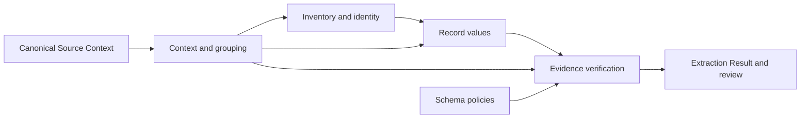

# Advanced tab: UI and behavior design

Status: proposed, 2026-09-28; no implementation. Source baseline: `4e2a5820`.
The [proposal](proposal.md) states the scope; [verification.md](verification.md)
defines the future acceptance harness. Decisions below are proposed product
behavior, not claims that Studio already supports them.

## Context

Studio has Models and Connections tabs, one account-owned draft and one
Apply/Discard footer. `useProviderConfigDraft` already owns saved-versus-draft
state. The Parsing Service validates experimental methods in `ArticleOptions`,
`CatalogFactors`, `CatalogOptions` and `ExtractRequest`. Studio's
`keiMethodOptions` currently forwards only strategy, recipe and requested models.
Putting controls on the page therefore requires an end-to-end method snapshot,
not just new inputs.

The supplied article's approach is applied here as a concrete contract, existing
code references, observable acceptance cases, independent final-candidate review
and a bounded maintenance probe. It is not treated as independently verified
external research. No additional architecture framework is needed.

### Evidence that informs the design

| Evidence inspected | Implication for the interface |
| --- | --- |
| [Completed R1/R3/R4 report](../../../docs/validation/2026-09-28-completed-development-study.md): R1 79/79, R3 12/12; R4 4/12, all controls | Keep defaults. No structural-grouping benefit has been estimated. |
| Same report: bounded context −33.35 percentage points and structured rendering −24.12, mean changes on six development papers under historical frozen conditions | Never label bounded or structured “more accurate.” Explain coverage/cost trade-offs and budget refusal. These numbers are not predictions for today's runtime. |
| [R2a selection report](../../../docs/validation/2026-09-28-extraction-selection-results.md): 30 conditional-replay cells | Selection is available to explore. Fixed-reply savings do not establish fresh-model speed or evidence recall. |
| [Grounding pilot](../../../docs/validation/2026-09-28-grounding-pilot.md): combined spans/policy/scheduling 10 versus 40 calls and 89,770 versus 222,156 input tokens | Useful illustrative result on one selected document, not a recommended universal preset. |
| [Pilot audit](../../../docs/validation/2026-09-28-grounding-pilot-audit.md): identical requests can disagree; reviewers disagree on attribution | Never equate linked values, exact source text or model agreement with semantic accuracy. |
| [Harvey micro-pilot](../../../docs/validation/2026-09-28-harvey-grounding-micro.md): compact spans admitted refused cases, but used 80,806 versus 34,910 input tokens; both methods linked an incompletely supported compound claim | Explain what span IDs guarantee and what they do not. No blanket “faster” or “safer” badge. |
| [Compact labels](../../../docs/validation/2026-09-28-compact-span-labels.md) and [singleton overflow diagnosis](../../../docs/validation/2026-09-28-grounding-singleton-overflows.md) | Protocol version is metadata, not a toggle. Short labels do not ensure every source unit fits. |

These are dated development findings. The full R4/R5 matrix remains deferred.
The page's help includes study date, corpus, method revision and evidence type;
it does not imply the current selection was evaluated as a combination.

## Goals / Non-Goals

**Goals:** Make every supported method combination reachable; keep ordinary
configuration compact; reveal substantial explanations on demand; preserve
unchosen/default behavior, account ownership and reproducible run attribution.

“Every combination” means the valid combinations of the controls below with
the existing field/reasoning model choices. Context limits and identity fields
are variable inputs, so there is no useful fixed total to advertise. Choices
from mutually exclusive strategies are not one method. Availability does not
mean the combination has been experimentally evaluated.

**Non-goals:** No automatic sweep, run queue, comparison dashboard, named-preset
storage, JSON import/export framework, new OCR options, sampling controls,
historical protocol switch, or extraction algorithm changes. Per-field policy
authoring remains schema work: this change exposes the existing method's
all-fields versus schema-policy choice. It does not add a second schema editor
to account configuration. Studio currently preserves policy metadata but has no
dedicated policy selector in its field UI; that is an explicit usability limit.

## Decisions

### 1. One tab, two strategy sections, three levels of detail

Keep the existing **Model Configuration** title and page width, colors, controls
and footer. Tabs read **Models · Connections · Advanced**. Advanced opens on
Article; a compact **Article / Catalog** selector switches which strategy's
saved settings are being edited. Its caption is “Settings for future Extractions
using this strategy.” It never changes an Extraction's chosen strategy.

Opening Advanced does not dirty the draft. The initial state shows a one-line
effective summary and “Use service defaults” selected. **Customize** explicitly
creates that strategy's override from the documented reference settings. While
customizing, **Use service defaults** removes only that strategy's override from
the draft; Apply is still required. It does not reset Models or Connections.

Level 1 is a compact summary and four rows. Level 2 opens a section's specific
controls inline. Level 3 opens a single **Explain** dialog for the selected topic.
Use text-labelled controls, not a toolbar of unexplained icons.

```text
Model Configuration                 Models  Connections  Advanced

Advanced extraction                           How this works
Applies to new Extractions in your Projects.

Settings for:  [Article] [Catalog]
Full source · Plain text · Source-label verification
[Use service defaults]  [Customize]

  Source context     Full source                    >
  Record identity    Reference                      >
  Extraction input   Reference prompt · Plain text  >
  Evidence           Source labels · All fields     >

  Effective settings                               >
Everything saved                              Discard   Apply
```

In default mode the rows are read-only explanations; Customize enables them.
Each collapsed row's value is derived from the draft. A changed row gets one
small “Changed” label. Invalid sections open automatically and show the issue
beside its field; the footer summarizes the number of issues. There is no
per-section Save and no global “Enable experimental pipeline” switch.

On narrow screens labels and controls stack. No page-level horizontal scrolling
at 360 CSS pixels or 200% zoom. Expandable rows use native disclosure semantics.
The tablist retains arrow-key navigation; all controls have persistent labels,
and errors are associated with their inputs. Color is never the only status cue.

### 2. Article control inventory and exact mapping

The table's defaults are the existing explicit reference; **service defaults**
means omitting the entire Article override, which also preserves its historical
request/artifact shape. Null optional factors are serialized by omission, not
invented wire enum values such as `plain` or `all`.

| Section / visible label | Choices and current reference | Wire field / behavior |
| --- | --- | --- |
| Source context / Scope | **Full source**; Bounded source units | `context=full|bounded` |
| Source context / Context ceiling | Integer, **12,288**, minimum 8,192; bounded only | `context_tokens`; total per-request ceiling includes instructions and output reserve, further limited by each served model |
| Source context / Grouping | **Token budget**; Structure-aware | omitted `grouping`; `structural` |
| Source context / Previous passages | **0**; 1; 2 | `overlap_passages`; whole passages, not pages or sentences |
| Source context / Value evidence | **All source units**; Supported units | omitted `selection`; `supported`; affects record-value calls, not inventory, document fields or verifier coverage |
| Record identity / Reconciliation | **Reference**; Declared identity fields | `identity=reference|conservative` |
| Record identity / Identity fields | Empty by default; exact field-name chips | `identity_fields`; required for conservative; unique top-level scalar record fields, validated against the pinned schema at start |
| Extraction input / Instructions | **Reference**; Schema-driven | `prompt=reference|schema`; reference includes historical laboratory examples |
| Extraction input / Source representation | **Plain text**; Structured blocks and tables | omitted `rendering`; `structured`; preserves existing source characters, cannot recover missing OCR/table cells |
| Evidence / Verification | **Source labels**; Generated quotes; Source spans; Off | `grounding=semantic|quoted|spans|off` |
| Evidence / Fields to verify | **All populated record fields**; Follow schema policies | omitted `evidence_policy`; `schema` |
| Evidence / Continue verification | **Across all source units**; Until first support | omitted `grounding_schedule`; `unresolved` |
| Evidence / Unit order | **Source order**; Origin and lexical relevance | omitted `grounding_routing`; `origin_lexical` |

“All populated record fields” accurately limits scope: Article document-level
fields currently remain unverified. Show this once below the Evidence section.
Do not describe **Across all source units** as contradiction detection; it
revisits claims, but does not establish exhaustive contradiction recall.

Full-source mode uses the served context size, not the inactive 12,288 ceiling.
Display inactive numeric fields as read-only with “Used with bounded source
units”; exclude those inactive draft values from the active-method summary and
restore their reference value when canonicalizing an explicit full-source method.
Reference identity may still accept explicit identity fields in the service;
keep the field input available under its disclosure rather than artificially
removing supported requests. Explain that conservative reconciliation is the
choice that requires declared keys.

For identity chips, trim entry whitespace, reject duplicates/empty names and
retain exact case. Configuration has no selected Extraction Schema, so Apply
can validate the names' shape, not their existence. At extraction start, show
missing/non-scalar/document-sourced names and refuse admission before work. Do
not infer substitute keys or silently revert to reference reconciliation.

### 3. Compatibility rules are visible, never silently repaired

| Rule | Interaction and error copy |
| --- | --- |
| Overlap > 0, supported selection or structural grouping requires bounded context | “This choice requires bounded source units.” |
| Schema evidence policies require generated quotes or source spans | “Schema policies require generated quotes or source spans.” |
| Until-first-support scheduling requires verification on | “Choose a verification method to use this schedule.” |
| Origin/lexical routing requires quoted/spans AND until-first-support | “Use generated quotes or source spans, and stop after support.” |
| Conservative identity requires nonempty unique declared fields | “Add the scalar record fields that identify one record.” |
| Numerical values must be integers within service minima | State the unit and minimum next to the field; never clamp silently. |

A new incompatible choice is visible but disabled with its reason. If changing a
parent makes an already selected child incompatible (for example Bounded → Full
with overlap 1), preserve the child visibly, mark the draft invalid and block
Apply. Let the researcher change the parent back or explicitly change each
conflicting child. Do not erase settings or keep applying hidden stale values.
An error under a collapsed section opens that section; clicking the error
summary focuses its first control. Direct HTTP requests receive equivalent
field-addressed validation, including cross-field constraints.

Schema-level constraints and actual token fit are checked when the Source
Document and Schema Revision are known. Apply makes no token-count or generation
calls. UI estimates must not promise that a source fits. A service rejection
remains visible with its own reason; no switch to another grounding method,
truncation, or full-source fallback is permitted.

### 4. Catalog keeps its own semantics

Catalog shows two disclosures, **Generic Catalog** and **Recipe Catalog**.
Both sets can be saved because the recipe is chosen per Extraction. Their
headings state when each applies. Recipe selection stays at extraction start;
the account page does not invent one recipe suitable for every source.

| Scope / label | Existing default and supported input | Mapping |
| --- | --- | --- |
| Generic / Discovery text limit | 48,000 characters, integer ≥ 1,000 | `discovery_chars` |
| Generic / Record text limit | 24,000 characters, integer ≥ 1,000 | `record_chars` |
| Recipe / Input budget | 4,096 tokens, integer ≥ 64 | `catalog.input_tokens` |
| Recipe / Output reserve | 1,024 tokens, integer ≥ 64 | `catalog.output_tokens` |
| Recipe / Glossary | On / Off; default On | `catalog.factors.glossary` |
| Recipe / Inherited headings | On / Off; default On | `catalog.factors.headings` |
| Recipe / Neighboring context | On / Off; default On | `catalog.factors.overlap` |
| Recipe / Verification | On / Off; default On | `catalog.factors.verification` |

The character limits are supported controls, not ablation findings. Do not
describe generic Catalog limits as the Article whole-passage guarantee. Recipe
budgets must fit the served model including the output reserve; failures are
reported before affected model calls. Catalog factor switches never disable
structural ownership or canonical spans. Verification Off retains typed values
as **proposals**, not accepted evidence. Glossary Off also disables glossary
normalization. Heading Off removes inherited bindings/context; overlap Off
removes neighboring/window context.

The Article spans/quotes/policy/schedule/routing controls do not appear as Catalog
options. Recipe Catalog has its existing verifier. No current service option
selects semantic/quoted/spans for generic Catalog, so the UI cannot promise it.

### 5. Explain on demand, using one consistent guide

Every section has an **Explain** action. It opens the same accessible dialog at
that topic, with **Meaning · Example · Study evidence** as local anchors, not
another configuration draft. Wide screens use a readable dialog; mobile uses a
full-height sheet. Escape closes it and focus returns to the trigger. The guide
has no Apply control, and opening/changing an example never changes settings.

Each topic contains one short purpose, the affected pipeline stage, a before/after
example, a diagram with equivalent text, valid combinations, and evidence limits.
Technical wire names and version metadata appear only under **Technical details**.
No permanent diagram competes with the controls.

Required examples and visualization storyboards:

| Topic | Example and visualization | Required takeaway |
| --- | --- | --- |
| Full / bounded | Six labelled source blocks, one table, one heading; show full source, then bounded units with primary ownership and optional duplicated context | Whole tables stay intact; repeated context is not a new record; a too-large block is refused. Diagram is illustrative, not live tokenizer output. |
| Grouping | Heading → paragraph and caption → table → footnote; toggle token grouping versus structure-aware grouping in the example | Structure adds context and can increase refusal/cost; it does not reconstruct missing tables or infer arbitrary heading hierarchies. |
| Selection | One identity supported in units 1 and 4; shade retained and omitted value units while inventory/verification still visit all units | Lower value-call count can omit relevant evidence. It is not grounding routing. |
| Identity | Two records share a species but differ by preparation; show reference merge versus declared species + preparation key | Too broad a key can merge records; missing declared keys can leave duplicates. |
| Source format | The same small 2×2 table as plain text and as labelled cells with row/column information | Exact input text is preserved; added markup consumes tokens. |
| Grounding | Synthetic source: “ASC: 18.6 °C. PSC: 15.6 °C.” Claim ASC temperature = 18.6; offer label, generated quote, offered span E1, or Off | Exact source location alone is not proof that the entire claim is supported. Wrong-subject 15.6 must not become support. |
| Schema policy | Parent `notes=derived`, child `temperature=quoted`, other child inherits derived; show the policy tree and eligible paths | “Quoted” means source support required, including with span grounding; derived does not compute/validate a value; skipped leaves remain ungrounded. |
| Scheduling / routing | Claim × unit grid: support in unit 2, NONE in unit 1; compare source order, first-support stop and preferred-unit ordering | NONE/failure does not stop later search; routing orders work, selection removes value inputs; first support does not settle contradictions. |
| Catalog | Synthetic heading “Grav 7”, abbreviated material and a neighboring line; vary one factor per illustration | Verification Off yields proposals; a recipe's applicability is source-specific. |

For Source spans, show a sentence highlighted inside its canonical parent and a
cell highlighted inside its row/headers. A small caption reads “Text range is
exact. Highlight precision depends on available geometry.” Unicode offsets are
code points; the example must not imply pixel-tight highlighting when only a
parent box exists. E1 is a compact transport label, not the stored evidence ID.

One diagram in **How this works** locates the independent choices:



The adjacent text explains that rendering/prompt affect model input, selection
affects record-value contexts, and scheduling/routing affect verification.
This diagram is conceptual; filename/document fields and recipe Catalog have
their own existing paths and must not be misrepresented as Article stages.

Study evidence is a small cited table, not a score badge or predicted cost chart.
Each entry names the document count, fresh versus replay/tokenizer evidence,
historical protocol revision and outstanding semantic review. Unknown effects
say **Not measured**. New cross-factor combinations say **Combination not studied**.

### 6. Starting points are transparent assignments, never a recommendation engine

Inside **How this works**, offer two optional **Use these settings** examples:

- **Reference controls:** explicit full source, reference identity/prompt, plain
  input, semantic grounding and no optional factors. This is a current-runtime
  reference configuration, not exact reproduction of historical R1 v11.
- **Explore spans and schema policies:** explicit bounded 12,288, overlap 0,
  token grouping, all value units, reference identity, schema prompt, plain input,
  spans, schema policies, until-first-support, source order. This explores the
  combined method family; it is not labelled best, fast or pilot reproduction.

Show the complete setting delta before applying an example to the draft. A single
**Use these settings** action then updates that strategy's draft; the normal
Apply saves it. Show an inline notice with Undo to restore the prior draft.
Neither example edits identity fields in a schema or imports old results. Names
are derived from matching values, not a second persisted preset ID. Normal
customization can reach all supported settings without using either example.

### 7. Requested choices and effective settings stay distinguishable

Use one optional `extractionSettings` object on the existing account document.
Its Article member contains the existing Article method fields. Its Catalog
member holds separate generic limits and recipe factors/budgets, without a
recipe ID. Omission means service defaults; empty normalized strategy members
collapse to omission. No optional factor is persisted as explicit null.

The page's **Effective settings** disclosure derives a human-readable active
summary and an optional read-only wire preview. In service-default mode it says
“Service defaults; resolved for the Extraction” and describes the current
documented reference without promising a model-specific ceiling. Show the chosen
field/reasoning models by reference to Models; do not duplicate their editor.

For a new Extraction, the server validates the submitted saved-setting intent
against the account's current configuration and selected schema, resolves only
the applicable strategy options and pins them with source/schema/model choices.
The start view shows **Saved advanced settings** and an expandable summary. A
configuration change after that preview produces a refreshable conflict before
admission; it cannot silently start the new method. No extra database-backed
preview ticket is required: compare the canonical active-method descriptor.
Include the requested field/reasoning model choices in that comparison. Perform
the comparison and snapshot write at one transaction boundary, ordered against
the account configuration write; a check followed by an unlocked later write is
insufficient. Reuse the existing account row's serialization mechanism.

Once admission succeeds, the workflow reads immutable stored method choices,
never today's account configuration. The request keeps its original descriptor
for network retries. Same Extraction ID + same descriptor replays the existing
run even after configuration changes; a different descriptor under that ID is
a conflict. Admission equality includes explicit-versus-omitted Article mode
where that distinction changes service artifacts.

The immutable snapshot pins the requested descriptor, including an explicit
record that a role or method was left to service defaults. Omitted options still
resolve in the executing service; preserving omission does not freeze deployment
code, model weights or defaults across upgrades. Effective options and versions
come from that execution. Reproduction across runtime revisions belongs to the
existing frozen-study tooling, not an invisible promise made by this page.

Batch admission resolves the account's active method once for all members and
stores it on the batch and members. Method choices participate in equal-selection
reuse. Changing an active factor creates a different batch selection; changing
only settings for the other strategy does not. “Run again” still creates a fresh
batch under existing semantics. An admitted batch does not read account defaults
again as later members start. No new queue or workflow family is needed.

Add **Method used** to the existing Extraction detail metadata: requested active
choices, effective returned options, requested/effective models and recorded
method/prompt/span/rendering/grouping/routing versions when available. A run that
fails before execution has requested settings and “Effective method unavailable.”
Historical rows without settings show “Not recorded”; retained artifacts can be
used when they already record the method, but never infer it from today's config.
Workflow recovery preserves the pinned request and records the executed protocol
version honestly; it does not claim bit-identical model output across upgrades.

### 8. Ownership and minimum necessary changes

| Owner / inspected reference | Future change and reason to retain the boundary |
| --- | --- |
| `prototypes/studio/src/providerConfig/ProviderConfigPage.tsx`, `useProviderConfigDraft.ts` | Add the tab and draft setters. One saved/draft owner already implements Apply/Discard. |
| `prototypes/studio/shared/modelConfig.contract.ts`, `api/_model_config.ts` | Validate and persist account method preferences with the existing whole document. Keys keep their present browser-only handling. |
| `prototypes/studio/api/extractions.ts`, `api/batch_extractions.ts` | Validate saved-setting intent at admission; no extraction policy algorithms in HTTP handlers. |
| `packages/extraction/src/extraction-method.ts` | Extend the existing method value and its wire translation; it is already the appropriate boundary. |
| `packages/extraction/src/postgres-admission.ts`, `workflows.ts`, `types.ts` | Pin and compare active settings, include them in batch identity, and read them during durable execution. |
| `packages/db` authored contract/migration and existing configuration store | Add immutable method JSON to existing records as required; no generic profile tables or event store. |
| `prototypes/parsing_service/src/kei_exp/kie/extract/method.py`, `run.py` | Keep authoritative semantic validation and schema-dependent identity checks. Contract fixtures connect TS and Python validation. |
| Existing provider-config component tests, extraction workflow tests, and `test_extraction_methods.py` | Extend behavior checks at their present seams; do not assert incidental component structure. |

These are inspected references for the future reviewer, not a claim that every
existing pattern is approved. Three enforceable architecture invariants:

1. Account draft state has one owner; UI and HTTP code do not implement extraction,
   token partitioning, evidence eligibility or source-span matching.
2. Execution depends on an admitted method value and pinned schema/source; it
   does not query account defaults on recovery or for individual batch members.
3. Serving code never imports `experiments/extraction` or validation/report code;
   canonical evidence logic remains independent of Studio transport and storage.

Use small import checks at the repository's existing test boundaries and adapter
behavior checks. Do not introduce Import Linter merely because the supplied
article illustrates it. No strategy registry, generic form generator, DI
container, new state machine or capability-discovery service is justified.
One small explicit Advanced tab component and an explanatory component are
reasonable UI boundaries; descriptions and enum labels are ordinary local data.

## Risks / Trade-offs

- **Account defaults span different schemas** → validate identity keys at start,
  display exact incompatible fields, never guess. Per-project profiles are not
  introduced as a speculative fix.
- **More controls invite unfounded conclusions** → label evidence scope; preserve
  current defaults and every observed failure/refusal in result reporting.
- **Front-end/Python contract drift** → shared accepted/rejected request fixtures,
  exhaustive categorical validity checks and real adapter checks on final code.
- **Invalid parent/child changes require extra edits** → preserve intent and give
  field-specific repair guidance; a silent cascade would make trials ambiguous.
- **Policy authoring is still technical** → explain inherited policies and show
  them against the pinned schema at extraction start; do not pretend a dedicated
  field-policy editor already exists. A future schema-editing change can add it.
- **Protocol changes alter experimental meaning** → show executed versions and
  distinguish study configurations from exact historical reproduction.
- **Large explanation content may overwhelm** → keep it behind Explain, with one
  example per topic and evidence tables outside the primary settings surface.

## Migration Plan

Future implementation uses authored forward migrations. Add an empty
`extractionSettings` to existing valid account documents without touching model
choices or keys; malformed documents retain the existing visible server-fault
behavior. Add nullable method snapshots to historical Extraction/Batch records;
do not backfill guesses. New admission writes explicit active snapshots.

Update the configuration contract, admission and worker mapping as one coherent
release. Preserve already queued workflows: review DBOS step changes against the
local `DBOS.patch()` rule, and keep existing app-version/drain requirements.
Test migration on populated disposable data and recovery on pinned admissions.

Rollback means deploying a compatible repair or disabling entry to the new UI
while preserving data; it does not mean down-migrating or erasing snapshots. Do
not introduce a permanent rollout flag or compatibility framework for this task.
README/CONTEXT changes describing the released contract belong to implementation,
not this proposed specification.
