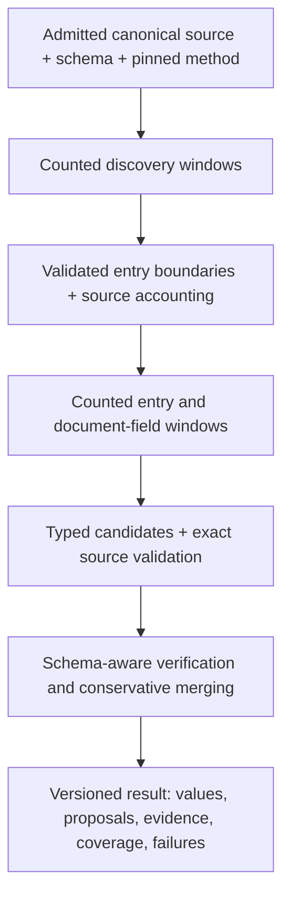

## Context

Status: proposed action plan, 2026-09-29. No application implementation.
Baseline: `dev` at `80686ec4aea3f4a5d37dfcb643d29ac5a23e0ed3`.
See [proposal.md](proposal.md), [tasks.md](tasks.md) and
[discussion.md](discussion.md) for the Claude Code Fable 5.1 sparring record.

### What the current code actually does

Paths below are relative to the repository root; line numbers refer to the
baseline and are navigation aids, not promises that future edits preserve them.

| Evidence | Consequence for this plan |
| --- | --- |
| `prototypes/parsing_service/src/kei_exp/kie/extract/run.py:38,115`: `options.catalog` selects `grounded.extract`; ordinary Catalog selects `catalog.extract`. | Unification must change dispatch and pinned options, not just labels. |
| `kie/extract/catalog.py:75,85,95` and `stages.py:73`: page-based discovery chunks, then clipped document/record calls; `chunks` is unused. | Discovery chunking does not provide complete value extraction. |
| `kie/extract/grounded.py:411,555`: entries have token-fitted windows; document fields use a fitting prefix. | Both implementations need coverage fixes. |
| `kie/blocks.py:69` requires decimal labels; `kie/segmentation.py:94,163` fingerprints recipe structure and checks numeric identity. | Neither contract can become general by renaming it. |
| `kie/extract/acceptance.py:129` accepts scalar values through recipe keys; other well-located values remain proposals. | Removing recipes also requires a general verification policy. |
| `kie/extract/grounded.py:485` merges accepted leaves and window-local array positions. | Nested candidate merging needs characterization and explicit identity rules. |
| `packages/extraction/src/kei-artifact.ts:123,150,193` expects v1/v2, with required recipe metadata for v2. | Add a new artifact version and retain historical decoders. |
| `packages/extraction/src/extraction-method.ts:201,329` uses `article/generic/recipe` settings and creates worker request options. | Update account settings, admission identity, stored methods and handoff together. |
| `packages/extraction/src/postgres-batches.ts:146` explicitly records that batches have no recipe. | New single and batch work must share the unified method. |
| `prototypes/studio/src/App.tsx:884`, `shared/catalogRecipes.ts`, `src/providerConfig/AdvancedTab.tsx:340`: recipe dropdown and separate Generic/Recipe controls. | Remove the actual split from run controls and configuration. |
| `prototypes/parsing_service/src/kei_exp/workflows/extract.py:31,48`: deployment concurrency and one durable extraction step. | Preserve workflow shape where possible; windowing is independent of concurrency. |

Root `README.md`, `CONTEXT.md` and `CONTRIBUTING.md` remain normative. Source
identity, authenticated ownership, schema revisions, evidence precision and
immutable admission are preserved. Equal methods do not promise identical model
answers. Existing recipe-specific evidence semantics must remain truthful when
historical results are read.

PR #150 supplies omission reporting and schema-suggestion persistence. It does
not supply this unification. Its actual diff must be refreshed at implementation
time; do not accidentally fold its inherited cleanup into this change. Preserve
its historical diagnostics and schema-suggestion notices. New Catalog budget
handling replaces clipping with complete scheduling or explicit failure.

## Goals / Non-Goals

**Goals:**

- One Catalog strategy and one active pipeline for new work, independent of a
  named recipe, source language, numbering convention, field names or model.
- Complete scheduling of admitted primary source text through actual counted
  requests, including discovery, document fields, entry fields and verification.
- Exact canonical evidence, conservative merging and visible uncertainty.
- Small, useful configuration controls with honest defaults and immutable runs.
- A measured cutover across diverse documents, with old results still readable.

**Non-Goals:**

- Merging Article and Catalog, changing ingestion/OCR or inventing source text.
- A user-editable recipe language, plugin registry, corpus-specific presets or
  a new schema field-binding feature.
- Guaranteeing perfect model recall, semantic verification or reproducible
  answers merely because every input range was processed.
- Implementing the concurrent sample workbench, schema-suggestion chunking, or
  a new durable workflow per window in this change.

## Decisions

### 1. One Catalog interface; reuse mechanics, replace recipe assumptions

Keep the existing extraction entry point and role-based model router. The active
Catalog implementation owns discovery, entry/document windows, candidate
verification, reconciliation and publication. Internal modules may be small,
but callers supply only the admitted source, pinned schema, versioned Catalog
method, model dependencies and cancellation/concurrency dependencies.

Reuse `tokens.py`, `calls.py`, model roles, canonical span/geometry validation,
the pure fitting mechanics in `windows.py`, and proven accounting invariants.
Evaluate reuse of `spans.py` range/label machinery and `contexts.py`
reconciliation; do not change Article behavior while extracting reusable parts.

Replace the recipe-specific entry identity, routing rules, field bindings and
acceptance rules. A fake universal recipe or optional live recipe plugin would
leave two behavioral paths and require researchers to understand them. Preserve
legacy execution only for the bounded compatibility period in the migration
plan; preserve historical readers independently.

### 2. General discovery and ownership

The schema's record definition drives discovery. Use canonical reading order,
layout labels and table structure as source cues, without matching German
headings, decimal labels or expected field names. Give the model offered source
labels and validate any finer boundary against the exact shown canonical text.
Support multiple entries within one segment or line and entries continuing
across windows/pages. Never synthesize a canonical boundary from a model's
rewritten text. A bare repeated quote is not a unique boundary: require a
resolvable canonical location, or retain the ambiguity. Use explicit continuation
observations and carried entry context; absence of a returned start alone is not
proof of continuation, particularly when user-configured overlap is zero.

Each entry has an extraction-local ID based on its source ownership and pinned
source identity, with an optional printed label. IDs are not printed numbers or
promises of identity across reprocessing. Repeated numbering in different
sections and alphanumeric/unnumbered entries remain distinct. Defer numbering-gap
heuristics; they are not needed to implement general discovery or accounting.

Reconcile overlapping observations by exact canonical location; contradictions
remain unresolved until a bounded reconciliation attempt resolves them. Each
window explicitly reports whether its primary head/tail continues an entry
(`begins_inside_entry` / `ends_inside_entry`, including unknown). A join requires
compatible observations on both sides and consistent anchored ownership. With
overlap, deduplicate locations first; with zero overlap, do not substitute silence
for agreement. Unknown, disagreeing or failed neighbors leave the affected head
and tail unresolved. Failed
discovery regions break assumed ownership: do not automatically make the last
known entry own an unsearched interval. Success requires validated responses
for every required primary discovery range, not merely HTTP success.

Persist an extraction-local discovery artifact containing boundaries, primary
ownership, context references, dispositions, diagnostics and the calls that
produced it. Reuse across extractions is deferred. Any future cache key must
include source generation/digest, schema/record definition, method, model roles,
budgets and prompt/protocol versions. Today's recipe-only cache is unsuitable.

The ledger covers canonical nonblank ranges (only Unicode `White_Space` is
blank; punctuation and printed labels are source), with explicit whitespace policy,
including entry, contextual, non-record and unresolved material. Ownership is
disjoint; repeated context is separately tagged. Withheld source and reading-order
uncertainty remain visible. Model-classified non-record material is a recorded
decision, not independent proof of irrelevance. Preserve table-cell identity and
available geometry through subdivision.

### 3. Budget every stage, including its output

Count the actual system/user/schema request with the serving tokenizer for the
appropriate role and reserve reply space. Partition primary source ranges so
each valid request fits. Oversized pages, segments, lines and cells can be split
at source-preserving offsets, retaining table identity and relevant labels.
Re-count the final rendered request: fitting heuristics are not admission proof.
If schema/instructions plus the smallest valid unit cannot fit, refuse visibly.

Document fields have their own partition over every admitted nonblank canonical
range, regardless of entry-ledger disposition: front matter, context, non-record
and unresolved entry ranges are still eligible document input. They do not reuse
only the entry partitions. Track document-stage processing separately; a failure
there cannot be hidden by successful entries, and an entry-boundary failure does
not prevent processing otherwise valid document text. When there are no document
fields this stage is not applicable. Merge their
candidates with explicit conflicts and keep their verification status honest;
first release does not claim they are verified merely because record verification
is enabled. Their original supporting ranges remain available for review.

Discovery output can itself overflow when a window contains many small entries.
Recover by bounded subdivision of the affected work where semantics permit,
recording attempts and accounting; otherwise report the unresolved range. Never
accept a repaired output prefix as a complete boundary list. The same rule covers
entry arrays and later verification/arbitration. Repeated failure has a finite,
versioned retry/subdivision policy and visible incomplete outcome.

Verification/arbitration input is also partitioned or refused. No first-N
competitor or source selection can silently stand in for exhaustive work.
Batch verification candidates with their necessary source and schema context in
counted requests, partitioning on overflow; do not impose one expensive request
per leaf. Every candidate keeps a stable ID and an explicit returned decision or
unresolved status after batching.
Supplementary context must be labelled as such and its omission disclosed when
it does not fit; it does not reduce primary coverage requirements. All windows
observe cancellation. Existing deployment concurrency limits parallel entries;
it is not a user-selected semantic chunk size.

### 4. Evidence and merging without fixed field bindings

Extract typed candidates carrying source references. Code checks canonical
membership, quote/range correspondence, allowed values, geometry and which
entry/context supports a claim. Schema-aware reasoning verification decides
whether the source supports that field for that record. A matching string alone
does not establish the relationship. Use supplied candidates and canonical
references; the verifier cannot invent replacement values or evidence.

Verification Off produces proposals, not accepted grounded values. Malformed,
missing, ambiguous or refused verification remains unresolved. Any schema
evidence policy supported by the new method must retain its existing meaning;
never silently claim derived values have exact lexical evidence.

Use a separate source-reading verification request, which can use the same
reasoning model; this is not statistically independent proof. Distinguish a
literal value span from a supporting passage for a nonliteral value such as a
boolean or normalized label. Preserve the canonical support, transformation and
verification provenance; never manufacture a raw span equal to a value absent
from the text. Heading/label context is not automatically assigned to fields or
accepted via an implicit binding. The v3 evidence contract must express these
distinctions instead of reusing v2 `linked_by: key|structure` with new meanings.

Deduplicate equal value/support observations. Preserve scalar conflicts and all
alternatives, including the selected reason when bounded arbitration succeeds.
For arrays of objects, preserve item grouping from each observation and reconcile
only on supported item identity and source location. Window-local array indexes
and equal text are not entity identifiers. The first located scalar leaf is also
insufficient: two items may share an inherited heading or the same support span.
An item needs discriminating occurrence/identity support, not an arbitrary leaf.

Concrete first-release rule: candidates carry an optional exact item-occurrence
anchor inside the entry's primary ranges, separate from leaf evidence. Context
or inherited heading spans and nonliteral supporting spans cannot establish item
identity. Deduplicate across observations only when the validated item occurrence,
object structure, normalized values and per-leaf literal/support ranges agree,
with unambiguous one-to-one correspondence. Do not deduplicate distinct items
within one observation merely because their span sets happen to match; flag that
ambiguity. Do not auto-join complementary partial objects in this release, even
if one identifier leaf agrees. Preserve them as partial proposals/alternatives,
report observed, resolved and partial item counts separately, and leave uncertain
cardinality explicit. General partial-item stitching is deferred until it has an
independent contract and evidence. Characterize
the existing merger before reuse; do not promise identical model answers when
window sizes change. Deterministic assembly for identical observations is testable.

### 5. One configuration surface

Use the existing Model Configuration → Advanced → Catalog draft/Apply/defaults
flow. Remove Generic/Recipe sections and the run-toolbar recipe selector. Keep
record definition and field meanings in the schema editor, and field/reasoning
model selection in Models. A new run summary shows the applicable method version,
settings and any required preference migration.

First-release control inventory:

| Control | Intended meaning |
| --- | --- |
| Input token ceiling | Auto by default: serving capacity minus the reply reserve, bounded by the declared deployment cap. Custom values govern request size, never source omission. |
| Reply token reserve | Versioned service defaults per stage/role, or an explicit custom reserve. Counted before each call; truncated replies cannot count as complete. |
| Window overlap | A small bounded source-unit count with disjoint primary ownership; initial candidate is one unit, including zero as a supported custom choice. |
| Heading context | On by default: source-backed contextual cues without field-name bindings. |
| Verification | On by default; Off retains proposals and does not disable ownership checks. |

Do not expose account-wide record prompts, regex rules, entry-number bindings,
arbitrary factor bags or deployment concurrency. Defer generic glossary expansion
and free-form boundary instructions. The source text and schema can still contain
abbreviations and instructions; this release adds no specialized glossary
extraction/substitution mechanism. Finite default values and tuning claims need
registered evaluation; Auto is a valid fitting policy without a benchmark claim,
while the complete new method still needs the cutover evaluation.

The UI displays the defaults version, requested cap/reserve and resolved values
when available. Validate numeric and cross-field rules in both TypeScript and
Python. Actual fit is checked where the served tokenizer/context is available;
do not promise that the browser can know it or silently clamp an explicit
oversized request. Freeze the versioned default policy and deployment ceiling
with admission, then record effective role/stage budgets before model work and
preserve them for recovery. A changed environment that cannot honor them refuses
explicitly. Trimming supplemental overlap/heading context records `context_omitted`
with ranges; it never removes primary ownership or certifies semantic recall.

### 6. Version results and pin admitted methods

Add an explicit unified Catalog method discriminator and result artifact v3.
Decide the exact serialized method shape in the first contract task, including
versioned defaults, requested overrides and effective values. A method must
remain identifiable even when the account omitted all custom settings. Include
the method in single admission identity, batch reuse, worker handoff and result
acceptance; resolve already admitted IDs before consulting current preferences.

Keep v1/v2 result and settings decoders for history. New v3 acceptance validates
source, schema, strategy, method/version, requested models, options and evidence,
with no fictitious recipe metadata. Historical reviews/exports must retain their
original result and evidence semantics. Additive nullable storage is acceptable
where needed; do not rewrite historical method rows or assume no migration is
required before checking the final shape.

Source accounting, processing completion and evidence status are separate.
`recall` remains `unmeasured`. The summary cannot be complete when required source
processing failed, even if every range has a ledger entry. Reports and UI must
distinguish unresolved boundaries, refused work, failed calls and unsupported
values. New method versions and protocol changes are visible rather than hidden
inside today's generic or recipe defaults.

### 7. Recover within the existing durable step

The existing Python extraction step can be re-entered after a crash. Before model
work, atomically create a write-once record at
`extractions/<extraction-id>/catalog-execution.json` with pins, resolved role/stage
budgets, reserves, overlap, defaults version, declared deployment cap and sanitized
tokenizer/context identities. Then run discovery and atomically create
`catalog-discovery.json`, referencing that execution-record digest. The discovery
record includes its full dependency identity and resolved/unresolved ledger.

Use completed-file publication with exclusive create/compare, not the current
overwrite-on-rename result helper without modification. A same-payload repeat is
a no-op; a different completed payload for the same extraction/kind is an explicit
conflict, never an overwrite. Ignore/remove only this operation's unfinished temp
files after a crash. Validate source/schema/method/model/protocol identity before
reusing a published record. Budget metadata present means honor it or report
`budget_unhonorable`; discovery present means validate and reuse it or fail the
identity check. An absent record can be computed and published. This permits
retries within one Extraction, not cross-extraction cache reuse.

The final v3 artifact embeds the published execution/discovery records and their
canonical digests. The worker checks them against its local files; Studio verifies
the embedded digests, admitted dependencies and source membership via the existing
artifact acceptance path. Do not add a second metadata-fetch API solely to compare
the same content. Retain immutable records after cancellation; a fresh Run again
has a new Extraction ID and does not reuse them. Test crashes at both publication
boundaries and concurrent recovery attempts; include the records in the existing
source lifecycle cleanup rather than adding an unrelated retention system.

## Risks / Trade-offs

- **General discovery loses specialized rules' precision** → retained numbered
  regressions plus independent publication-family evaluation; no default cutover
  on synthetic tests alone.
- **Exhaustive processing increases cost and latency** → measured per-stage
  tokens/calls/latency (including the independent document-field pass), custom
  budgets, bounded retries and deployment concurrency;
  do not buy speed by silently dropping primary source.
- **Exact span verification is mistaken for semantic truth** → separate code
  validation, schema-aware model judgment and researcher review in the artifact/UI.
- **Array reconciliation invents entity combinations** → supported item identity,
  explicit alternatives and adversarial nested-array tests.
- **A source ledger is mistaken for recall** → distinct accounting, processing,
  evidence and human-assessed quality metrics throughout.
- **Interrupted old jobs run new semantics** → versioned admission, legacy drain
  policy and process-recovery tests before retiring executors.
- **Another task introduces sample scopes concurrently** → coordinate with
  `sample-extraction-workbench`; coverage is relative to the admitted scope and
  source ownership remains suitable for cross-page entries. Do not edit its
  concurrently owned artifacts here. Its proposal was committed as `6b3abb8f`
  during this planning session; the extraction-code baseline above is unchanged.

## Migration Plan

1. Register contracts and the diverse evaluation protocol before optimization.
   Amend the active numbered-catalogue change's eventual product direction in
   coordination with its owner; retain its work as regression evidence.
2. Add v3 readers and versioned method handling first. Develop the unified worker
   behind an internal admission rollout gate, without a new researcher mode.
3. Connect single and batch admission, immutable pins, result acceptance and
   recovery. Continue existing admitted work through its original executor during
   the compatibility period. Capture legacy golden artifacts before adapting
   shared helpers. Freeze legacy dependencies, or prove shared helpers unchanged
   through byte-equal scripted legacy outputs in CI on every PR (with fixed
   clock/metadata); do not call an
   executor frozen while changing functions it imports. Keep the durable extraction step sequence stable;
   apply `DBOS.patch()` if the sequence actually changes, and drain before any
   application-version change as required by local instructions.
4. Deliver one configuration/run surface. Accounts without legacy overrides see
   the new defaults in the next start summary. Explicit old overrides require an
   explained migration draft and Apply; character counts are never converted to
   tokens by guess. Preserve both old branches until migration is applied; do not
   silently select between conflicting values. Until Apply, new single and batch
   Catalog admissions return a refreshable migration-required conflict. Tolerant
   account decoders retain retired keys unchanged; Apply atomically replaces only
   the Catalog preference branch. Article remains usable. Treat glossary/recipe
   choices as retired, not silently mapped to other controls.
5. Run deterministic, database/recovery, browser and held-out live-model gates.
   Reject stale new client descriptors with a refreshable conflict. A repeated
   existing ID still resolves the old admission; Run again creates a fresh method
   under the current start summary.
6. Stop old admissions, identify queued/running/retrying/suspended legacy work,
   then drain or explicitly settle it. Remove legacy execution after proving no
   resumable work needs it. Retain historical decoders and review compatibility.
7. Rollback pauses new unified admissions; keep the v3 reader and compatible
   workers until admitted v3 work drains. Never roll back to a binary that cannot
   read or execute the work already admitted, and never rewrite those pins.

## Validation and release gates

Freeze a manifest of independent publications and split by document family,
not random pages from one tuned book. Include numbered and unnumbered catalogues,
alphanumeric/restarted labels, multiple languages/scripts, tables, headings,
nested lists, mixed/OCR layout, cross-page entries and multiple entries within a
single segment. Include very long entries, late document fields, repeated values,
conflicting candidates and nested arrays, including labelled cross-window partial
items in each family. Rename schema fields and perturb labels
to detect name-dependent code. Keep the German catalogue as one regression case.

Register exact quality thresholds and a baseline comparison before inspecting
the held-out results. Measure boundary precision/recall and field quality against
human labels, evidence precision, all-source processing, unresolved work, calls,
tokens and latency separately. Report partial-item rates against preregistered
tolerances; unresolved partials are not complete correct objects and do not
disappear from expected-item recall denominators. Excessive partial rates block
cutover rather than justify unsafe stitching. Use at least two valid field/reasoning model
configurations and report unavailable models or corpora as unmet gates. No test
can establish perfect semantic recall for arbitrary sources.

Deterministic tests cover exact range accounting, fit/refusal, oversized source
units, output truncation, failure gaps, context ownership, candidate merging,
version parity and source/model/schema mismatch. Integration tests cover frozen
methods, batch identity, lost-response replay, cancellation and crash recovery.
Browser checks cover one Catalog interface, configuration validation/defaults,
migration, incomplete results and historical review. Existing v1/v2 fixtures must
remain readable with unchanged evidence meaning.

Relevant commands at this baseline: `pnpm --filter parsing-service test`,
`pnpm --filter extraction test`, `pnpm --filter studio test`, `pnpm typecheck`,
`pnpm lint`, and the documented PostgreSQL/recovery/E2E/service tiers. Use only
guarded disposable databases; keep actual model evaluation separate from fast
tests. This planning task runs specification validation only.

## Open Questions

These are bounded implementation/evaluation tasks, not reasons to retain two
Catalog modes:

- Choose and preregister finite output reserves, custom input limits, overlap
  bounds and recovery limits before evaluating the frozen holdout.
- Verify general heading-context handling against ambiguous layout fixtures;
  glossary expansion remains deferred.
- Confirm available independent labelled catalogues and two served model
  configurations; missing resources block default cutover, not contract work.
- Inventory resumable legacy work and choose the drain window during deployment
  preparation; no runtime database inspection is part of this planning task.
