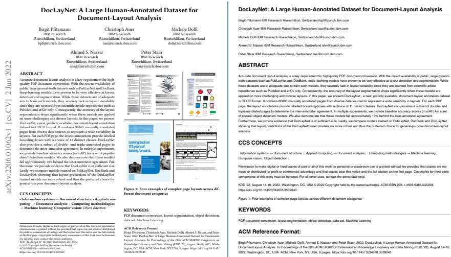

## Appendix 

# In this section, we illustrate a few examples of Docling's output in Markdown and JSON.

Figure 2: Title page of the DocLayNet paper (arxiv.org/pdf/2206.01062) - left PDF, right rendered Markdown. If recognized, metadata such as authors are appearing first under the title. Text content inside figures is currently dropped,the caption is retained and linked to the figure in the JSON representation (not shown). 

