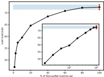

KDD'22.August14-18.2022.Washington.DC.USABirgit Pfitzmann.Christooh Auer.Michele Dolfi.Ahmed S.Nassar.and Peter Staar 

Table 2: Prediction performance (mAP@0.5-0.95) of object detectionnetworksonDoeLavNettestsetTheMRCNN (Mask R-CNN) and FRCNN (Faster R-CNN) models with ResNet-50 or ResNet-101 backbone were trained based on the network architectures from the detectron2 model zoo (Mask R-CNN R50, R101-FPN 3x,Faster R-CNN R101-FPN 3x),withdefaultconfigurations．TheYOLOimplementation utilized wasYOLOv5x6 [13].Allmodelswereinitiallisedusing pre-trained weights from the Coco 2017 dataset.

<html><body><table border="1"><thead><tr><td></td><td>human</td><td colspan="2">MRCNN</td><td>FRCNN</td><td>YOLO</td></tr><tr><td></td><td></td><td>R50</td><td>R101</td><td>R101</td><td>v5x6</td></tr></thead><tbody><tr><td>Caption</td><td>84-89</td><td>68.4</td><td>71.5</td><td>70.1</td><td>77.7</td></tr><tr><td>Footnote</td><td>83-91</td><td>70.9</td><td>71.8</td><td>73.7</td><td>77.2</td></tr><tr><td>Formula</td><td>83-85</td><td>60.1</td><td>63.4</td><td>63.5</td><td>66.2</td></tr><tr><td>List-item</td><td>87-88</td><td>81.2</td><td>80.8</td><td>81.0</td><td>86.2</td></tr><tr><td>Page-footer</td><td>93-94</td><td>61.6</td><td>59.3</td><td>58.9</td><td>61.1</td></tr><tr><td>Page-header</td><td>85-89</td><td>71.9</td><td>70.0</td><td>72.0</td><td>67.9</td></tr><tr><td>Picture</td><td>69-71</td><td>71.7</td><td>72.7</td><td>72.0</td><td>77.1</td></tr><tr><td>Section-header</td><td>83-84</td><td>67.6</td><td>69.3</td><td>68.4</td><td>74.6</td></tr><tr><td>Table</td><td>77-81</td><td>82.2</td><td>82.9</td><td>82.2</td><td>86.3</td></tr><tr><td>Test</td><td>84-86</td><td>84.6</td><td>85.8</td><td>85.4</td><td>88.1</td></tr><tr><td>Title</td><td>60-72</td><td>76.7</td><td>80.4</td><td>79.9</td><td>82.7</td></tr><tr><td>All</td><td>82-83</td><td>72.4</td><td>73.5</td><td>73.4</td><td>76.8</td></tr></tbody></table></body></html>

to avoidthsatanycostinordertohaveclear,unbiasedbasline numbers for human document-layout annotation. Third, we introduced the feature ofsnapping boxes around text segments to obtain a pixel-accurate annotation and again redace time and effort The CCSannotation tool automatically shrinks every userdrawn box to the minimum bounding-box around the enelosed text-ells for all purelytext-based segments, which excludesonly Tabe nd Pictur.Forthe lattegweinstractedannotationstaftominimise inclusionofsurroundingwhitespacewhileincladingall graphieal lines.A downsideofsnapping boxes to enclosed text cells isthat some wronggly parsed PDF pagescannot beannotatedcorrectly and need to be skipped Fourth, we established away toflag pages as rejected focaseswhereno validannotationaccoedingtothelbel guidelinescould be achieved.Examplecases for this would be PDF pages thatndeinrrectlycontainlayoutsthataeiosle to capturewithnonoverlappingectangles.Suchjectedpagea not contained in the final dataset. With all these measures in place experienced annotation staffmanaged to annotate a single page in a typical timeframe of20s to 60s, depending on its complexity.

## 5 EXPERIMENTS 

TheprimarygoalofDoLayNetistoobtainhighqualityMLmods capable of accurate document-layout analysis on awide variety of challenginglayouts.Asdiscussedin Section2,object detection modelsarecurrentlytheasiesttouse,detothestandaatio of ground-truth data in COCO format [16] and the availability of general frameworkssuchas detectron217].Furthermor, baseline numbers in PubLayNet and DocBank were obtainedusing standard object detection models such as Mask R-CNN and Faster R-CNN.As such, we will relate to these object detection methodsin this 

Figure 5:Predietion performance (mAP@0.5-0.95) of a Mask RCNNnetworkwithResNet5obackbonetrainedonincreasingraonofeDcLaNeaaeTeearngure flattens around theosmarkindieating thatinereasingthe sizeoftheDocLavNetdatasetwithsimilardatawillnotvield significantly better predictions. 

paper and leave the detailed evaluation of moee recent methods mentioned in Section 2 for future work.

In this section, we will present several aspects related to the performance of object detection models on DocLayNet. Similarlly as in PubLayNet, we will evaluate the quality of their peedictions using mean average precision (mAP) with 10 overlaps that range from 0.5 to0.95instepsof0.05 (mAP0.50.951Thesesc0res ae computed by leveraging theevaluationcode provided by the Coco API [16].

## Baselines for Object Detection 

InTable2,wepresentbaseline experiments (givenin mAP)on Mask R-CNN [12], Faster R-CNN [11], and YOLOv5 [13]. Both training and evalaation were performed on RGB images with dimensions of 1025×1025pixels.Fortrainingweonlyusedoneannotationincase of redundantly annotated pages. As one can observe, the variation in mAP between the models is rather low, but overall between 6and 10% lower than the mAP computed from the pairwise human annotations on triple-annotated pages. This gives a good indication that the DocLayNet dataset posesa worthwhilechallenee for the research commity to close the gao between haman recoeition andMLaoproachesIt isinteresting to see thatMaskR-CNNand Faster R-CNN produce very comparable mAP scores, indicating that pixel-basedimage segmentationderived from bounding-oxs does not help to obtain better predictions. On theother hand, the more recent Yolov5x model does very well and even out-performs humans on selected labels such as Text, Table and Picture. This is not entirely surprising, as Text, Table and Picture are abundant and the most visually distinctive in a document.

FACNNFrACNithRNtorRN1bewtddntnrksme 2ot 

<html><body><table border="1"><tbody><tr><td></td><td>human</td><td>MRCNN</td><td>MRCNN</td><td>FRCNN</td><td>YOLO</td></tr><tr><td></td><td>human</td><td>RSO</td><td>R101</td><td>R101</td><td>vōsi</td></tr><tr><td>Capion</td><td>04-09</td><td>60.4</td><td>71.5</td><td>70.1</td><td>77.7</td></tr><tr><td>Fodtrele</td><td>83-91</td><td>70.9</td><td>71.8</td><td>73.7</td><td>77.2</td></tr><tr><td>Formula</td><td>83-85</td><td>60.1</td><td>63.4</td><td>63.5</td><td>66.2</td></tr><tr><td>List-tem</td><td>87-88</td><td>81.2</td><td>80.8</td><td>81.0</td><td>86.2</td></tr><tr><td>Page-looter</td><td>93-94</td><td>61.6</td><td>50.3</td><td>58.9</td><td>61.1</td></tr><tr><td>Page-header</td><td>85-89</td><td>71.9</td><td>70.0</td><td>72.0</td><td>67.9</td></tr><tr><td>Peture</td><td>69-71</td><td>71.7</td><td>72.7</td><td>72.0</td><td>77.1</td></tr><tr><td>Section-header</td><td>83-84</td><td>67.6</td><td>60.3</td><td>68.4</td><td>74.6</td></tr><tr><td>Tatle</td><td>77-81</td><td>82.2</td><td>82.9</td><td>82.2</td><td>86.3</td></tr><tr><td>Teet</td><td>84-06</td><td>84.6</td><td>86.8</td><td>85.4</td><td>88.1</td></tr><tr><td>Title</td><td>60-72</td><td>76.7</td><td>80.4</td><td>79.9</td><td>82.7</td></tr><tr><td>A</td><td>82-00</td><td>72.4</td><td>73.5</td><td>73.4</td><td>76.8</td></tr></tbody></table></body></html>

thefeatreofsnaopngboesaroundtesgttonp-arteangttionandaginreuetmeanfnThecs annatationtoolautomaticallyshrinkseaaryuner-drawnbaxtotheminimumbounding-baxaround theenclosedtaetoailsforalpurelyteadbaosdsegments,whicheaclucksonlyTiableandPicture.Parthelattetwaimstructedarnotationatafftominimiseindusionafsurrounding wpewhoiiggAfigtittgdo pages cannot bearnotatedcorreclyandreedto beskigped. Fourth,weestabiished a way toflag pagesasrejectedforceses where no validarnatationaoardingtothelabelguidelinscouldbeachied.EaamplecafortiswouldbePopagesthatrenerineonay orcartainlyoutttaeimpbletocapturewithnonoveappingrectangle.Schrectpagesaentcontindinfhefiral datasetWnallthesemeasuresingleee,experiencedarnotationstalmenagedtoametateasinglepageinatypioaltimefameol20s to 00s, degending on its congiewlty 

## 5 EXPERIMENTS 

TheorieygolofDoeLaNtitotanhiuinyMLmodscepbeofautedoumet-lvutansisonawidevreyof challenginglvoutsAdssdinSeton2oiedttionmodeaecuenytheastoued tothesandariaton of ground-truthcastaninCocDtormat[M]and theaailabilityofgeneralframeworkssuchascletectron2[17].Purthermore,banelinenumbers inPubLaNetad DocBankwreobaireusirgadobitdtectionmodsuchaMaakB-CNNndFastrB-CNAauchwe FrePrnmA0.)ofMkRntkthRtidniigf withsimlrdatewillrotyeldsigiliattlybefrpredietions 

paper and leove thecetalledeveluationofmore reoentmethodsmentioned in Seetion 2 tor tunture work 

Inthis section,wewllpresentseveralaspectsrelatedto the performaneofobjectdetectionmodeisonDocLayNet.Similay asin 0.95inssof0.05 (nAP@.50.Thse sonnsereoomoud bkverntheeglutn odeorovidd bytheCo0oAP11

## BaselinesforObiectDetection 

InTe 2wg et begg n inmAP)nM PCNFarRN 3 OLovatt tg and evekuationweregerlormed onRGB imeoes withdimensionof10e5x1e5giesFor traininaweontyvsedoneanntation incase ofredundantyannotatedgagesAsoreanbsevethevariation inmAPbetwn themodeisiratherlowbutoverallbetweenand 10%lowerthan themAPcomgutedthamthepairisehumanannotatiansontriple-anrtatedpagasThisgiws agoodindicationthatte DocLayNetdatasetpoiaworthwtiechalengefortheresearchcommuritytoclcsethegapbeteaanhumanrecognitionandML pptton based imagesogmentationderivedfrom bounding-boxesdoes not heiptoebtainbetter predietions. On theotherhand, the more recent cT sTTPeeuttemtttitiveint 

Figure 3: Page 6 of the DocLayNet paper. If recognized, metadata such as authors are appearing first under the title. Elements recognized as page headers or footers are suppressed in Markdown to deliver uninterrupted content in reading order. Tables are inserted in reading order. The paragraph in"5. Experiments" wrapping over the column end is broken up in two and interrupted by the table.