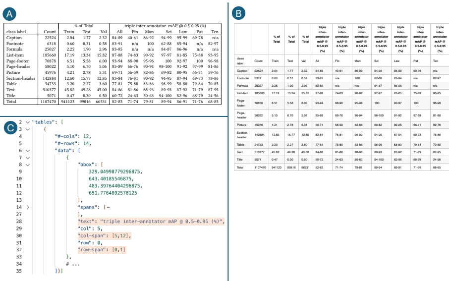

Figure 4: Table 1 from the DocLayNet paper in the original PDF (A), as rendered Markdown (B)and in JSON representation (C). Spanning table cells, such as the multi-column header "triple interannotator mAP@0.5-0.95 (%)", is repeated for each column in the Markdown representation (B),which guarantees that every data point can be traced back to row and column headings only by its grid coordinates in the table. In the JSON representation, the span information is reflected in the fields of each table cell (C). 

