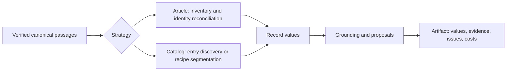

# Extraction stages and controlled experiments

The serving entrypoint is `kei_exp.kie.extract.run.extract`. It reads one verified
canonical generation, checks strategy settings, calls the stages, and assembles
one evidence-bearing artifact. DBOS still owns scheduling and cancellation;
the experiment runner calls this same extraction entrypoint directly.



## Ownership

| Module | Responsibility |
| --- | --- |
| `evidence.py` | Verify canonical files and expose stable passages/tables. |
| `rendering.py` | Expose block types and table cell spans to the model while retaining exact canonical text. |
| `method.py` | Validate explicit experimental choices; enforce the Article context ceiling. |
| `contexts.py` | Partition whole passages with disjoint primary ownership and optional preceding overlap; reconcile values without hiding scalar conflicts. |
| `selection.py` | Select whole value contexts from inventory support, adjacent qualifiers and schema relevance; expose omitted units. |
| `article.py` | Enumerate recurring identities, reconcile them, and extract each record across its source contexts. |
| `stages.py` | Shared model admission, schema prompts, generic Catalog discovery, values, grounding and record assembly. |
| `grounded.py` | Recipe Catalog entry extraction, candidate verification, conflict arbitration and normalization. |
| `run.py` | Select the strategy and assemble the pinned artifact. |
| `experiments/extraction/` | Register inputs/comparisons, capture and resume calls, and analyze completed cells. Never imported by serving code. |

These are ordinary Python functions. There is no plugin graph or separate
service per stage. Strategy differences reflect source structure: Article
identities recur across sections; Catalog entries own contiguous source spans.

## Article choices

Omitting `options.article` preserves the captured prompt-v11 reference,
including its artifact serialization. Specifying it records all settings and
`method_version: 1` in the fingerprint. It is currently a research interface;
Studio does not expose these controls.

- `identity=reference|conservative`: the reference deduplicates any nonempty
  scalar key. Conservative reconciliation restricts inventory attributes to
  explicit `identity_fields`. Only complete declared keys merge across units;
  incomplete keys also require the same label and supporting passages. Partial
  identities remain visible and can produce duplicates requiring review.
- `prompt=reference|schema`: retain the earlier laboratory instructions or
  derive record semantics from the supplied schema without laboratory examples.
- `rendering=structured`: expose canonical block IDs, labels and pages, plus
  table cell IDs, rows, columns, spans and available roles in document, inventory
  and value inputs. Tagged text preserves every source character; it is not XML.
  Missing table cells stay missing. Omission preserves plain reference requests.
  Rendering and `rendering_version` participate in the fingerprint. Tokenizers
  count the actual markup, so structure can increase costs or cause refusal.
  This changes neither the grouping algorithm nor the verifier's cell renderer.
- `context=full|bounded`: send the full source, or partition whole canonical
  passages under a fixed served-token ceiling, including output reserves.
  Inventory and record-value prompts use their actual tokenizer/template.
  By default every record reads every unit.
- `selection=supported` (bounded only): retain value units owning identity
  support and neighboring canonical passages, plus at most one additional unit
  with positive schema-term relevance. The deterministic lexical score uses
  term frequency, inverse unit frequency and length normalization. It preserves
  whole original units and records selected/omitted passages and reasons.
  Inventory, document fields and verification still visit all bounded units.
  Selection can omit relevant late evidence; relevance recall remains unmeasured.
  Omission of this setting preserves the all-unit method and its fingerprint.
- `overlap_passages=0..2`: preceding context that never changes primary
  ownership. Tables are indivisible passages. An oversized passage is explicitly
  refused; it is never clipped or reconstructed under its original identity.
- `grounding=semantic|quoted|off`: source-label verification; verification with
  exact source-substring checks and model-attested attribution; or no links.
  Quoted verification uses four claims per batch and at most 500 characters per
  quote. Quoted support is retained in the artifact. A valid substring and a
  model's attribution are **not independent proof of semantic correctness**.

Bounded value reconciliation unions exactly equal array items, merges objects,
and leaves scalar conflicts null with all alternatives recorded. It does not
infer that different array items represent the same observation. Multiple
units can therefore increase duplicate or contradictory candidates.

`completion` separates processing, attempted inventory coverage, grounding,
unverified document fields and unmeasured recall. Experimental Article artifacts
never assert complete record recall from their own inventory. A successful call
is not evidence that the model found every subject.

## Catalog choices

`options.catalog.factors` independently controls glossary use, inherited
headings, overlap, and verification. Omission preserves existing behavior and
serialization. Disabling verification retains typed model values as proposals,
without accepting or grounding them; `raw_candidates` preserves the replies.
Structural ownership and canonical spans are never disabled. Glossary-off also
disables glossary normalization; heading-off disables inherited bindings and
heading context; overlap-off disables neighboring context and window overlap.

`headed-graves-da@1` is a narrow, declared recipe for standalone `Grav N`
headings. It was developed on the supplied Ellekilde excerpt. Its seven detected
blocks and complete line disposition are observations, not annotated block F1.
It does not apply the German catalogue's field bindings or strip `Grav` from a
printed identifier. Transfer to other grave reports is unmeasured.

## Research boundary

The assemblies implement controllable adaptations of the intentions in
[kei-exp's literature review](https://github.com/GennaroBaratta/kei-exp/blob/4f724dd9d576329e4b8a53c6f25d3da8c84fe319/docs/literature.md):
bounded decomposition, stable source IDs, overlap, explicit nulls, deterministic
verification, and schema/glossary context. They do not replicate trained models,
coordinate-embedding experiments, supervised SCRI/GEC training, stochastic voting,
VLM crop rereading, learned routing, or the complete published systems. Those
require separate implementations and evaluation data.

The full-source reference remains an experimental baseline because comparison
is an explicit requirement. It is not an invisible fallback for a refused
bounded call. Bounded processing currently trades repeated calls for exhaustive
source visitation; call count grows with records times source units. The optional
lexical selector is a separate hypothesis, not hybrid retrieval replication.
Cross-unit semantic reconciliation remains unimplemented.
The R3 [rendering protocol](../experiments/extraction/rendering-protocol.md)
declares a separate six-paper fresh comparison. It tests structure in model input,
not semantic grouping or the complete historical DocTags pipeline.

## Run a study

From this service directory, with the existing virtual environment:

```sh
.venv/bin/python -m experiments.extraction.register DIAGNOSIS_ROOT MANIFEST.json
.venv/bin/python -m experiments.extraction.study validate MANIFEST.json OUTPUT_DIR
.venv/bin/python -m experiments.extraction.study preflight MANIFEST.json OUTPUT_DIR
.venv/bin/python -m experiments.extraction.study run MANIFEST.json OUTPUT_DIR
.venv/bin/python -m experiments.extraction.analyze OUTPUT_DIR REPORT.json
```

Registration pins source PDFs, every canonical JSON file, generations, schemas,
gold, scorer, implementation files, method settings and model endpoint metadata.
Any changed pinned input refuses execution. Registration is immutable; a code,
schema or policy change requires a new study revision. No new conversion is
mixed into a method comparison. The registry uses only existing example and
validation inputs; the six gold papers are development data, and the ten examples
have no independently annotated field gold.

`run --cell CELL_ID` selects one registered cell. Rerunning `run` retains completed
cells and resumes interrupted cells only when their next request exactly matches
the captured request. Saved replies count as reused, not fresh inference.
Requests without saved replies carry an unknown-prior-completion count before
resubmission. A cell lock prevents concurrent execution of that cell. Completed
results commit together with their execution receipt in `cells/ID/result.json`:
the native extraction artifact is under `artifact`, execution accounting under
`execution`. Failed attempts and full request/reply captures remain separate.

The runner does not start or deploy model services, supply credentials, reset
databases, or claim authenticated service/DBOS timing. It uses greedy decoding.
Saved model latency is distinguished from the wall time of the current attempt.

Analysis uses the unchanged adjudicated collagen scorer. It reports populated
and empty fields separately, per-document paired effects, document bootstrap
intervals, one registered two-factor interaction, token/call costs, grounding
diagnostics, failures, and an extra-prediction review queue. Extra predictions
are not automatically false positives because the gold is non-exhaustive.
Unannotated examples support operational comparisons only. Small development
samples cannot establish generalization, and model links cannot establish an
independent semantic grounding accuracy score.

The selector has a separate [conditional replay protocol](../experiments/extraction/selection-protocol.md).
`python -m experiments.extraction.selection_replay register R1_DIR OUTPUT_DIR`
pins that comparison; `run OUTPUT_DIR SOURCE_ID` first reproduces the original
bounded result exactly, then compares all versus selected value units using only
captured response subsequences. Both paired arms disable grounding. Tokenizer
probes are cached, and unseen generation requests fail. Saved calls/tokens are
counterfactual costs; replay is not a fresh latency or model-variability trial.
