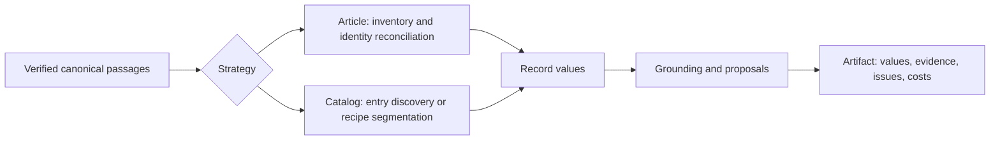

# Extraction stages and controlled experiments

The serving entrypoint is `kei_exp.kie.extract.run.extract`. It reads one verified
canonical generation, checks strategy settings, calls the stages, and assembles
one evidence-bearing artifact. DBOS still owns scheduling and cancellation;
the experiment runner calls this same extraction entrypoint directly.



## Ownership

| Module | Responsibility |
| --- | --- |
| `kie/passages.py` | Verify canonical files and expose stable passages/tables; shared with the recipe stages, outside `kie/extract/`. |
| `rendering.py` | Expose block types and table cell spans to the model while retaining exact canonical text. |
| `spans.py` | Offer exact generation-scoped source ranges and intact canonical cells for compact grounding decisions. |
| `routing.py` | Map reconciled values to reply origins and order whole verification units with exhaustive unresolved fallback. |
| `method.py` | Validate explicit experimental choices; enforce the Article context ceiling. |
| `contexts.py` | Partition whole passages or structural groups with disjoint primary ownership, inherited heading context and optional overlap; reconcile values without hiding scalar conflicts. |
| `selection.py` | Select whole value contexts from inventory support, adjacent qualifiers and schema relevance; expose omitted units. |
| `article.py` | The Article implementation: enumerate recurring identities, reconcile them, and extract each record across its source contexts. |
| `catalog.py` | The version 1 Catalog implementation: generic record discovery and one call per record slice. |
| `assembly.py` | What Article and the version 1 Catalog share: document values over contexts, policy, scheduling and routing of fixed record values through `grounding.technique` (shared with grounding-only experiments), and the version 1 artifact with its fingerprint and prompt version. |
| `stages.py` | The shared value prompts (guardrail, schema instruction, labelled passages), document and record value requests and their conformance, value helpers, and the record merge. |
| `calls.py` | Extraction call execution: `complete` routes a finished request to its role's model, admits it against the served context when counted, invokes the adapter, reads the reply and records every attempt as a `Call`. The only way an extraction stage reaches a model. |
| `llm.py` | The protocol adapters `OpenAIChat` and `NuExtractChat` (request construction, the one explicit unsupported-format fallback, the HTTP call) and `parse_json`. |
| `models.py` | The deployment's extraction models, their permitted roles and defaults, a run's choice, and `ROLE`/`Router`: which role and chat serve each stage. |
| `tokens.py` | Count requests on the serving endpoint's `/tokenize` and read its context size. |
| `grounding.py` | Ground version 1 Catalog and Article values in their passages. The `semantic`, `quoted`, `spans` and `off` techniques share one call shape; `technique` maps `article.grounding` (omitted: `semantic`) to one, and `assembly.py` calls it without knowing which. |
| `grounded.py` | The recipe Catalog implementation: entry extraction under the token budget, the merge of an entry's windows and conflict arbitration. |
| `acceptance.py` | Decide, without a model, whether a recipe Catalog candidate is accepted, proposed or rejected: its value typed, its quote in the entry, a recipe key introducing it; the candidate reply schemas. |
| `windows.py` | Cut an oversized recipe Catalog entry into consecutive windows whose request fits the budget, with optional one-line overlap. |
| `catalog_result.py` | Shape recipe Catalog outcomes into records, evidence links (table cells, glossary normalization) and review items. |
| `run.py` | Load the evidence, check its generation and hand it to the implementation the options choose; all three share one call shape. Publish the artifact. |
| `experiments/extraction/` | Register inputs/comparisons, capture and resume calls, and analyze completed cells. Never imported by serving code. |

These are ordinary Python functions. There is no plugin graph or separate
service per stage. Strategy differences reflect source structure: Article
identities recur across sections; Catalog entries own contiguous source spans.

## Pipeline map

How one production Extraction runs, from the pinned request to the result
Studio accepts. Studio owns Schema Suggestion and Interaction model calls; this
service owns every Extraction model call and grounding. Studio pins the Schema
Revision and Source Representation Revision it admitted; the request carries
that schema and the parse generation, and nothing below substitutes a newer one.

### Admission, source and publication

| Step | Owner |
| --- | --- |
| Pinned request | Studio's [`keiExtractRequest`](../../../packages/extraction/src/workflows.ts) sends the pinned executable schema, options and parse generation through [`KeiHandoff`](../../../packages/extraction/src/kei-handoff.ts) as the portable input of the `extract` workflow. |
| Durable step | [`extract_workflow`/`extract_run`](../src/kei_exp/workflows/extract.py): the one `extract_run` step requires a complete manifest, validates `run.ExtractRequest` (an unservable model choice or unknown recipe is refused by `run.Options` before any call), builds the run's clients with `models.chats_for`, checks cancellation, extracts, checks cancellation again and publishes. Its checkpoint is `ExtractOk` (identities, generation, artifact digest, models), never source text, prompts or replies. There is no per-record or per-call checkpoint. |
| Canonical input | [`run.extract`](../src/kei_exp/kie/extract/run.py) loads verified canonical `Evidence`/`Passage`s with [`passages.load`](../src/kei_exp/kie/passages.py), refuses a stale generation (`StaleGeneration`) before any model or tokenizer request, and dispatches: `options.unified` to `unified.extract` (with the extraction ID its records are published under), a recipe to `grounded.extract`, `article` to `article.extract`, otherwise `catalog.extract`. |
| Version-1 artifact | [`assembly.artifact`](../src/kei_exp/kie/extract/assembly.py) builds Article and generic Catalog's artifact: it merges records (`stages.merge`), lists ungrounded values, serializes `Link`, `Issue` and `Call`, and computes `fingerprint`; `article.extract` adds its inventory and method fields. |
| Recipe Catalog artifact | [`grounded.extract_grounded`](../src/kei_exp/kie/extract/grounded.py) constructs the version-2 body; `grounded.extract` adds the run and generation identity, schema, options, model identities and fingerprint. |
| Unified Catalog artifact | [`unified.extract`](../src/kei_exp/kie/extract/unified.py) publishes `catalog-execution.json` (pins and each stage's resolved budget) before any model call and `catalog-discovery.json` (entries, source ledger, windows and their calls) before entry calls, both write-once beside the result; a re-executed step validates and reuses them, and refuses budgets the served context no longer fits (`budget_refused`). Its version-3 artifact embeds both with their canonical digests. |
| Publication | `run.publish_extraction` writes `extractions/<id>/result.json` by rename, only after `extract_run`'s final forced cancellation check. |
| Studio acceptance | [`runExtractionWorkflow`](../../../packages/extraction/src/workflows.ts) reads the artifact, compares its digest with `ExtractOk`, and [`acceptKeiArtifact`](../../../packages/extraction/src/kei-artifact.ts) validates its shape, requires the requested run, generation, strategy, schema, recipe and model choice, maps each Evidence link to its anchor ID and verifies table-cell anchors against the pinned Source Representation before the Extraction settles. |

### Model calls

Each row is one call purpose: the stage label its `Call` records, the role
[`models.ROLE`](../src/kei_exp/kie/extract/models.py) assigns it, who prepares
the source and builds the prompt and reply schema, and who interprets the answer.

| Strategy | Stage → role | Initiated by | Source, prompt and reply schema | Interpretation |
| --- | --- | --- | --- | --- |
| Article | `document` → fields | [`assembly.document_values`](../src/kei_exp/kie/extract/assembly.py), per source context | [`stages.extract_document`](../src/kei_exp/kie/extract/stages.py): `_instruction` over the document fields, the context's complete text as `text_of` or `rendering.structured_source`, [`schema.json_schema`](../src/kei_exp/kie/extract/schema.py); counted, 2,048 output tokens | `schema.conform`; contexts reconciled by `contexts.reconcile_values`; listed as `unverified` |
| Article | `inventory` → reasoning | [`article.extract_records`](../src/kei_exp/kie/extract/article.py), per source context | [`article.inventory_request`](../src/kei_exp/kie/extract/article.py): identity-inventory instruction plus `_instruction`, passages labelled with canonical IDs (`_labelled`) or structured, reply schema enumerating those IDs; counted, output allowance chosen in `article.inventory` | `article.inventory` validates identities and passage IDs and merges duplicates; `article.reconcile_identities` across bounded contexts |
| Article | `record` → fields | `article.extract_records`, per identity and value context | [`stages.record_request`](../src/kei_exp/kie/extract/stages.py) with the identity and the `ARTICLE` (or neutral) instruction, over each value context (by default the complete source); counted, 4,096 output tokens | `schema.conform` under the bound identity; `contexts.reconcile_values` across value contexts |
| Article | `grounding` → reasoning | [`assembly.ground_records`](../src/kei_exp/kie/extract/assembly.py) → `grounding.technique` (default `semantic`) | [`grounding.verify`](../src/kei_exp/kie/extract/grounding.py): `GROUNDING`, `QUOTED_GROUNDING` or `SPAN_GROUNDING`, record identity, claims and complete evidence; per-batch reply schema enumerating eligible labels; counted, 2,048 output tokens, batches split to fit | `grounding.verify` accepts only offered labels (and, when quoted, exact substrings with attribution) as `Link`s; every claim is verified by the model |
| Generic Catalog | `document` → fields | `assembly.document_values`, one context | `stages.extract_document` over the source clipped to `record_chars` (`text_truncated` when cut) | `schema.conform`; `unverified` |
| Generic Catalog | `discovery` → reasoning | [`catalog.discover`](../src/kei_exp/kie/extract/catalog.py), per page-aligned chunk of `discovery_chars` | `catalog.DISCOVERY` with its examples, `B`-labelled blocks (`_labelled`), reply schema enumerating the shown labels | `catalog.discover` keeps ordered starts and a final-chunk end, reports ignored labels and numbering anomalies, and cuts record slices |
| Generic Catalog | `record` → fields | [`catalog.extract`](../src/kei_exp/kie/extract/catalog.py), per slice | [`stages.extract_record`/`stages.record_request`](../src/kei_exp/kie/extract/stages.py): `_instruction` and the slice clipped to `record_chars` | `schema.conform` |
| Generic Catalog | `grounding` → reasoning | `assembly.ground_records` → `grounding.semantic` | `grounding.verify`: every claim, a value found once in its slice included, goes to `GROUNDING` calls with its field, its sibling fields and the record's fields, under the `record_chars` character budget | as Article |

| Unified Catalog | `discovery` → reasoning | [`discovery.discover`](../src/kei_exp/kie/extract/discovery.py), per counted window of source lines (`discovery.plan`), halved on a failed or cut-off reply | `discovery.DISCOVERY`: record description, `L`-labelled window lines between unlabelled context; reply names each record or record-free start by line and exact text, and whether the window begins and ends inside a record | code places each start where its text occurs once in its line; windows join only on agreeing continuation flags; the rest stays `unresolved` in the ledger |
| Unified Catalog | `entry` → fields | [`unified._Run.entry`](../src/kei_exp/kie/extract/unified.py), per counted window of the entry's own lines | `unified.ENTRY` with field notes; the entry text, earlier and later lines of the entry as overlap, record-free lines before it as context; `{value, quote}` candidates, `_item_text` per list object | `unified._Checker`: typed value, quote located in the entry, literal or supporting span; `unified._merged` joins equal observations and keeps partial list items as proposals |
| Unified Catalog | `verification` → reasoning | `unified._Run._verify`, per window's candidates | `unified.VERIFY`: the window's text and labelled candidates; reply `supported`, `unsupported` or `unclear` per label; batches halved on overflow | only `supported` is accepted; anything else stays a proposal or rejection |
| Unified Catalog | `arbitration` → reasoning | `unified._Run._settle`, per scalar whose accepted values disagree | `unified.ARBITRATION` over every candidate with its snippet, or no call when they do not fit | the chosen candidate, or all left unresolved |
| Unified Catalog | `document` → fields | `unified._Run.document`, per counted window over every admitted line | `unified.DOCUMENT`: `{value, quote}` candidates for document fields | located in the window; windows reconciled by `contexts.reconcile_values`, conflicts kept; always `unverified` |

Article counts every request on the serving endpoint of its role
([`tokens.counters_for`](../src/kei_exp/kie/extract/tokens.py) over `/tokenize`)
and refuses when either role's context size is unknown. Generic Catalog uses
character budgets and sends no `max_tokens`, so the adapter's 8,192 applies.
The unified Catalog counts every request too; each stage's input ceiling is the
served context minus its reply reserve (or the method's custom ceiling), and
its reply reserve is sent as `max_tokens`.

Every row above sends its request through the same execution seam,
[`calls.complete`](../src/kei_exp/kie/extract/calls.py):

1. `models.Router.for_stage` picks the chat serving the stage's role. The
   run's routes come from `models.chats_for`: the run's `options.models` over
   the deployment's defaults (NuExtract fills fields when the deployment
   configures it; the instruction model reasons).
2. With a counter, the request is counted; one that does not fit its output
   allowance in the served context is a failed `Call` and is never sent.
3. The adapter in [`llm.py`](../src/kei_exp/kie/extract/llm.py) builds and
   sends the HTTP request. Both adapters send temperature 0 with thinking off.
   `OpenAIChat` requests strict `json_schema` output and repeats the request once without it only
   after a 400 refusal that names structured output as unsupported; nothing
   remembers that refusal for later calls. `NuExtractChat` sends the reply schema
   as its template (`nuextract_template`) and the instructions in
   `chat_template_kwargs`, with the source as the only user message; a schema it
   cannot express raises `TemplateError`, with no fallback to another model.
4. A `finish_reason` of `length` or text `llm.parse_json` cannot read is a failed
   call with a null answer; nothing is repaired. A counted request whose served
   prompt count differs is failed too.
5. Every attempt becomes a `Call`, the refused one included, in order.

Transport failures (connection errors, timeouts, HTTP errors) are not `Call`s:
they end the step, and [`failures.classify`](../src/kei_exp/failures.py) decides
whether DBOS reruns the whole `extract_run` step. `calls.complete` owns no prompt,
reply schema, conformance or grounding decision, and makes no retry of its own.

Cancellation is cooperative. `extract_run` checks before model work and again
before publication. Article and generic Catalog invoke their `before_entry`
hook before document calls, inventory or discovery, record extraction, record
verification and grounding batches. Recipe Catalog invokes it before each entry
in `grounded._in_chunks`; its document-level call in `grounded._document`
precedes those entry checks and does not invoke the hook. A request already
in flight finishes first.

### The recipe Catalog

A request with `options.catalog.recipe` runs
[`grounded.extract`](../src/kei_exp/kie/extract/grounded.py) instead of generic
Catalog; it is an optional path for catalogues a recipe describes, not the
generic Catalog's replacement. Structural segmentation replaces discovery.
`grounded._Run.call` counts each `entry` and `document` (fields) and
`arbitration` (reasoning) request against the recipe's input budget before handing it to the same
`calls.complete`; code in `acceptance.py` accepts, proposes or rejects each
candidate, and the result is version 2 with code-point span Evidence.

## Article choices

Omitting `options.article` retains the full-source reference requests. Protocol v12
preserves literal source control characters when decoding replies; quoted verification
also has corrected instructions and literal source matching. Version/fingerprint metadata
therefore differs from v11. The frozen R1 checkout/archive retains exact v11 behavior.
Specifying Article options records all settings and `method_version: 1` in the fingerprint. It is currently a research interface;
Studio does not expose these controls.

- `identity=reference|conservative`: the reference deduplicates any nonempty
  scalar key. Conservative reconciliation restricts inventory attributes to
  explicit `identity_fields`. Only complete declared keys merge across units;
  incomplete keys also require the same label and supporting passages. Partial
  identities remain visible and can produce duplicates requiring review.
- `prompt=reference|schema`: retain the earlier laboratory instructions or
  derive record semantics from the supplied schema without laboratory examples.
- `rendering=structured`: expose canonical block IDs, labels and pages, plus
  table cell IDs, rows, columns, spans and available roles in document, inventory
  and value inputs. Tagged text preserves every source character; it is not XML.
  Missing table cells stay missing. Omission preserves plain reference requests.
  Rendering and `rendering_version` participate in the fingerprint. Tokenizers
  count the actual markup, so structure can increase costs or cause refusal.
  This changes neither the grouping algorithm nor the verifier's cell renderer.
- `context=full|bounded`: send the full source, or partition whole canonical
  passages under a fixed served-token ceiling, including output reserves.
  Inventory and record-value prompts use their actual tokenizer/template.
  By default every record reads every unit.
- `grouping=structural` (bounded only): keep a heading with its first body block
  and tables with immediately adjacent captions/footnotes, across page furniture.
  Prefer section boundaries and carry the latest heading into continuation units.
  Required heading context is token-counted and recorded separately from primary
  ownership. An oversized group is refused intact; it never sheds its qualifier
  to fit. Labels do not establish a heading hierarchy or arbitrary cross-page
  table association, so neither is inferred. Omission keeps token-only partitioning.
  The setting and `grouping_version` participate in the fingerprint.
- `selection=supported` (bounded only): retain value units owning identity
  support and neighboring canonical passages, plus at most one additional unit
  with positive schema-term relevance. The deterministic lexical score uses
  term frequency, inverse unit frequency and length normalization. It preserves
  whole original units and records selected/omitted passages and reasons.
  Inventory, document fields and verification still visit all bounded units.
  Selection can omit relevant late evidence; relevance recall remains unmeasured.
  Omission of this setting preserves the all-unit method and its fingerprint.
- `overlap_passages=0..2`: preceding context that never changes primary
  ownership. Tables are indivisible passages. An oversized passage is explicitly
  refused; it is never clipped or reconstructed under its original identity.
- `grounding=semantic|quoted|spans|off`: source-label verification; verification with
  exact source-substring checks and model-attested attribution; or no links.
  Quoted verification uses four claims per batch and at most 500 characters per
  quote. Matching preserves case and whitespace; normalization cannot manufacture
  a source substring. Quoted support is retained in the artifact. A valid substring and a
  model's attribution are **not independent proof of semantic correctness**.
- `grounding=spans` reconstructs quotes from offered canonical ranges instead of
  asking the model to generate source text. Replies select a span ID and attest
  support for the field and record; negative attribution creates no link. Prose
  ranges cover every character and are at most 500 code points, preferring sentence
  or whitespace boundaries. Existing table cells stay intact, including longer
  cells. Complete parent text and eligible cell/header context remain available.
  `quoted_support` retains exact start/end offsets, source text and cell identity;
  geometry remains at the parent's precision unless a measured cell box exists.
  Batches start at 32 claims, then split under actual input-token admission with
  a 2,048-token output reserve. Missing/unknown decisions and truncation remain
  failures. The setting and `span_grounding_version` change the fingerprint.
- `grounding_schedule=unresolved` independently removes supported full record paths
  from later source-unit calls. NONE, missing decisions and failed calls stay
  unresolved. Omission keeps the exhaustive all-claim schedule and its previous
  fingerprint. Early exit searches for support; it does not establish absence of
  contradictions elsewhere. It can amplify false-positive support and needs
  independently reviewed attribution evidence before production adoption.

- `evidence_policy=schema` independently enables node `evidencePolicy` metadata
  with quoted or span grounding. Policies are `quoted`, `derived` or `unverified`.
  Omitted metadata inherits the closest parent's policy, defaulting to `quoted`;
  explicit child metadata overrides its parent. Explicit null is rejected.
  For example, a diagnostic array node can declare `"evidencePolicy": "derived"`
  while an observation child declares `"evidencePolicy": "quoted"`. Renaming the
  array does not change eligibility. Derived describes eligibility, not a verified
  calculation. Both skipped policies retain values, full paths in `ungrounded`,
  and `evidence_policy_skipped` reasons in the result and Studio adapter.
  `grounding_eligibility` records all/eligible leaf counts and skipped paths/policies;
  `completion.eligible_grounding` reports only the eligible set (or `not_applicable`
  when empty). Existing all-leaf grounding and link-rate metrics remain unchanged.
  The analyzer checks the ledger against the schema and rejects links on skipped
  fields. Without this method factor, metadata does not prune verification.
- `grounding_routing=origin_lexical` requires `grounding_schedule=unresolved` and
  quoted or span grounding. It orders whole source units per claim: units owning
  extraction-origin passages first, then bounded lexical value matches and BM25
  field/value relevance, with canonical index as the final tie-breaker. No source
  unit is excluded; unresolved claims continue through every remaining unit.
  Claims sharing their next unit are verified in one batch where budgets allow.
  Failed, missing and invalid decisions do not stop search; refusals remain gaps.
  Table cells, headers, qualifiers and structural context are not cut by routing.
  This is deterministic lexical retrieval, without a dense model or service.

With routing enabled, `value_origins` retains each full record leaf path and its
contributing value-call unit/index path. Array unions may change output indexes;
the mapping requires an exact whole-item match to an original reply. Scalar
conflicts remain null and acquire no origin. Identity fields bound by the inventory
retain `kind=inventory` and its model-supplied citations instead of pretending they
were extracted again in each value call. Value units refer to `value_contexts`;
routing prefers their primary ownership, not duplicated heading/overlap text.
These are extraction hints, not canonical evidence or proof of support.

`grounding_routes` retains full claim paths, ordered unit indexes, origin/value
match hints, lexical scores, attempted/refused/remaining units and supported status.
An attempted unit can still have a failed model reply; the existing calls/issues
ledger retains those failures. `attempted_all` means every unit was submitted,
not that every reply was usable or no contradiction exists. `partial` retains
budget/no-evidence refusals; `stopped_after_support` retains unvisited units.
The separately recorded `grounding_routing_version` participates in fingerprints.

These methods are opt-in prototypes. Their controlled live comparison remains in
the [follow-up plan](../../../docs/plans/2026-09-28-span-grounding.md).
They do not alter the running frozen R1/R2a/R3/R4 study.

The shared decoder accepts literal control characters only inside strings and
preserves their values exactly, like escaped JSON spellings. It still rejects
missing delimiters, invalid escapes, trailing objects and output truncation.
Only a leading model thinking envelope is removed; literal tags inside source
quotes remain intact. The provider prompt requests escaped JSON strings. Recipe
Catalog records protocol v5 for the same decoder correction. This is an explicit
syntax extension, not semantic acceptance or repair of missing model output.

To exercise the new structural input with an approved schema, set:

```json
{"strategy": "article", "article": {
  "context": "bounded", "context_tokens": 12288,
  "rendering": "structured", "grouping": "structural",
  "prompt": "schema", "grounding": "quoted"
}}
```

Add conservative identity reconciliation only with identity fields appropriate to
the schema. These remain experimental controls, not a new Studio default.

Bounded value reconciliation unions exactly equal array items, merges objects,
and leaves scalar conflicts null with all alternatives recorded. It does not
infer that different array items represent the same observation. Multiple
units can therefore increase duplicate or contradictory candidates.

`completion` separates processing, attempted inventory coverage, grounding,
unverified document fields and unmeasured recall. Experimental Article artifacts
never assert complete record recall from their own inventory. A successful call
is not evidence that the model found every subject.

## Catalog choices

`options.catalog.factors` independently controls glossary use, inherited
headings, overlap, and verification. Omission preserves existing behavior and
serialization. Disabling verification retains typed model values as proposals,
without accepting or grounding them; `raw_candidates` preserves the replies.
Structural ownership and canonical spans are never disabled. Glossary-off also
disables glossary normalization; heading-off disables inherited bindings and
heading context; overlap-off disables neighboring context and window overlap.

`headed-graves-da@1` is a narrow, declared recipe for standalone `Grav N`
headings. It was developed on the supplied Ellekilde excerpt. Its seven detected
blocks and complete line disposition are observations, not annotated block F1.
It does not apply the German catalogue's field bindings or strip `Grav` from a
printed identifier. Transfer to other grave reports is unmeasured.

## Research boundary

The assemblies implement controllable adaptations of the intentions in
[kei-exp's literature review](https://github.com/GennaroBaratta/kei-exp/blob/4f724dd9d576329e4b8a53c6f25d3da8c84fe319/docs/literature.md):
bounded decomposition, stable source IDs, overlap, explicit nulls, deterministic
verification, and schema/glossary context. They do not replicate trained models,
coordinate-embedding experiments, supervised SCRI/GEC training, stochastic voting,
VLM crop rereading, learned routing, or the complete published systems. Those
require separate implementations and evaluation data.

The full-source reference remains an experimental baseline because comparison
is an explicit requirement. It is not an invisible fallback for a refused
bounded call. Bounded processing currently trades repeated calls for exhaustive
source visitation; call count grows with records times source units. The optional
lexical selector is a separate hypothesis, not hybrid retrieval replication.
Cross-unit semantic reconciliation remains unimplemented. Structural grouping adapts
[BLOCKIE's linked-block idea](https://arxiv.org/html/2505.13535v1) using canonical
labels, without an LLM rewriting the source or proof of block independence. Literal
quoted-source checking follows the decoding constraint in
[LMDX Algorithm 2](https://arxiv.org/html/2309.10952v2); it does not reproduce coordinate
training or voting. These development fixes are separate from the frozen studies.
The R3 [rendering protocol](../experiments/extraction/rendering-protocol.md)
declares a separate six-paper fresh comparison. It tests structure in model input,
not semantic grouping or the complete historical DocTags pipeline.

## Run a study

From this service directory, with the existing virtual environment:

```sh
.venv/bin/python -m experiments.extraction.register DIAGNOSIS_ROOT MANIFEST.json
.venv/bin/python -m experiments.extraction.study validate MANIFEST.json OUTPUT_DIR
.venv/bin/python -m experiments.extraction.study preflight MANIFEST.json OUTPUT_DIR
.venv/bin/python -m experiments.extraction.study run MANIFEST.json OUTPUT_DIR
.venv/bin/python -m experiments.extraction.analyze OUTPUT_DIR REPORT.json
```

Registration pins source PDFs, every canonical JSON file, generations, schemas,
gold, scorer, implementation files, method settings and model endpoint metadata.
Any changed pinned input refuses execution. Registration is immutable; a code,
schema or policy change requires a new study revision. No new conversion is
mixed into a method comparison. The registry uses only existing example and
validation inputs; the six gold papers are development data, and the ten examples
have no independently annotated field gold.

`run --cell CELL_ID` selects one registered cell. Rerunning `run` retains completed
cells and resumes interrupted cells only when their next request exactly matches
the captured request. Saved replies count as reused, not fresh inference.
Requests without saved replies carry an unknown-prior-completion count before
resubmission. A cell lock prevents concurrent execution of that cell. Completed
results commit together with their execution receipt in `cells/ID/result.json`:
the native extraction artifact is under `artifact`, execution accounting under
`execution`. Failed attempts and full request/reply captures remain separate.

The runner does not start or deploy model services, supply credentials, reset
databases, or claim authenticated service/DBOS timing. It uses greedy decoding.
Saved model latency is distinguished from the wall time of the current attempt.

Analysis uses the unchanged adjudicated collagen scorer. It reports populated
and empty fields separately, per-document paired effects, document bootstrap
intervals, one registered two-factor interaction, token/call costs, grounding
diagnostics, failures, and an extra-prediction review queue. Extra predictions
are not automatically false positives because the gold is non-exhaustive.
Unannotated examples support operational comparisons only. Small development
samples cannot establish generalization, and model links cannot establish an
independent semantic grounding accuracy score.

The selector has a separate [conditional replay protocol](../experiments/extraction/selection-protocol.md).
`python -m experiments.extraction.selection_replay register R1_DIR OUTPUT_DIR`
pins that comparison; `run OUTPUT_DIR SOURCE_ID` first reproduces the original
bounded result exactly, then compares all versus selected value units using only
captured response subsequences. Both paired arms disable grounding. Tokenizer
probes are cached, and unseen generation requests fail. Saved calls/tokens are
counterfactual costs; replay is not a fresh latency or model-variability trial.
