# Catalog strategy experiment

Disposable, executable benchmark for the supplied Beier catalog excerpt. It uses
the existing Studio model adapters and Catalog executor, without writing to the
application database or changing saved model configuration. Results describe this
excerpt and the seven fields in `schema.ts`; they do not establish an optimal
general-purpose Catalog pipeline.

[Measured results and limitations](RESULTS.md) ·
[RTX 4090 desktop handoff](HANDOFF.md) ·
[Interactive diagrams and PDF evidence report](../../../../artifacts/catalog-lab/beier/report.html)

## Run

From the repository root, with Studio dependencies installed and the Parsing
Service running:

```bash
python3 prototypes/studio/experiments/catalog/prepare.py \
  --pdf /home/gebbaro/Downloads/Beier1988_GAC_02_Catalogue-001-001.pdf \
  --out artifacts/catalog-lab/beier
```

Preparation saves one parser snapshot and renders the original PDF using
`pdftoppm`. Reusing the directory verifies the source hash. To reuse a service task,
add `--task-id UUID`. Review the images and `beier.reference.json` together before
reusing the reference with a different parser snapshot; its block positions must
be rebound and checked if parsing changes.

Run a fresh baseline from `prototypes/studio`:

```bash
node node_modules/tsx/dist/cli.mjs experiments/catalog/run.ts \
  --input ../../artifacts/catalog-lab/beier/parsed_document.json \
  --out ../../artifacts/catalog-lab/beier/my-baseline \
  --strategy baseline --model luna
```

Luna uses an existing Studio Codex CLI connection and its authenticated local CLI.
The prototype selects `gpt-5.6-luna` in memory. NuExtract uses Ollama at
`http://spark.cdch-dgxspark.lan.ku.dk:11434`, model
`hf.co/numind/NuExtract3-GGUF:Q4_K_M`; override with `--ollama-url`.
The per-call timeout defaults to 180,000 ms and can be overridden with `--timeout`.

For a new experiment directory, freeze execution code, prompts, scoring and
reference answers before the comparison:

```bash
python3 experiments/catalog/suite.py \
  --input-dir ../../artifacts/catalog-lab/beier \
  --discovery-from ../../artifacts/catalog-lab/beier/my-baseline/result.json \
  --presets rule-lexical rule-lexical-fallback grouped-joint-nuextract \
    grouped-joint-luna chunk-joint-nuextract chunk-joint-luna \
  --freeze
```

Omit `--freeze` when continuing an existing frozen experiment. Use
`--start-repetition 2 --repetitions 2` for additional repetitions. The suite rotates
preset order across repetitions, preserves failed runs, and refuses to overwrite
an existing run or continue after execution/reference changes. For another
revision, use a new input directory. Requests within a suite run serially; run one
suite per provider at a time when comparing latency.

Late in this experiment, the local Luna CLI rejected the desktop configuration
with `invalid type: map, expected a boolean`. An isolated probe reproduced the
failure when `features.context_management` was a table containing
`experimental_mode = true`; the same probe with no override succeeded. The
`features.multi_agent_v2` table alone did not reproduce it. The saved configuration
subsequently changed outside this experiment and the normal adapter worked again.
Failed trials and temporary startup-wrapper attempts remain in the artifacts.
`probe-cli-config.ts` reproduces the diagnosis through request-local overrides,
without editing saved configuration; it makes minimal real Luna requests.

## Strategies and prompts

Let C be discovery chunks, N records, B the record batch size, and F either zero or
one selective fallback call. Counts below exclude optional document-scoped fields
and discovery correction retries. This schema has no document-scoped fields.

| Strategy | Calls | Model input and output |
| --- | --- | --- |
| `baseline` | C + N + grounding batches | Current production discovery (`starts`, `end`), one values-only extraction per record, then separate claim-to-anchor grounding. |
| `separate` | C + N + grounding batches | Reuse validated discovery; values-only extraction with optional synthetic examples; current grounding engine and prompt. |
| `joint` | C + N | One record's labelled source → values plus one E label per populated field. |
| `grouped-joint` | C + ceil(N/B) | B labelled records → values and field evidence together. |
| `grouped-lexical` | C + ceil(N/B) + F | B records → values only; code selects unique supporting blocks; optional Luna call handles unlinked populated fields. |
| `rule-grouped-lexical` | ceil(N/B) + F | Same extraction/linking, with Beier-format numbered `Fdpl.` headings supplying boundaries in code. |
| `chunk-joint` | C | Each page/size chunk, with adjacent context → record starts, values and evidence in one response. |

The default B is five. `--few-shot` inserts one example containing two invented records into
NuExtract's advertised native example slots. They teach numbered findspots, literal `u.`, null
fields and evidence labels; they contain no Beier answers. `--field-aware` uses the
printed `Fdpl.`, `Mbl.` and first `FA:` conventions to narrow evidence candidates.
`--fallback-model luna` sends only unresolved non-null claims to Luna, grouped in
one request. It cannot repair incorrect values or detect missing values.

The rule strategy and field-aware linker are specific hypotheses for this catalog
format. A unique text match is not a semantic guarantee. An unrelated passage can
contain the same orientation; evaluation checks values and supporting anchors
independently. No strategy reads the reference file during extraction.

Presets `rule-lexical-fallback-b1`, `rule-lexical-fallback-b3` and
`rule-lexical-fallback-b10` vary the record batch size. These were added as a
supplemental exploration after inspecting the original full-excerpt comparison;
execution prompts, reference answers and scoring remained frozen.

`--discovery-from` checks the exact parser snapshot hash and reuses the baseline's
boundaries. Its discovery calls and duration are added explicitly to estimated
full-pipeline totals. These are not newly measured end-to-end runs. A comparison
with reused Luna discovery must not be labelled an all-NuExtract pipeline.

## Score and inspect

From the repository root:

```bash
python3 prototypes/studio/experiments/catalog/evaluate.py \
  --document artifacts/catalog-lab/beier/parsed_document.json \
  artifacts/catalog-lab/beier/my-baseline/result.json

python3 prototypes/studio/experiments/catalog/report.py \
  --input-dir artifacts/catalog-lab/beier \
  --out artifacts/catalog-lab/beier/report.html \
  artifacts/catalog-lab/beier/my-baseline/result.json
```

Pass additional `result.json` paths to compare runs. The standalone HTML embeds
the source pages, reference answers, errors and evidence boxes; it needs no server.
Raw prompts, actual Ollama requests, responses, transport traces, model metadata,
timing, failures, code hashes and reused-call provenance remain in each run's
directory. Artifacts are gitignored because they contain the supplied source and
large generated files.

Primary scoring is against the PDF: 29 parent records, 203 field values, 164
populated reference fields. Missing/duplicate records do not earn null-value
credit. Record precision exposes extra records. Supported accuracy requires a
correct value and an annotated supporting anchor; evidence precision also
penalizes links on spurious records and wrong values. The separate OCR-tolerant
diagnostic allows the observed Greek-beta/ß confusion in locality names.
Evidence links identify canonical blocks, whose observations can cover several
paragraphs or pages; they are not character-level highlights of individual values.

The agent reviewed the references against rendered source pages; a researcher has
not independently adjudicated them. Candidate strategies were developed on IDs
205–214. The whole PDF and initial full-baseline results were visible before the
freeze. IDs 215–233 provide an additional reported subset, not a blind holdout.
Use full-excerpt record precision as the primary extra-record measure: subset
scores restrict returned records to IDs belonging to that subset.

## Verification

From `prototypes/studio`:

```bash
python3 -m unittest discover -s experiments/catalog -p 'test_*.py'
node node_modules/vitest/vitest.mjs run experiments/catalog/link.test.ts
node node_modules/typescript/bin/tsc --ignoreConfig --noEmit --target es2024 \
  --module esnext --moduleResolution bundler --allowImportingTsExtensions \
  --esModuleInterop --skipLibCheck --strict --types node experiments/catalog/run.ts
```

These checks cover scoring failures and ambiguity in evidence selection. Live
model runs supply the accuracy/latency evidence; unit tests cannot establish it.

## Current Catalog pipeline, verified in code

```mermaid
flowchart LR
    A[Scanned PDF] --> B[Parsing Service: OCR, layout, column order]
    B --> C[Canonical blocks, anchors and PDF observations]
    C --> D[Discovery: starts and end per chunk]
    D --> E[Code resolves record boundaries]
    E --> F[One values-only LLM call per record]
    F --> G[Save value checkpoint]
    G --> H[Separate grounding: claims to E labels]
    H --> I[Validate links and return evidence anchors]
```



Source: `packages/extraction/src/module.ts` (`executeCatalog`, checkpoint before
`groundExtraction`), `catalog-discovery.ts` (validation/correction),
`source-context.ts` (chunking and labels), `grounding.ts` (claim batches/validation),
and Studio `api/_model.ts` / `api/_provider.ts` (provider requests). For this input
and schema the measured baseline has three discovery, 29 extraction and 29
grounding calls. Grounding groups populated claims by record, with a separate
group for root claims. Document fields, discovery correction retries, failed
records and records without populated claims can change the count.

The current grounding request contains claim labels and **values**, plus labelled
candidate text. It does not include each claim's field name, result path or schema
definition. The prototype's joint prompts and selective fallback include field
definitions; the latter also names each unresolved field explicitly.
